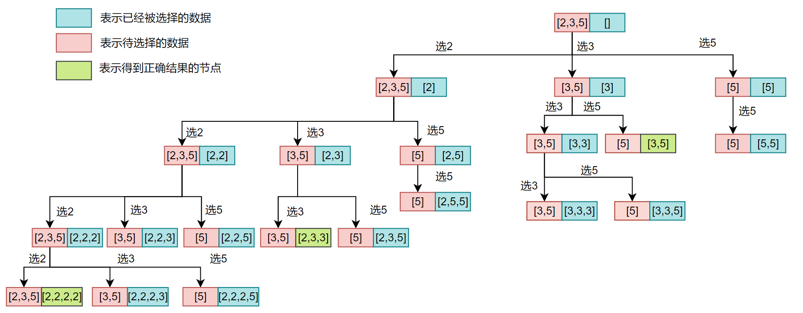
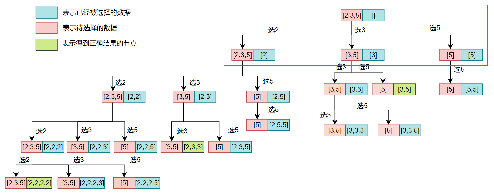
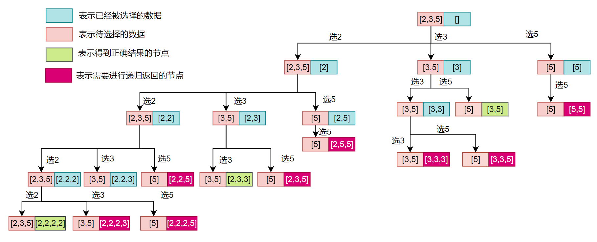

# 组合总和

## 前言

在上篇文章[通过组合问题看透回溯法](https://mp.weixin.qq.com/s?__biz=Mzg3ODgyNDgwNg==&mid=2247486751&idx=1&sn=8e9cedd729d01ff8867fcb2c085ecbe3&chksm=cf0c9116f87b18002551eefcd773f4762d79d2c06614b304437bfcd382e14afa031d29cc4dcc&mpshare=1&scene=22&srcid=0921yRhazbXlqGuEZagKb0p9&sharer_sharetime=1663737871952&sharer_shareid=236a49567847c05f78e6b440ce6dabff#rd)当中我们通过介绍一个组合问题，仔细地分析了组合问题的回溯过程。我们之后会继续介绍一些比较经典的回溯算法题，帮助深入彻底理解回溯算法的执行过程和原理，如果对回溯的整个过程还不是很了解的话可以先阅读上面那篇文章。

## [组合总和](https://leetcode.cn/problems/combination-sum-ii/)

>给你一个 无重复元素 的整数数组 candidates 和一个目标整数 target ，找出 candidates 中可以使数字和为目标数 target 的 所有 不同组合 ，并以列表形式返回。你可以按 任意顺序 返回这些组合。
>
>candidates 中的 同一个 数字可以 无限制重复被选取 。如果至少一个数字的被选数量不同，则两种组合是不同的。 
>
>对于给定的输入，保证和为 target 的不同组合数少于 150 个。

例1：

```JAVA
输入：candidates = [2,3,6,7], target = 7
输出：[[2,2,3],[7]]
解释：
2 和 3 可以形成一组候选，2 + 2 + 3 = 7 。注意 2 可以使用多次。
7 也是一个候选， 7 = 7 。
仅有这两种组合。
```

例2：

```JAVA
输入: candidates = [2,3,5], target = 8
输出: [[2,2,2,2],[2,3,3],[3,5]]
```

## 解法

根据题目的意思我们是需要从给定的集合当中选出几个数据，而且可以进行重复选取，只需要保证被我们选中的数据的和为`target`即可。对于这个问题我们可以构造一个如下图所示的解树：（下面的树的`target = 8`，当被选中的数据的和大于8的时候我们不需要再往下进行遍历了，因为再选择数据的话，被选择的数据的和只会大于8，这永远不可能等于`target = 8`）



可能你会对上面的解树有所疑问，为什么我们选完2之后是从`[2, 3, 5]`当中继续选择数据，选择完3之后是从`[3,5]`当中继续选择数据，而选择完5之后只能从`[5]`当中选择数据呢？

事实上我们是需要穷举所有的组合的然后一一进行匹配，所以我们现在的问题是上面的树穷举完所有的组合了吗？上面的树是穷举完所有的组合了的。

穷举的组合如下：

- 第一个数据和其他所有数据进行组合，
- 第二个数据和其他所有数据的组合。
- 第三个数据和其他所有数据的组合。
- ....

我们现在来仔细分析一样上面的解树：

- 我们再进行第一次选择的时候，当我们选择完2之后还可以从`[2, 3, 5]`当中进行选择，这就表示了2和其他所有数据`[3, 5]`进行了组合，因为题目说明我们还可以进行重复选择，因此还加入了2。
- 我们再进行第一次选择的时候。当我们选择3的时候，还能从`[3, 5]`当中进行选择，选择3的原因也是因为可以重复进行选择，但是选择5的原因是因为需要和其他所有数据进行组合。在这里你可能还会有一个疑问就是3不是只和5进行了组合吗，还缺它和2的组合啊，仔细想一想我们在前一步选择2的时候已经将2和3的组合遍历过一遍了，因此在这不需要再进行组合了。
- 同样的道理我们在第一次选择5的时候，不需要和在他前面的数据进行组合，因为在他前面的数据已经遍历过所有跟5的组合了。



## 写代码的流程

- 仔细分析程序递归的过程，分析求解问题的树，得到代码的主题思路，根据分析的结果我们可以设计我们函数会有哪些参数，在这道题目当中我们需要记录选中的数据的集合的和，这样就可以避免反复去计算选中数据的和了，还有当前遍历到数据的下标。

```C++
backtrace(vector<int> &candidates, int target, int idx, int curSum)
```

- 确定递归函数的出口：
  - 在这里我们一个出口就是，当被选中的集合当中的数据的和满足要求的时候就进行退出。
  - 当被选中的数据的和大于给定的值的时候我们不需要再进行遍历了，因为即使遍历得到的结果使用会大于给定的值，因此没有遍历的必要了，下图当中深红色的节点就是表示和大于给定的值的情况。



```C++
if(curSum == target) {
    ans.push_back(path);
}
if(curSum >= target || idx >= candidates.size())
    return;
```

- 根据我们思路确定我们函数的主体部分：

  ```C++
  for (int i = idx; i < candidates.size(); ++i) {
      path.push_back(candidates[i]);
      curSum += candidates[i];
      backtrace(candidates, target, i, curSum);
      path.pop_back();
      curSum -= candidates[i];
  }
  ```

## 完整代码

### C++版

```C++
class Solution {

    vector<vector<int>> ans;
    vector<int> path;
public:
    vector<vector<int>> combinationSum(vector<int>& candidates, int target) {
        backtrace(candidates, target, 0, 0);
        return ans;
    }

    void backtrace(vector<int> &candidates, int target, int idx, int curSum) {
        if(curSum == target) {
            ans.push_back(path);
        }
        if(curSum >= target || idx >= candidates.size())
            return;
        for (int i = idx; i < candidates.size(); ++i) {
            path.push_back(candidates[i]);
            curSum += candidates[i];
            backtrace(candidates, target, i, curSum);
            path.pop_back();
            curSum -= candidates[i];
        }
    }
};

```

### Java版

```JAVA
class Solution {
    private List<List<Integer>> res = new ArrayList<>();
    private List<Integer> path = new ArrayList<>();

    public List<List<Integer>> combinationSum(int[] candidates, int target) {

        solve(candidates, target, 0, 0);
        return res;
    }

    public void solve(int[] candidates, int target, int startPosition,
                      int curSum) {
        if (curSum == target) {
            res.add(new ArrayList<>(path));
            return;
        }
        else if (curSum > target) return;
        for (int i = startPosition; i < candidates.length; i++) {
            path.add(candidates[i]);
            curSum += candidates[i];
            solve(candidates, target, i, curSum);
            path.remove(path.size() - 1);
            curSum -= candidates[i];
        }
    }

}
```

## 总结

这道题目体现了经典的回溯过程，就是在往集合当加入数据之后，再经过遍历完成，就需要将之前加入的数据移出，而这个回到开始的状态的现象就叫做回溯，即回到之前的状态。

---

以上就是本篇文章的所有内容了，我是**LeHung**，我们下期再见！！！更多精彩内容合集可访问项目：<https://github.com/Chang-LeHung/CSCore>

关注公众号：**一无是处的研究僧**，了解更多计算机（Java、Python、计算机系统基础、算法与数据结构）知识。


