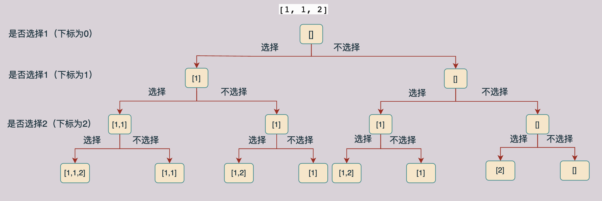
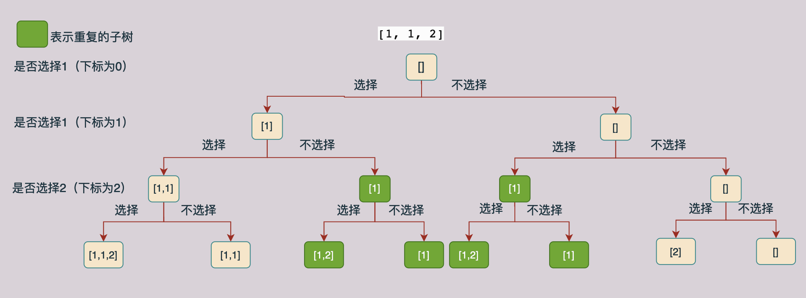
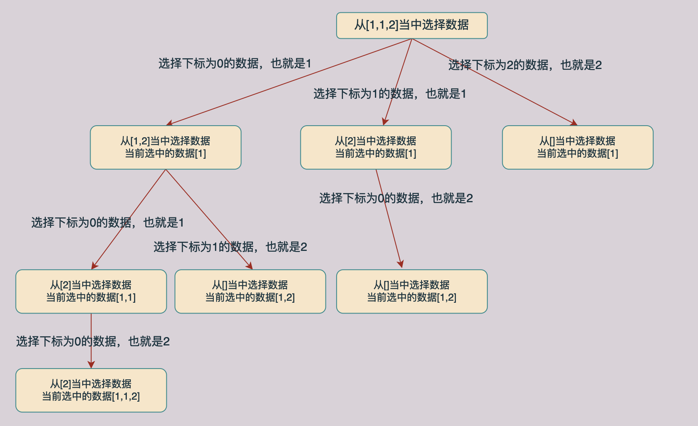
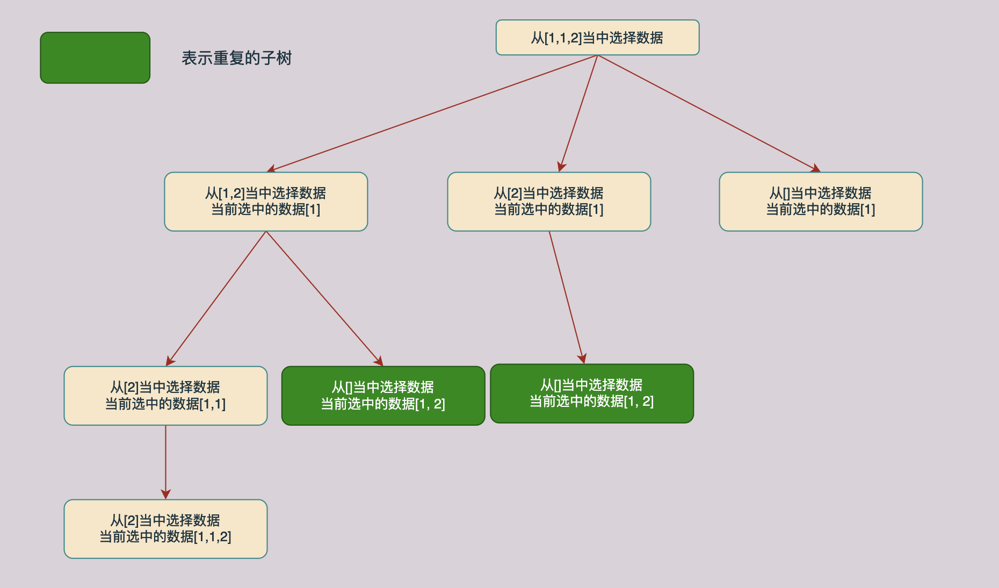
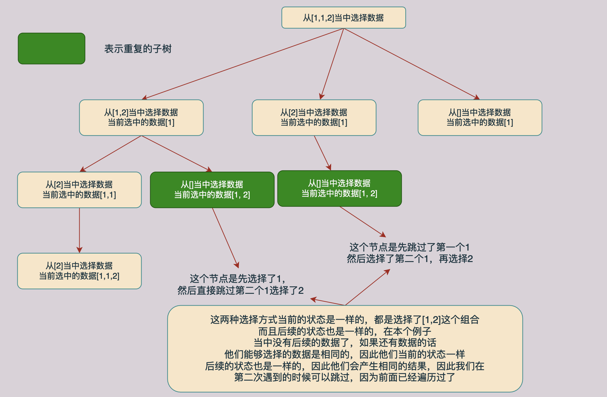

# [组合总和 II](https://leetcode.cn/problems/combination-sum-ii/)

## 题目介绍

>给定一个候选人编号的集合 candidates 和一个目标数 target ，找出 candidates 中所有可以使数字和为 target 的组合。
>
>candidates 中的每个数字在每个组合中只能使用 一次 。
>
>注意：解集不能包含重复的组合。 
>

示例：

```java
输入: candidates = [10,1,2,7,6,1,5], target = 8,
输出:
[
[1,1,6],
[1,2,5],
[1,7],
[2,6]
]
```

示例：

```java
输入: candidates = [2,5,2,1,2], target = 5,
输出:
[
[1,2,2],
[5]
]
```

## 问题分析

### 方法一

在这道问题当中我们仍然是从一组数据当中取出数据进行组合，然后得到指定的和，但是与前面的[组合总和](https://mp.weixin.qq.com/s/7A8-rmw0l5Y8c8SnQ5vqwQ)不同的是，在这个问题当中我们可能遇到重复的数字而且每个数字只能够使用一次。这就给我们增加了很大的困难，因为如果存在相同的数据的话我们就又可能产生数据相同的组合，比如在第二个例子当中我们产生的结果`[1, 2, 2]`其中的2就可能来自`candidates`当中不同位置的2，可以是第一个，可以是第三个，也可以是最后一个2。但是在我们的最终答案当中是不允许存在重复的组合的。当然我们可以按照正常的方式遍历，然后将得到的复合要求的结果加入到一个哈希表当中，对得到的结果进行去重处理。但是这样我们的时间和空间开销都会加大很多。

在这个问题当中为了避免产生重复的集合，我们可以首先将这些数据进行排序，然后进行遍历，我们拿一个数据来进行举例子：`[1,  2 1]`，现在我们将这个数据进行排序得到的结果为：`[1, 1, 2]`，那么遍历的树结构如下：



上图表示`[1, 1, 2]`的遍历树，每一个数据都有选和不选两种情况，根据这种分析方式可以构造上面的解树，我们对上面的树进行分析我们可以知道，在上面的树当中有一部分子树是有重复的（重复的子树那么我们就回产生重复的结果，因此我们要删除重复的分支，也就是不进行递归求解），如下图所示：



我们现在来分析一下上面图中产生重复子树的原因，在一层当中选1的到第二层不选1的子树和第一层不选1而第二层选1的树产生了重复，因此我们可以在第一层不选1第二层选1的子树当中停止递归。

根据上面的例子我们可以总结出来，在同一层当中，如果后面的值等于他前面一个值的话，我们就可以不去生成“选择”这个分支的子树，因为在他的前面已经生成了一颗一模一样的子树了。

现在我们的问题是如何确定和上一个遍历的节点是在同一层上面。我们可以使用一个`used`数组进行确定，当我们使用一个数据之后我们将对应下标的`used`数组的值设置为`true`，当递归完成进行回溯的时候在将对应位置的`used`值设置为`false`，因此当我们遍历一个数据的时候如果他前面的一个数据的`used`值是`false`的话，那么这个节点就和前面的一个节点在同一层上面。

根据上面的分析我们可以写出如下的代码：

```C++
class Solution {
    vector<vector<int>> ans;
    vector<int> path;
public:
    vector<vector<int>> combinationSum2(vector<int>& candidates, int target) {
      sort(candidates.begin(), candidates.end());
      vector<bool> used(candidates.size(), false);
      backtrace(candidates, target, 0, 0, used);
      return ans;
    }

    void backtrace(vector<int>& candidates, int target, int curIdx,
                   int curSum, vector<bool>& used) {
      if (curSum == target) { // 满足条件则保存结果然后返回
        ans.push_back(path);
        return;
      } else if (curSum > target || curIdx >= candidates.size()) {
        return;
      }
      if (curIdx == 0) {
        // 选择分支
        path.push_back(candidates[curIdx]); 
        used[curIdx] = true;
        backtrace(candidates, target, curIdx + 1, curSum + candidates[curIdx], used);
     		// 在这里进行回溯
        path.pop_back();
        used[curIdx] = false;
        // 不选择分支
        backtrace(candidates, target, curIdx + 1, curSum, used);
      }else {
       if (used[curIdx - 1] == false && candidates[curIdx - 1] ==
              candidates[curIdx]) { // 在这里进行判断是否在同一层，如果在同一层并且值相等的话 那就不需要进行选择了 只需要走不选择的分支及即可
         backtrace(candidates, target, curIdx + 1, curSum, used);
       }else{
         // 选择分支
         path.push_back(candidates[curIdx]);
         used[curIdx] = true;
         backtrace(candidates, target, curIdx + 1, curSum + candidates[curIdx], used);
         // 在这里进行回溯
         path.pop_back();
         used[curIdx] = false;
         // 不选择分支
         backtrace(candidates, target, curIdx + 1, curSum, used);
       }
      }
    }
};

```

### 方法二

在回溯算法当中我们一般有两种选择情况，这一点我们在前面[组合问题](https://mp.weixin.qq.com/s?__biz=Mzg3ODgyNDgwNg==&mid=2247486751&idx=1&sn=8e9cedd729d01ff8867fcb2c085ecbe3&chksm=cf0c9116f87b18002551eefcd773f4762d79d2c06614b304437bfcd382e14afa031d29cc4dcc&mpshare=1&scene=22&srcid=0921yRhazbXlqGuEZagKb0p9&sharer_sharetime=1663737871952&sharer_shareid=236a49567847c05f78e6b440ce6dabff#rd)当中已经介绍过了，一种方法是用选择和不选择去生成解树，这样我们将生成一颗二叉树的解树，另外一种是多叉树，下面我们来看一下后者的解树：



同样对上面的解树进行分析我们回发现同样的也存在相同子树的情况，如下图所示，途中绿色的节点就时相同的节点：



与前一种方法分析一样，当当前的数据和同一层上面的前一个数据相同的时候我们不需要进行求解了，可以直接返回跳过这个分支，因为这个分支已经在前面被求解过了。具体的分析过程如下图所示：



因此和第一种方法一样，我们也需要一个`used`数组去保存数据是否被访问过，但是在这个方法当中我们还可以根据遍历时候下标去实现这一点，因此不需要`used`数组了，代码如下所示：

#### Java代码

```java
class Solution {
    private List<List<Integer>> res = new ArrayList<>();
    private ArrayList<Integer> path = new ArrayList<>();

    public List<List<Integer>> combinationSum2(int[] candidates, int target) {
        Arrays.sort(candidates);
        backtrace(candidates, target, 0, 0);
        return res;
    }

    public void backtrace(int[] candidates, int target, int curSum,
                          int curPosition) {
        if (curSum == target) // 达到条件则保存结果然后返回
            res.add(new ArrayList<>(path));
        for (int i = curPosition;
             i < candidates.length && curSum + candidates[i] <= target;
             i++) {
          	// 如果 i > curPosition 说明 i 对应的节点和 curPosition 对应的节点在同一层
          	// 如果 i == curPosition 说明 i 是某一层某个子树的第一个节点
            if (i > curPosition && candidates[i] == candidates[i - 1])
                continue;
            path.add(candidates[i]);
            curSum += candidates[i];
            backtrace(candidates, target, curSum, i + 1);
          	// 进行回溯操作
            path.remove(path.size() - 1);
            curSum -= candidates[i];
        }
    }

}
```

#### C++代码

```C++
class Solution {
    vector<vector<int>> ans;
    vector<int> path;
public:
    vector<vector<int>> combinationSum2(vector<int>& candidates, int target) {
      sort(candidates.begin(), candidates.end());
      backtrace(candidates, target, 0, 0);
      return ans;
    }

    void backtrace(vector<int>& candidates, int target, int curIdx, int curSum) {
      if (curSum == target) {
        ans.push_back(path);
        return;
      } else if (curSum > target || curIdx >= candidates.size()) {
        return;
      }
      for(int i = curIdx; i < candidates.size() && curSum + candidates[i] <= target; ++i) {
        if (i > curIdx && candidates[i] == candidates[i - 1])
          continue;
        path.push_back(candidates[i]);
        backtrace(candidates, target, i + 1, curSum + candidates[i]);
        path.pop_back();
      }
    }
};
```

## 总结

在本篇文章当中主要给大家介绍了组合问题II，这个问题如果仔细进行分析的话会发现里面还是有很多很有意思的细节的，可能需要大家仔细进行思考才能够领悟其中的精妙之处，尤其是两种方法如何处理重复数据结果的情况。

---

以上就是本篇文章的所有内容了，我是**LeHung**，我们下期再见！！！更多精彩内容合集可访问项目：<https://github.com/Chang-LeHung/CSCore>

关注公众号：**一无是处的研究僧**，了解更多计算机（Java、Python、计算机系统基础、算法与数据结构）知识。


