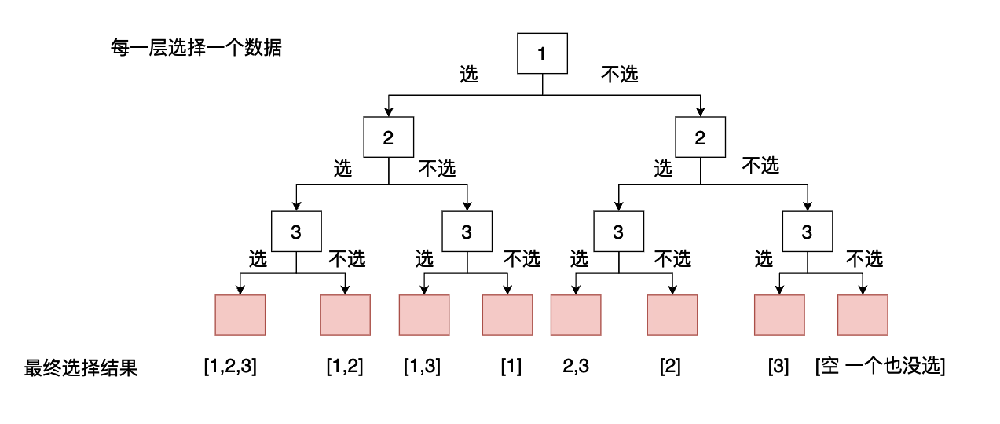
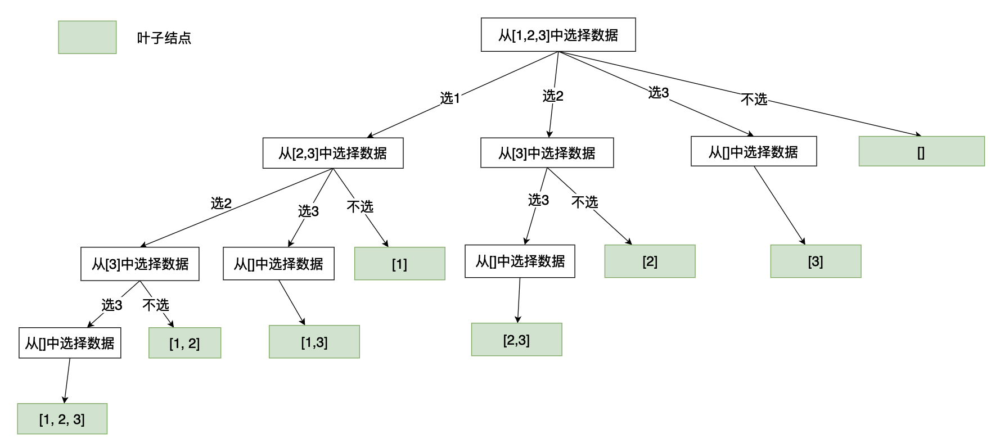

# [数组总和III](https://leetcode.cn/problems/combination-sum-iii/)

## 题目

>找出所有相加之和为 n 的 k 个数的组合，且满足下列条件：
>
>只使用数字1到9
>每个数字 最多使用一次 
>返回 所有可能的有效组合的列表 。该列表不能包含相同的组合两次，组合可以以任何顺序返回。

示例1：

```java
输入: k = 3, n = 7
输出: [[1,2,4]]
解释:
1 + 2 + 4 = 7
没有其他符合的组合了。
```

示例：

```java
输入: k = 3, n = 9
输出: [[1,2,6], [1,3,5], [2,3,4]]
解释:
1 + 2 + 6 = 9
1 + 3 + 5 = 9
2 + 3 + 4 = 9
没有其他符合的组合了。
```

## 问题分析

在这道题目当中我们需要从1-9几个数中间选择固定数目的数据去组合得到一个指定的结果。很显然这是一个组合问题，一般组合问题我们都可以使用回溯算法进行求解，在本篇文章当中我们主要通过介绍两种在回溯问题当中比较常用的分析方法，下面我们使用这两种分析方法去分析这个题目。

## 解法分析

### 解法一：选择和不选择

首先我们先降低一下这个数据的要求，我们要在1-3之间进行选择，指定数据的个数和相加之和。在这个问题当中对于每一个数据来说我们都用两种选择：将这个数据放入求和列表当中或者不将其放入求和列表当中。因此我们可以画出如下的求解树（对于每一个数据都有选和不选两种情况，每一层是针对一个具体的数据）：



如上图所示，第一层表示对数据1进行选择，第二层表示对数据2进行选择，第三层表示对数据3进行选择。每一个节点都会有两个分支，因为对应着选择和不选择，因此我们构造的树是一个完全二叉树。

现在我们的问题是，我们在遍历的时候，在什么条件下应该停下来。

- 当数据的和等于指定的值而且数据个数相等的肯定需要停下来，因为这个已经满足条件了，我们也不需要往里面继续加入数据了，因此我们在这样的节点的时候应该要停止递归。
- 

### 解法二：遍历选择

