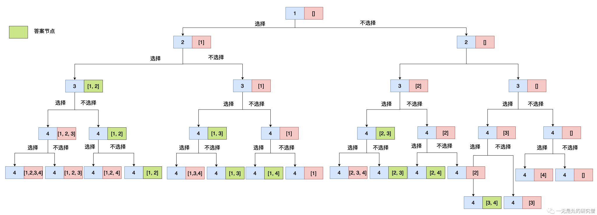
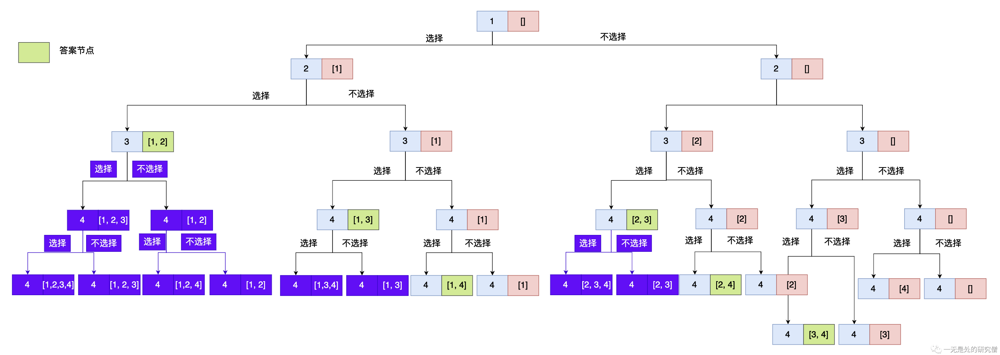
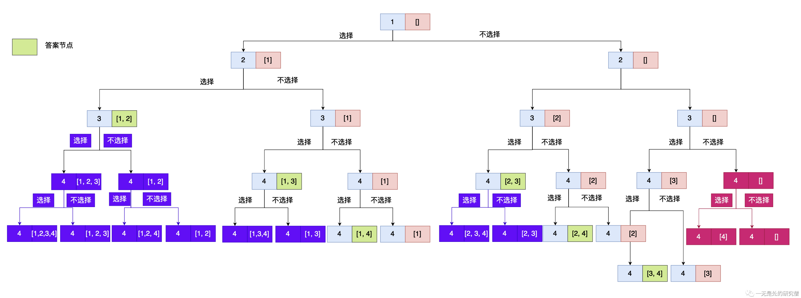
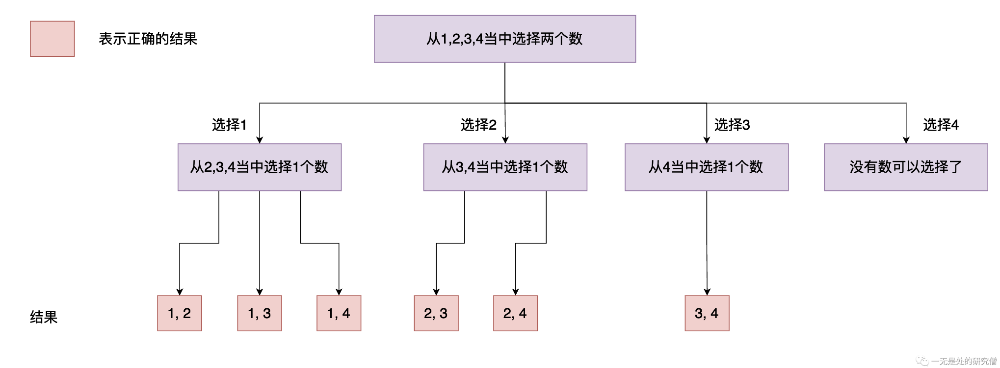

# 组合

## 前言

已经好久没有更新了🤣，从今天开始要保证每周的更新频率了（立个flag，应该能够想到打脸会来的很快😂），今天给大家分享一道`LeetCode`算法题，题目不是很困难，但是从这到简单的题目我们可以分析出回溯算法的几个核心要点，以后遇到需要回溯的题目可以应对的思路，知道应该怎么思考，朝什么方向去寻找解决问题的出口！

## [题目](https://leetcode.cn/problems/combinations/)

>给定两个整数 `n` 和 `k`，返回范围 `[1, n]` 中所有可能的 `k` 个数的组合。你可以按 **任何顺序** 返回答案。

例子：

```java
输入：n = 4, k = 2
输出：
[
  [2,4],
  [3,4],
  [2,3],
  [1,2],
  [1,3],
  [1,4],
]
```


## 解法

乍一看这道题好像是一个很直接的问题，我们只需要从[1, n]当中选出k个数据出来，比如说题目当中给出的，我们需要从[1, 4]这个区间取出两个数，那么我们只需要使用两层for循环即可，像下面这样：

```C++
for (int i = 1; i <= n; i++) {
  	// 在这里选择 i 
    for (int j = i + 1; j <= n; j++) {
        // 每一次循环选择 j 
    }
}
```


但是遗憾的是`k`是一个变量，它不是一个定值，如果他是一个定值的话，那么我们就可以使用上面的循环操作去解决这个问题，而且是很高效的。那这个问题我们应该如何解决的？我们思考一下，对于每一个数我们都有两种选择：选择和不选择，也就是是否需要讲这个数据加到集合当中去。

现在我们对上述给定的例子进行求解**（n = 4, k = 2）**，每一个数据都有两种选择，选和不选（很多回溯的问题都是可以按照这种思路）具体过程入下图所示，其中蓝色的节点表示待选择的数据，红色的框表示当前被选中的数据的集合：



上图是例子的解树，其中绿色的节点表示最终的答案，对于每个节点的数据都有两种选择办法，选和不选，因此上面的解决问题的树结构是一个完全二叉树，我们可以使用**深度优先遍历**去实现上面的解题过程。从上图来看我们可以进行一些剪枝，当我们选中的数据的个数已经达到`k`的时候我们不需要在进行递归，因为我们需要的数据长度是固定的，当达到之后我们不需要再加入数据了，因此也没有继续往下遍历的必要了。具体看下图，其中紫色节点表示不需要进行递归的节点：



因此当我们选中的元素达到`k`个的时候，我们就可以退出递归，因此这是我们的一个递归出口。



除了上面提到的递归出口之外我们还有另外一个隐藏的递归出口。当我们当前选择的数据的个数加上后面还剩下的所有的数据的时候还达不到我们所需要的数据的个数`k`的时候，我们也不需要在进行遍历了，可以直接退出递归了。

根据上面我们的思路，我们可以写出下面的代码：

```java
public void backTrace(int n, int k, List<Integer> path,
                      int idx) {
  // idx 表示当前正在遍历的数据
  if (path.size() == k){ // 如果选中的数据个数达到 k 了那么我们需要将当前选中数据的集合加入到我们返回的数据当中 ans 是选中的所有的数据的个数为 k 的集合
    ans.add(new ArrayList<>(path));
    return;
  } else if ((path.size() + n - idx + 1) < k)
    return;
  path.add(idx); // 加入一个数据 表示选择数据 idx
  backTrace(n, k, path, idx + 1);
  path.remove(path.size() - 1); // 移出上面加入的数据 表示在这里进行回溯 因为我们是深度优先遍历，前面将 idx 加入到了 path 当中 当递归返回的时候我们需要将加入的数据移出 因为这里表示不选择数据 idx 
  backTrace(n, k, path, idx + 1);
}
```

完整代码如下：

```java
class Solution {
  private List<List<Integer>> ans = new ArrayList<>();

  public List<List<Integer>> combine(int n, int k) {

    backTrace(n, k, new ArrayList<>(), 1);
    return ans;
  }

  public void backTrace(int n, int k, List<Integer> path,
                        int idx) {
    if (path.size() == k){
      ans.add(new ArrayList<>(path));
      return;
    } else if ((path.size() + n - idx + 1) < k)
      return;
    path.add(idx);
    backTrace(n, k, path, idx + 1);
    path.remove(path.size() - 1);
    backTrace(n, k, path, idx + 1);
  }

}
```

除了上面的实现方式之外，我们还有另外一种方式实现**选和不选**的操作。如果我们不选一个数据的话表示我们在后面对数据的选择过程当中就不会选到这个数据了，我们另外一种实现方式如下所示，可能看代码不能够很好的理解，可以结合后面的问题和图进行理解：

```java
public void backtrace(int n, int k,
                      int startPosition) {
  if (path.size() == k) {
    res.add(new ArrayList<>(path));
    return;
  }
  for (int i = startPosition; i <= n; i++) {
    path.add(i);
    backtrace(n, k, i + 1);
    path.remove(path.size() - 1);
  }
}
```



在上面的图当中，数据1在第一个节点出现之后不会在后面的节点再出现了，数据2在第二个节点出现之后就不会在出现了，数据3在第三个节点出现之后就不会在出现了，......

可能你会有疑问为什么是这样？为什么这样进行选择和**选和不选**得到的结果一样呢？

- 其实第一个节点就是选择数据1得到的所有的结果，表示选择数据1，后面的所有的节点就表示不选择数据1。
- 前面两个节点表示选择数据2得到的所有的结果，第二个节点之后的所有节点表示不选择2得到的结果。
- 前面三个节点表示选择数据3得到的所有的结果，第三个节点之后所有的节点表示不选择3得到的结果。

## 代码实现

### C++实现

#### 实现方式2

```c++
class Solution {
    vector<vector<int>> ans;
public:
    vector<vector<int>> combine(int n, int k) {
      backtrace(n, k, vector<int>());
      return ans;
    }

    void backtrace(int n, int k, vector<int> tmp, int cur=1) {
      if (tmp.size() == k) {
        ans.push_back(tmp);
        return;
      }
      if (tmp.size() + (n - cur) + 1 < k)
        return;
      tmp.push_back(cur);
      backtrace(n, k, tmp, cur + 1);
      tmp.pop_back();
      backtrace(n ,k, tmp, cur + 1);
    }
};

```

#### 实现方式2

```c++


#include <vector>

using namespace std;
class Solution {
    vector<vector<int>> ans;
public:
    vector<vector<int>> combine(int n, int k) {
      backtrace(n, k, vector<int>());
      return ans;
    }

    void backtrace(int n, int k, vector<int> tmp, int cur=1) {
      if (tmp.size() == k) {
        ans.push_back(tmp);
        return;
      }
      for (int i = cur; i <= n - (k - tmp.size()) + 1 ; ++i) {
        tmp.push_back(i);
        backtrace(n, k, tmp, i + 1);
        tmp.pop_back();
      }
    }
};
```

### Java实现

#### 实现方式1

```java
class Solution {
  private List<List<Integer>> ans = new ArrayList<>();

  public List<List<Integer>> combine(int n, int k) {

    backTrace(n, k, new ArrayList<>(), 1);
    return ans;
  }

  public void backTrace(int n, int k, List<Integer> path,
                        int idx) {
    if (path.size() == k){
      ans.add(new ArrayList<>(path));
      return;
    } else if ((path.size() + n - idx + 1) < k)
      return;
    path.add(idx);
    backTrace(n, k, path, idx + 1);
    path.remove(path.size() - 1);
    backTrace(n, k, path, idx + 1);
  }

}
```

#### 实现方式2

```java
class Solution {
    private List<List<Integer>> res = new ArrayList<>();
    private List<Integer> path = new ArrayList<>();
    public List<List<Integer>> combine(int n, int k) {

        backtrace(n, k, 1);
        return res;
    }

    public void backtrace(int n, int k,
                          int startPosition) {
        if (path.size() == k) {
            res.add(new ArrayList<>(path));
            return;
        }
        for (int i = startPosition; i <= n; i++) {
            path.add(i);
            backtrace(n, k, i + 1);
            path.remove(path.size() - 1);
        }
    }

}
```

