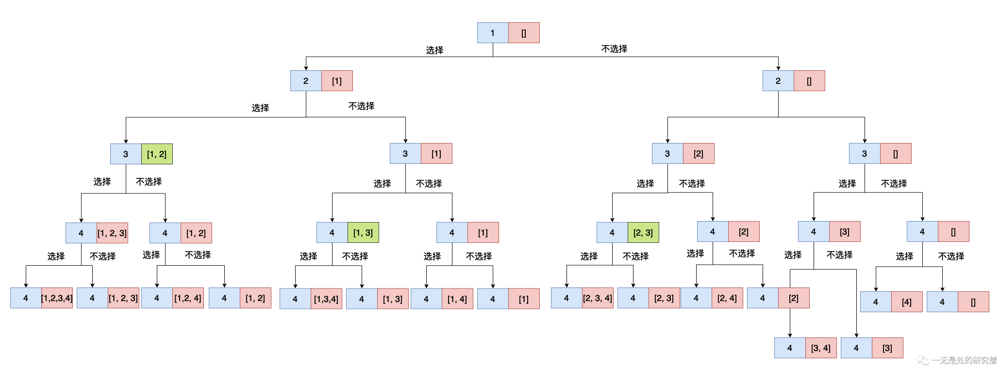

# 组合

## 前言

已经好久没有更新了，从今天开始要保证每周的更新频率了，今天给大家分享一道`LeetCode`算法题，题目不是很困难，但是从这到简单的题目我们可以分析出回溯算法的几个核心要点，以后遇到需要回溯的题目可以应对的思路，知道应该怎么思考！

## 题目

>给定两个整数 `n` 和 `k`，返回范围 `[1, n]` 中所有可能的 `k` 个数的组合。你可以按 **任何顺序** 返回答案。

例子：

```java
输入：n = 4, k = 2
输出：
[
  [2,4],
  [3,4],
  [2,3],
  [1,2],
  [1,3],
  [1,4],
]
```


## 解法

乍一看这道题好像是一个很直接的问题，我们只需要从[1, n]当中选出k个数据出来，比如说题目当中给出的，我们需要从[1, 4]这个区间取出两个数，那么我们只需要使用两层for循环即可，像下面这样：

```C++
for (int i = 1; i <= n; i++) {
  	// 在这里选择 i 
    for (int j = i + 1; j <= n; j++) {
        // 每一次循环选择 j 
    }
}
```


但是遗憾的是`k`是一个变量，它不是一个定值，如果他是一个定值的话，那么我们就可以使用上面的循环操作去解决这个问题，而且是很高效的。那这个问题我们应该如何解决的？我们思考一下，对于每一个数我们都有两种选择：选择和不选择，也就是是否需要讲这个数据加到集合当中去。

具体过程入下图所示:



## 代码实现

```c++


#include <vector>

using namespace std;
class Solution {
    vector<vector<int>> ans;
public:
    vector<vector<int>> combine(int n, int k) {
      backtrace(n, k, vector<int>());
      return ans;
    }

    void backtrace(int n, int k, vector<int> tmp, int cur=1) {
      if (tmp.size() == k) {
        ans.push_back(tmp);
        return;
      }
      for (int i = cur; i <= n - (k - tmp.size()) + 1 ; ++i) {
        tmp.push_back(i);
        backtrace(n, k, tmp, i + 1);
        tmp.pop_back();
      }
    }
};
```

