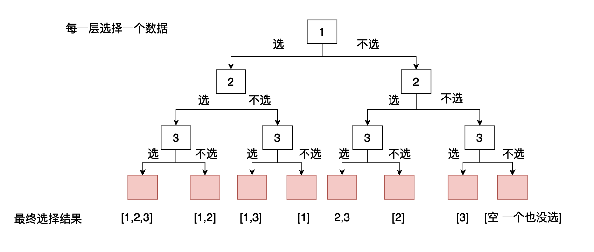
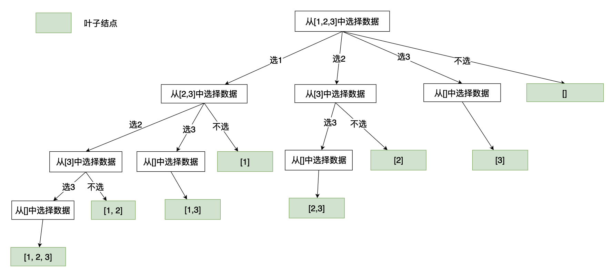

# [数组总和III](https://leetcode.cn/problems/combination-sum-iii/)

## 题目

>找出所有相加之和为 n 的 k 个数的组合，且满足下列条件：
>
>只使用数字1到9
>每个数字 最多使用一次 
>返回 所有可能的有效组合的列表 。该列表不能包含相同的组合两次，组合可以以任何顺序返回。

示例1：

```java
输入: k = 3, n = 7
输出: [[1,2,4]]
解释:
1 + 2 + 4 = 7
没有其他符合的组合了。
```

示例：

```java
输入: k = 3, n = 9
输出: [[1,2,6], [1,3,5], [2,3,4]]
解释:
1 + 2 + 6 = 9
1 + 3 + 5 = 9
2 + 3 + 4 = 9
没有其他符合的组合了。
```

## 问题分析

在这道题目当中我们需要从1-9几个数中间选择固定数目的数据去组合得到一个指定的结果。很显然这是一个组合问题，一般组合问题我们都可以使用回溯算法进行求解，在本篇文章当中我们主要通过介绍两种在回溯问题当中比较常用的分析方法，下面我们使用这两种分析方法去分析这个题目。

## 解法分析

### 解法一：选择和不选择

首先我们先降低一下这个数据的要求，我们要在1-3之间进行选择，指定数据的个数和相加之和。在这个问题当中对于每一个数据来说我们都用两种选择：将这个数据放入求和列表当中或者不将其放入求和列表当中。因此我们可以画出如下的求解树（对于每一个数据都有选和不选两种情况，每一层是针对一个具体的数据）：



如上图所示，第一层表示对数据1进行选择，第二层表示对数据2进行选择，第三层表示对数据3进行选择。每一个节点都会有两个分支，因为对应着选择和不选择，因此我们构造的树是一个完全二叉树。

现在我们的问题是，我们在遍历的时候，在什么条件下应该停下来。

- 第一种情况是当数据的和等于指定的值而且数据个数相等的肯定需要停下来，因为这个已经满足条件了，我们也不需要往里面继续加入数据了，因此我们在这样的节点的时候应该要停止递归。
- 第二种情况是如果我们在遍历的时候，当前列表当中数据的个数加上后面所的数据的时候，数据个数还不足k的时候我们也需要听下来，因为继续遍历没有意义，即使把后面的数据全部放入列表也不符合条件了，因此没有继续遍历子树的必要了。
- 第三种情况是，当我们选择的数据个数大于k的时候我们需要停止递归，因为我们只能选择k个数据。
- 第四种情况是，当我们选择的数据的和已经大于指定的数据的时候也需要停止递归，因为再往列表当中加入数据的话和只会越来越大。
- 当遍历完1-9的所有数据的时候应该停下来。

根据上面的分析我们可以写出如下代码：

#### java 代码

```java
import java.util.ArrayList;
import java.util.List;

public class LeetCode216 {

  private List<List<Integer>> ans = new ArrayList<>();
  private List<Integer> path = new ArrayList<>();

  public List<List<Integer>> combinationSum3(int k, int n) {
    backTrace(k, n, 1, 0);
    return ans;
  }

  public void backTrace(int k, int n, int cur, int curSum) {
    // 当满足条件的时候将得到的结果加入到最终的答案当中
    if (curSum == n && path.size() == k) {
      ans.add(new ArrayList<>(path));
      return;
    }
    // 在这里判断上文谈到的几个递归停止条件
    if ( cur >= 10 || path.size() > k || curSum > n
            || (path.size() + (10 - cur) + 1) < k) return;
    // 选择数据
    path.add(cur);
    curSum += cur;
    backTrace(k, n, cur + 1, curSum);
    // 下面两行代码进行回溯过程
    curSum -= cur;
    path.remove(path.size() - 1);
    // 不选择数据
    backTrace(k, n, cur + 1, curSum);
  }
}

```

### 解法二：遍历选择

在上一个方法当中我们的分析方法是每一个数据都有两种选择办法选和不选。在接下来我们要讨论的分析方法是使用组合的观点去进行分析。下图是我们的分析过程得到的树。



首先我们来分析一下这个树是怎么生成的：

>首先从待选择的数据当中进行遍历选择形成一个分支，然后分支能够选择的数据就是从这个数据往后的数据，比如对于第一个分支来说它选择了数据1，而他后面的数据是`[2, 3]`，因此他的子分支只能够从`[2, 3]`当中选择数据。对于第二个分支来说，它选择了2，他后面的数据只有`[3]`了，因此他只能够从3当中选择数据。如此进行递归下去就得到了上面谈到的树。

从第一层到第二层变化的时候，第一个分支表示所有包含1的组合，第二个分支表示所有包含2的组合，第三个表示所有包含3的分支。但是这种说法是不够准确的，准确的来说第一个分支也有包含2的组合，包含3的组合，第2个分支也有包含3的组合，更准确的来说是前`n`个分支有数据`n`的所有组合。因此上面的树结构和递归方式能够组合出所有的数据。

现在我们的任务就是需要用代码将上面的这颗树生成出来，具体代码如下：

#### C++代码

```c++
class Solution {
    vector<vector<int>> ans;
    vector<int> path;
public:
    vector<vector<int>> combinationSum3(int k, int n) {
      backtrace(k, n, 1, 0);
      return ans;
    }

    void backtrace(int k, int n, int cur, int curSum) {
      // 如果满足要求则将最终的数据加入到返回的答案当中
      if (curSum == n && path.size() == k) {
        ans.push_back(path);
        return;
      }
      // 这里就是上面谈到的递归终止条件
      if (cur >= 10 || path.size() >= k || n <= curSum || (path.size() + (10 - cur) + 1) < k)
        return;
      // 遍历每一个数据产生对应的分支 
      for (int i = cur; i <= 10 - (k - path.size()); ++i) {
        path.push_back(i);
        curSum += i;
        // 产生子树
        backtrace(k, n, i + 1, curSum);
        // 下面两行进行回溯操作
        curSum -= i;
        path.pop_back();
      }
    }
};
```

## 总结

在本篇文章当中主要给大家介绍了组合问题III，主要用两种不同的方式去解决这个问题，第一个种解法更加容易理解一些，但是递归的深度更深，第二种方法虽然理解起来更加复杂，但是递归的深度是比第一种方法小的，空间复杂度更低。

---

以上就是本篇文章的所有内容了，我是**LeHung**，我们下期再见！！！更多精彩内容合集可访问项目：<https://github.com/Chang-LeHung/CSCore>

关注公众号：**一无是处的研究僧**，了解更多计算机（Java、Python、计算机系统基础、算法与数据结构）知识。


