# Linux命令系列之top——里面藏着很多鲜为人知的宝藏知识


## 简介

top命令是我们经常用来查看系统信息的一个指令，它提供了一个动态的而且是实时的借口帮助我们去查看系统执行时的进程、线程和系统参数的信息。

## top命令输出内容详细剖析

首先我们先看一下top命令的输出结果：
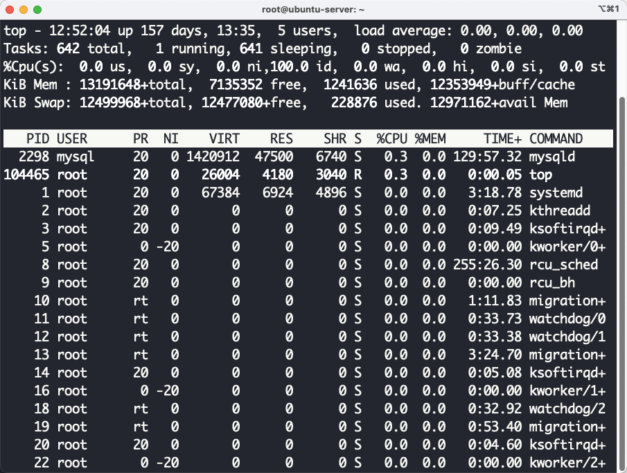

我们现在一一分析这些字段的含义：

#### 第一行

- `12:53:04`表示当前时间，也就是当前真实的时间。

- `up 157 days 13:35`，表示这个系统从启动到现在的时间，上图显示的含义就是这个系统从157天13个小时35分钟以前就启动了。
- `5 users` 表示当前在使用这个机器的用户数量。
- `load average: 0.00, 0.00, 0.00` ，这个值表示系统过去1分钟，5分钟，15分钟的系统负载。现在有一个问题就是，什么是这里谈到的系统负载。所谓系统负载，我们拿一分钟来举例子，我们将一分钟一个CPU时间定义为t，在这一分钟之内总共消耗的CPU时间为c，那么在这一分钟之内的负载为$\frac{c}{t}$，需要注意的是这个消耗的CPU时间c是可以大于t的，因为一个程序可能使用了多个CPU（并发程序，也可能是多个进程同时在使用不同的CPU）。

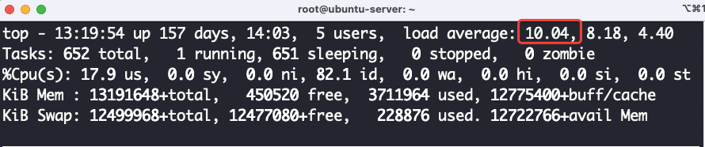

比如上面图中的1分钟内的负载大约是10，那么在过去的一分钟之内系统当中各种程序所消耗的CPU时间为$c = 10.04 \times t$。他表示的意思就是在过去的1分钟之内，CPU时间的消耗可以看作大约有10个CPU在满负荷运转。**注意：**这里是可以看作是10个CPU在满负荷的运转，其实真实情况可以是在过去的一分钟之内有20个CPU在进行计算，然后每个CPU的计算时间为$\frac{1}{2}t$，或者其他相同的CPU消耗情况。

#### 第二行

- 第二行主要表示当前系统当中任务的相关情况，所谓任务就是当前系统当中一共有多少个进程。
- `652 totoal`，这个表示当前系统当中一共有652个进程。
- `1 runnung`，表示有一个进程正在执行。
- `651 sleeping`，表示有651个进程处于睡眠状态，也就是不需要使用CPU的状态。
- `0 stoped`，表示有0个进程处于`stopped`状态，这个状态就是被停下来的进程，比如说通过ctrl+z让一个进程停下来，你可以通过给这个进程发送一个信号SIGCONT让这个进程恢复执行，linux当中进程的状态变换如下所示：

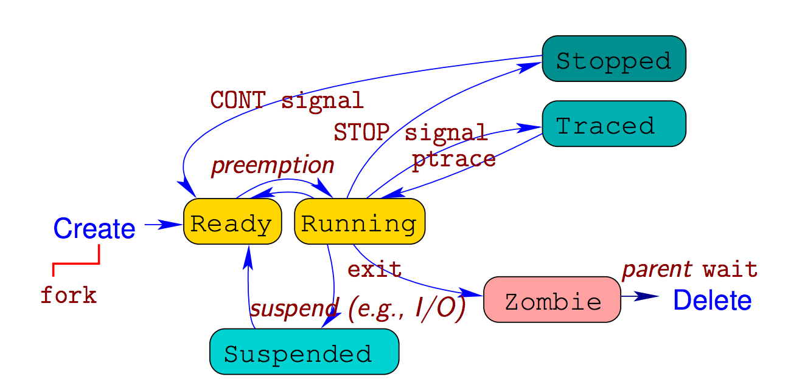

- `0 zombie`，这个就表示僵尸进程的个数，这里是0个僵尸进程，所谓僵尸进程就是一个进程执行完成了，对于C程序来说你可以理解为你的`main`函数执行完成了（这个不够准确，其实`main`函数执行完成之后还会有其他函数需要执行，但是这里你可以大致这么理解），如果这个时候（函数执行完成），这个进程的父进程却没有接受子进程发送给他的信号（子进程在执行完成之后会给父进程发送信号，父进程需要通过wait等系统调用去接受这个信号），那么子进程就处于zombie状态，处于这个状态的进程就需要父进程接受它发送的信号，然后子进程的系统资源就可以被回收了，然后子进程会彻底消亡。

我们现在花一点时间来谈一谈linux当中的进程状态。

- `Ready`，当进程被创建完成之后他就处于`Ready`状态，在这个状态下的进程只差CPU了，也就是说，他现在只需要被操作系统调度获取CPU然后他就可以执行了。

- `Running`，当进程从`Ready`状态获取CPU的执行权的时候，进程就处于Running状态，这个状态表示进程正在执行。
- `traced`，这个状态主要是一个进程处于调试状态，这个状态需要调试的进程给这个被调试的进程发送信号，然后和这个进程才可以继续执行。
- `Zombie`，当进程执行完成之后，父进程接受子进程发送的信号之前，进程就处于这个状态。
- `Suspended`，这个状态表示进程被挂起，当进程请求IO的时候，需要阻塞等待IO请求完成，这个时候的进程状态就是`Suspened`状态。

#### 第三行

这一行主要是各种时间所占的百分比的统计，这个数据的统计时间区间是，从本次刷新到上一次刷新之间，实在这个区间统计的数据

- `us`，运行没有指定优先级的用户进程所消耗的CPU时间所占百分比，默认的终端执行的程序都是没有指定优先级的，我们可以使用`nice`这个命令来改变程序执行的优先级：`sudo nice -n -10 ./time`。
- `sy`，运行内核进程所消耗的CPU时间所占的百分比。
- `ni`，运行指定了修改过优先级之后的用户进程所占的CPU时间百分比。这里可以结合PR和NI两个字段进行分析，我们现在执行`sudo nice -n 10 ./a.out`命令，在./a.out当中我启动了10个死循环的线程，我们来看一下它的top输出结果：

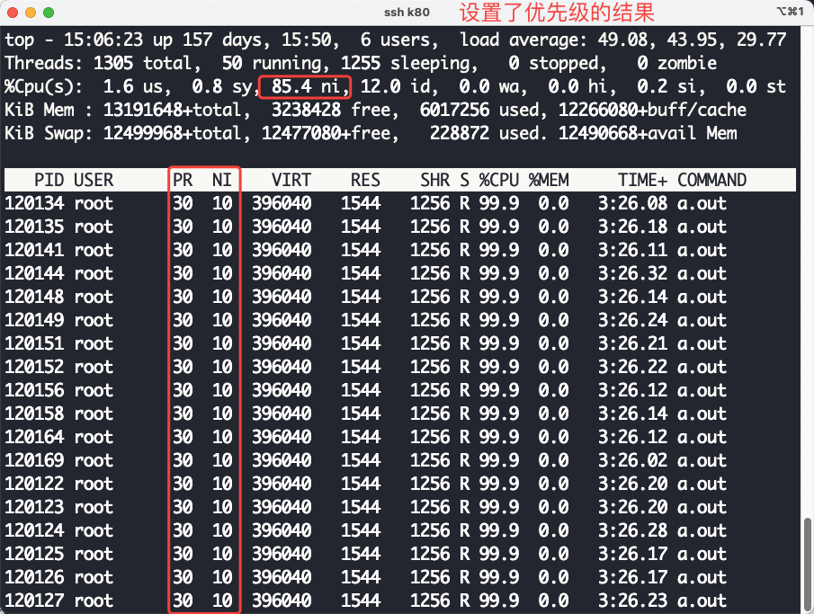

从上面的结果来看我们通过nice命令修改来进程优先级，但是需要主要的是一个进程的PR值越大他的优先级越低，NI值越大优先级越低，也就是说我们上面实际上是降低了进程执行的优先级了，但是我们可以看到ni的值是发生变化了的，这也印证了上面我们所谈到的ni值发生变化的过程。我们再来看一下没有设置优先级的结果，直接执行`sudo ./a.out`：

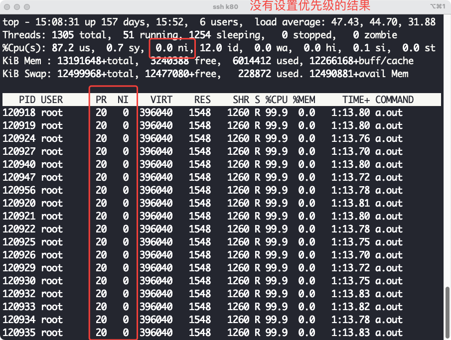

但是在实验测试的过程当中发现了一个奇怪的问题，但我们提升进程的优先级（提升优先级需要管理员权限）的时候ni的值没有发生变化，因此上面所谈到的ni的变化应该只适用于普通用户的进程（因为降低优先级不需要管理员权限）。

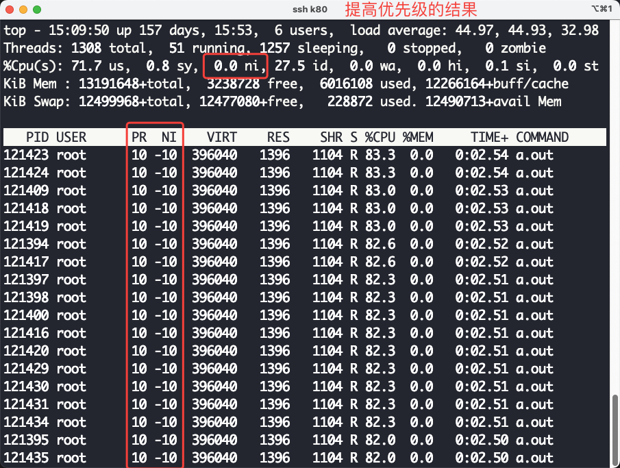

- `id`， idle进程执行所占的CPU时间百分比，当系统当中没有足够的进程让CPU执行的时候，idle进程会被调度到CPU上进行执行，这个idle进程是为了让操作系统能够良好的执行起来所设置的，idle进程主要执行HLT指令，这个指令主要是让CPU节能，不需要CPU满负荷运转，因为这个时候没有具体的进程需要执行，这个百分比越大说明系统负载越轻，CPU不繁忙。
- `wa`，这个很好解释，等待IO的时间。
- `hi`，处理硬件中断所消耗的时间。
- `si`，处理软件中断所消耗的时间
- `st`，这个时间稍微有点复杂，IBM解释原文为：

> Steal time is the percentage of time a virtual CPU waits for a real CPU while the hypervisor is servicing another virtual processor.

这个主要是虚拟机的虚拟CPU等待真实物理CPU的时间，可以大致认为是`Ready`状态到`Running`状态的等待时间，如果这个值越大说明虚拟机运行状态越不好，因为它等待真实CPU的时间很长。

#### 第四行

这一行表示的是物理内存的信息，单位是KiB。

- total, 表示一共有多少内存，也就是物理内存大小。
- free, 表示还有多少物理内存没有使用。
- used, 表示使用了多少物理内存。
- buff/cache, 表示用于用于缓存的物理内存的大小。

#### 第五行

这一行主要表示的是对换区的数据，所谓对换区就是当操作系统发现内存满了之后，操作系统会选择部分不常使用的页面将它放到磁盘当中当需要使用的时候再将这部分数据从磁盘当中读取出来。

- total, 表示对换区的总大小。
- free, 表示对换区当中还有多少空间没有使用。
- used, 表示对换区当中有多少空间被使用了。
- 最后一项 avail Mem 是一个可用于启动新程序的内存大小的估计值。

#### 表头内容含义

- PID，表示进程号，就是每个进程的ID。
- USER，就是用户的名称。
- PR，优先级值。
- NI，nice值，通过程序给进程设置的。
- VIRT，进程使用的虚拟内存的大小，单位是KiB。
- RES，常驻内存的内存大小，单位是KiB。
- SHR，共享内存的大小，单位是KiB。
- S，表示进程的状态，有一下几个状态。
  - D，不能够中断的睡眠状态。
  - R，表示程序正在CPU上执行。
  - S，表示进程正在睡眠。
  - T，进程被信号停止执行。
  - t，表示进程正在被调试器追踪，调试器将这个进程停了下来。
  - Z，zombie表示是一个僵尸进程。
- %CPU，上次一刷新之前对应的进程对CPU的占有率，这个值是可以突破100%的，因为一个进程可以有多个进程，比如下面这样，我们开启10个线程进行死循环：

```c++

#include <pthread.h>


void* func(void * args) {
  while (1)
  {
    /* code */
  }
  
}

int main() {
  #define num_threads 10
  pthread_t t[num_threads];
  for(int i = 0; i < num_threads; i++) {
    pthread_create(&t[i], NULL, func, NULL);
  }
  for (size_t i = 0; i < num_threads; i++)
  {
    pthread_join(t[i], NULL);
  }
  
  return 0;
}
```

执行上面的程序之后，top的输出结果如下所示：

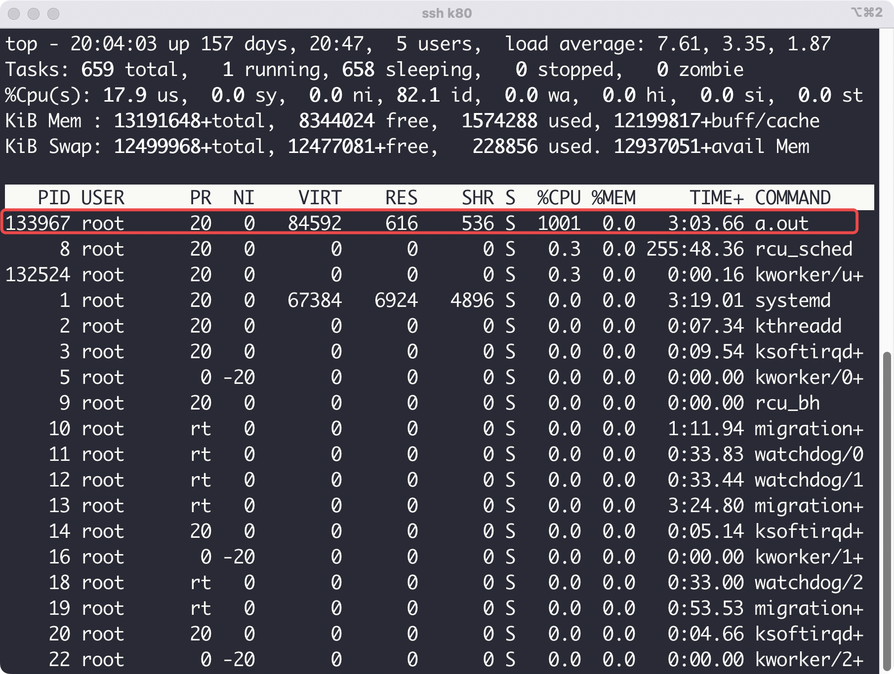

从上面的这个结果我们可以知道CPU的占有率是可以超过%100的，这个值的计算主要是在刷新之间内一个进程消耗的CPU时间和在这段时间内一个CPU能够产生的CPU时间的比值。

- %MEM，这个主要是进程使用的内存占用实际的可用的物理内存的比例。
- TIME+，这个表示自从进程启动以来累计消耗的CPU时间。
- COMMAND，这个表示启动进程的时候执行的命令。

## top命令交互操作

- c，详细显示命令行的内容，你在交互模式下直接按下键盘上的c即可。

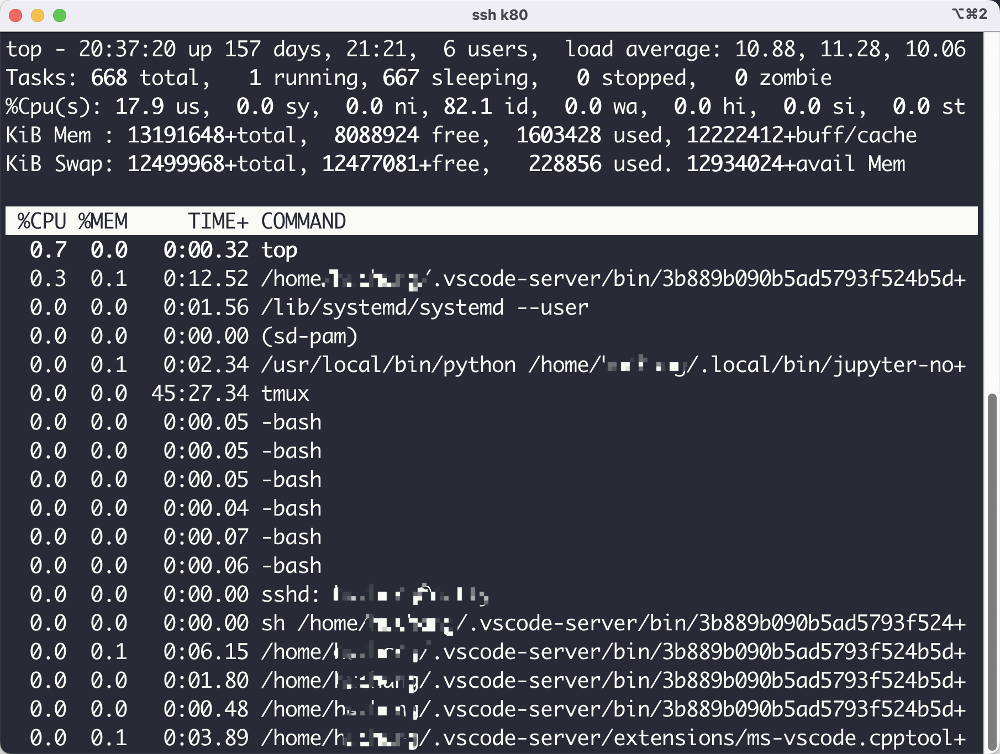

- o，在交互模式下先按下键盘上的o，然后就可以输入过滤条件，在这里掩饰的是COMMAND=a.out的进程：

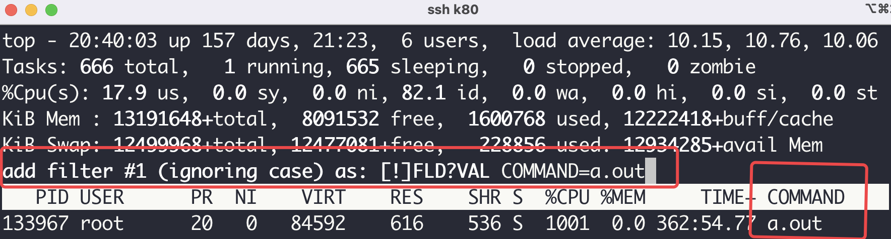

- k，shell给我们提供了一个非常方便的操作我们可以在交互模式下选择我们想要杀死的进程，比如在下图当中我们杀死进程135020。

我们先在交互模式下先按下键盘上的k，然后输入进程号，然后输入回车，再输入想发送的信号类型。

输入进程号

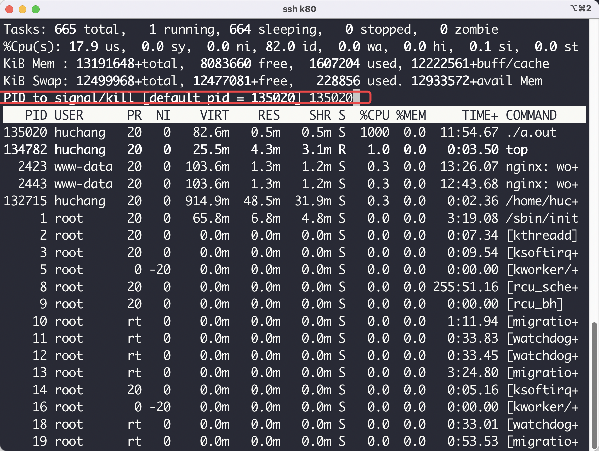

再输入想要发送的信号：

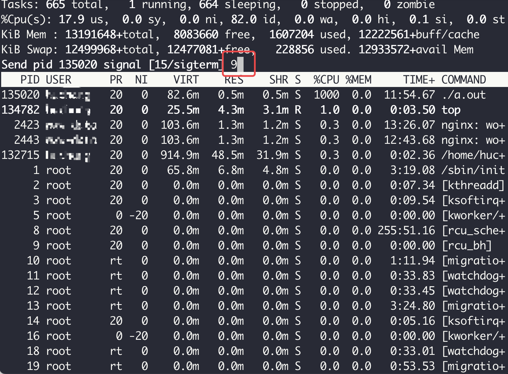

这里可以输入代表信号的数字，也可以输入代表信号的名字，不同的信号的名字和代表输入如下：

```C++
 1) SIGHUP	 2) SIGINT	 3) SIGQUIT	 4) SIGILL	 5) SIGTRAP
 6) SIGABRT	 7) SIGBUS	 8) SIGFPE	 9) SIGKILL	10) SIGUSR1
11) SIGSEGV	12) SIGUSR2	13) SIGPIPE	14) SIGALRM	15) SIGTERM
16) SIGSTKFLT	17) SIGCHLD	18) SIGCONT	19) SIGSTOP	20) SIGTSTP
21) SIGTTIN	22) SIGTTOU	23) SIGURG	24) SIGXCPU	25) SIGXFSZ
26) SIGVTALRM	27) SIGPROF	28) SIGWINCH	29) SIGIO	30) SIGPWR
31) SIGSYS	34) SIGRTMIN	35) SIGRTMIN+1	36) SIGRTMIN+2	37) SIGRTMIN+3
38) SIGRTMIN+4	39) SIGRTMIN+5	40) SIGRTMIN+6	41) SIGRTMIN+7	42) SIGRTMIN+8
43) SIGRTMIN+9	44) SIGRTMIN+10	45) SIGRTMIN+11	46) SIGRTMIN+12	47) SIGRTMIN+13
48) SIGRTMIN+14	49) SIGRTMIN+15	50) SIGRTMAX-14	51) SIGRTMAX-13	52) SIGRTMAX-12
53) SIGRTMAX-11	54) SIGRTMAX-10	55) SIGRTMAX-9	56) SIGRTMAX-8	57) SIGRTMAX-7
58) SIGRTMAX-6	59) SIGRTMAX-5	60) SIGRTMAX-4	61) SIGRTMAX-3	62) SIGRTMAX-2
63) SIGRTMAX-1	64) SIGRTMAX
```

- u，通过用户过滤，在交互模式下按下键盘上的u键，然后就可以输入你想看那个用户的进程，输入对应的用户名称即可，比如说看root用户的进程：

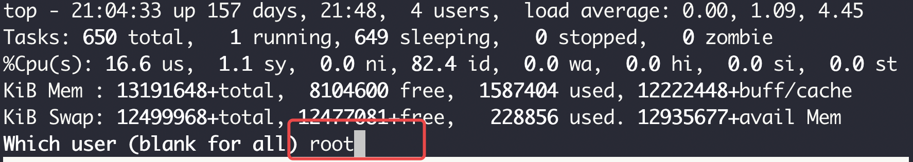

然后我们就只能够看到root用户的进程了。

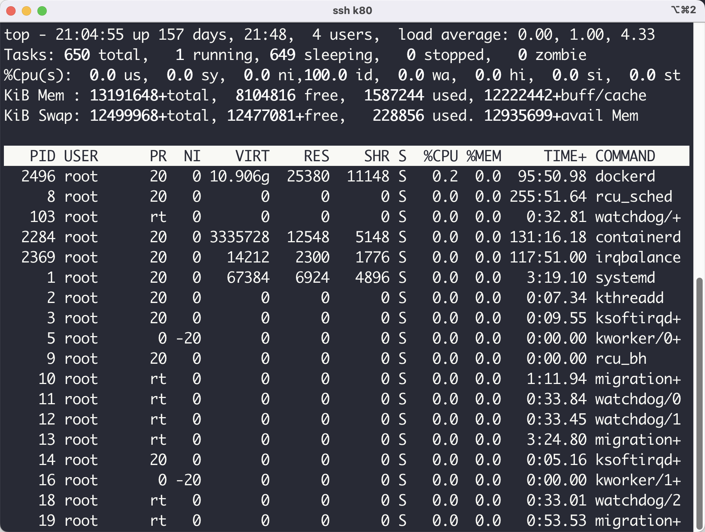

- h，查看帮助信息：

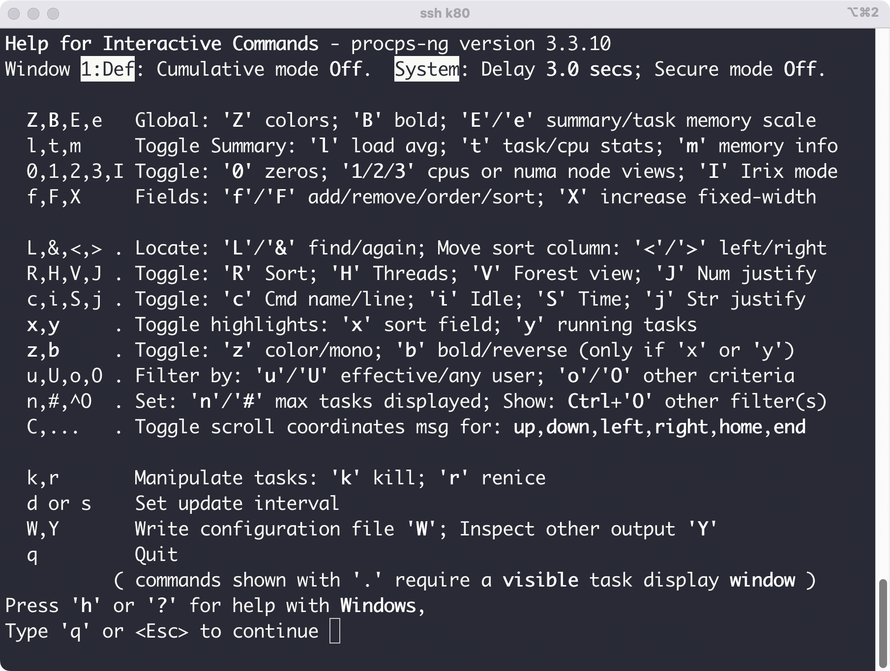

- i，过滤掉CPU利用率很低的进程，很多时候我们在进行系统分析的时候需要去判断那个进程CPU占有率高，因此i是一个非常有效的方式过滤掉干扰进程。

---

以上就是本篇文章的所有内容了，我是**LeHung**，我们下期再见！！！更多精彩内容合集可访问项目：<https://github.com/Chang-LeHung/CSCore>

关注公众号：**一无是处的研究僧**，了解更多计算机（Java、Python、计算机系统基础、算法与数据结构）知识。


