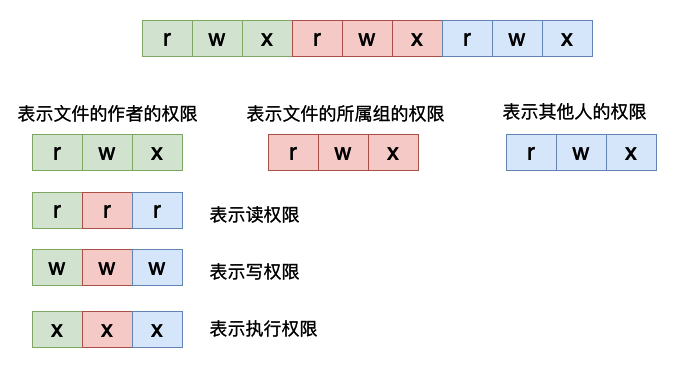
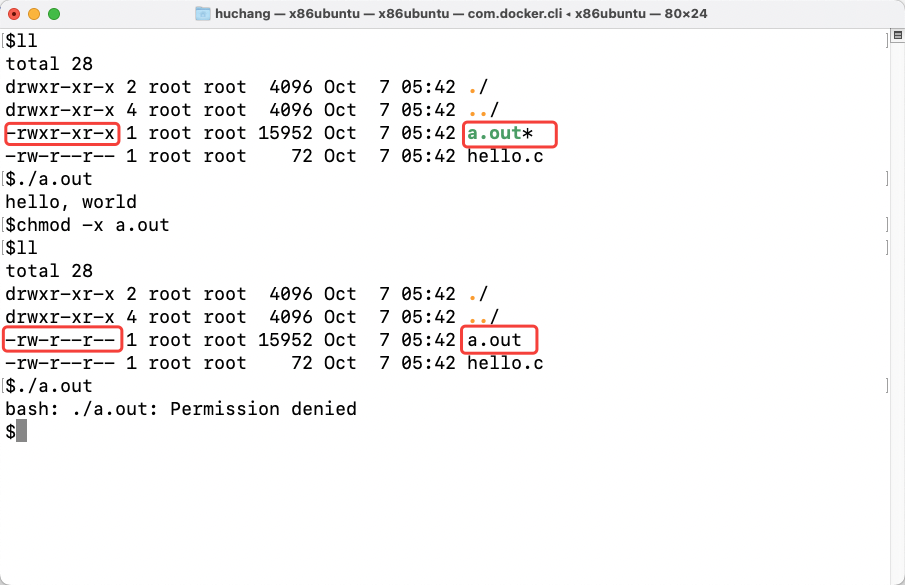
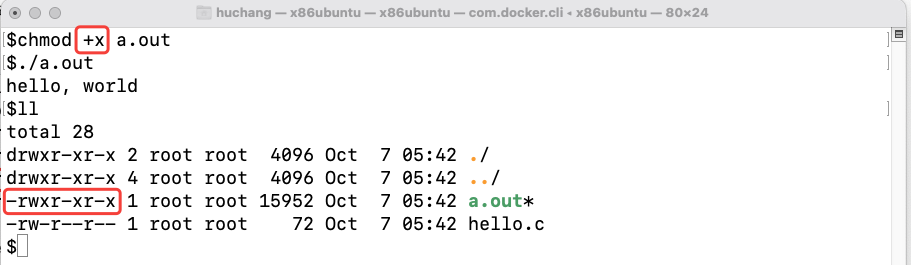
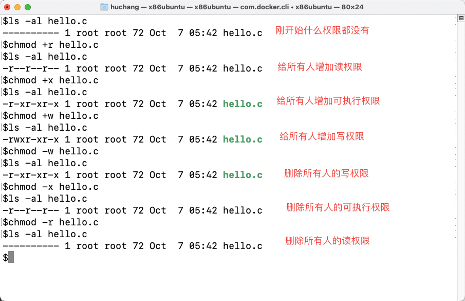
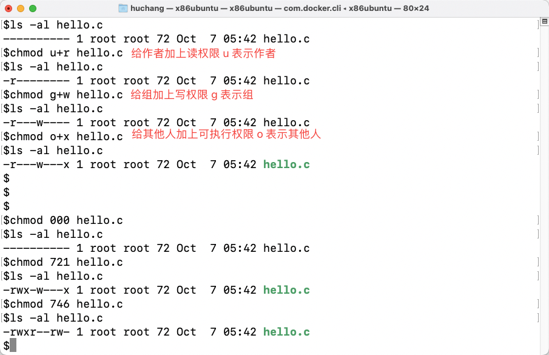
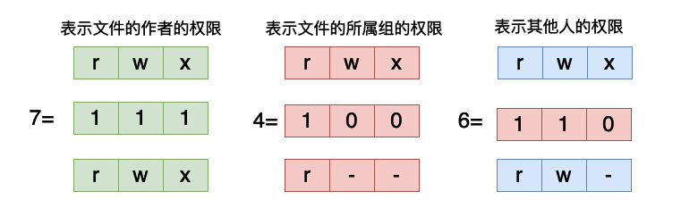
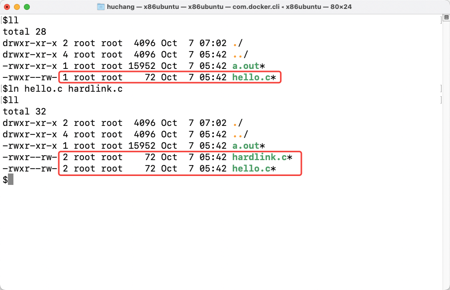
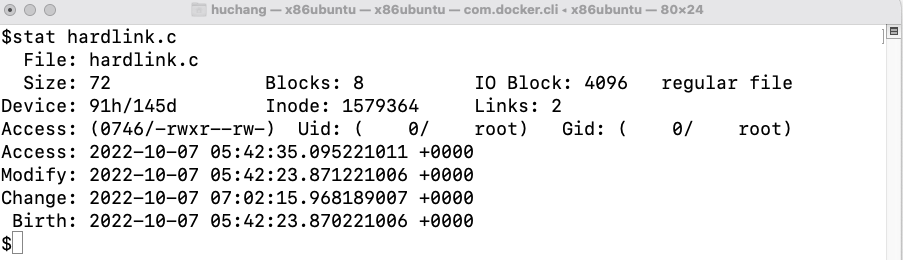

# Linux命令系列之ls——原来最简单的ls这么复杂

ls命令应该是我们最常用的命令之一了，但是我们可能容易忽略那些看起来最简单的东西。

## 简介

ls命令的使用格式如下

```shell
ls [选项] [具体的文件] # [] 表示可选
```

- 直接在命令行输入`ls`将当前目录下的列出当前目录下的文件和目录。

```shell
$ls
LICENSE  README.md  hello.c
```

- 也可以指定具体的目录和文件

```shell
$ls /
bin   dev  home  lib32  libx32  mnt  proc  run   srv  tmp  var
boot  etc  lib   lib64  media   opt  root  sbin  sys  usr
```

- 展示隐藏文件（所谓隐藏文件就是以`.`开头的目录或者文件），增加`-a`选项。

```shell
$ls -a
.  ..  .git  LICENSE  README.md  hello.c # . 表示当前目录 .. 表示上一级目录
```

- 展示文件的详细信息。

```shell
$ls -al
total 44
drwxr-xr-x 3 root root  4096 Oct  6 04:20 .
drwx------ 1 root root  4096 Oct  7 03:16 ..
drwxr-xr-x 8 root root  4096 Aug 26 15:28 .git
-rw-r--r-- 1 root root 18027 Aug 26 15:28 LICENSE
-rw-r--r-- 1 root root   210 Aug 26 15:28 README.md
-rw-r--r-- 1 root root    72 Aug 26 15:32 hello.c
```

## 详细信息说明

我们现在来仔细分析一下`ls`输出结果：

第一行 `total 44`，表示这个目录下面所有的文件的大小总和，单位是`KiB`。

然后是接下来的每一行，每一行的开头都有10个字符，他们的含义具体如下：

### 文件类型说明

第一个字符，有的是`d`, 有的是`-`，在linux系统当中，这第一个字符表示文件的类型，他有如下几种类型：

- `d`，表示目录，比如说上面的`.`当前目录，`..`上一级的目录。
- `-`，表示一般的文件，比如说上面的`hello.c`.
- `b`，表示块设备，比如我们的磁盘就是一种块设备，他们的这个位置都是`b`。

```shell
$ls -al /dev/ | grep sda
brw-rw----  1 root disk      8,   0 Apr 30 23:16 sda
brw-rw----  1 root disk      8,   1 Apr 30 23:16 sda1
brw-rw----  1 root disk      8,   2 Apr 30 23:16 sda2
brw-rw----  1 root disk      8,   3 Apr 30 23:16 sda3
```

- `l`，表示一个符号链接文件，也叫做软链接。比如我们创建一个软链接文件，并且查看它，软链接就相当于windows中的快捷方式，它并不真正的去存储数据，简单说来只是存储来一个指向一个文件的链接。

```shell
$ln -s hello.c softlink.c
$ls -al
total 52
drwxr-xr-x 3 root root  4096 Oct  7 03:39 .
drwx------ 1 root root  4096 Oct  7 03:33 ..
drwxr-xr-x 8 root root  4096 Aug 26 15:28 .git
-rw-r--r-- 1 root root 18027 Aug 26 15:28 LICENSE
-rw-r--r-- 1 root root   210 Aug 26 15:28 README.md
-rw-r--r-- 3 root root    72 Aug 26 15:32 copy.c
-rw-r--r-- 3 root root    72 Aug 26 15:32 dcopy.c
-rw-r--r-- 3 root root    72 Aug 26 15:32 hello.c
lrwxrwxrwx 1 root root     7 Oct  7 03:39 softlink.c -> hello.c # 这里就表示是软链接
```

- `p`，表示一个管道，我们在进行多进程通信的时候可能需要使用到这个设备文件。比如我们创建一个具体的管道：

```shell
$mkfifo test
$ll
total 52
drwxr-xr-x 3 root root  4096 Oct  7 05:06 ./
drwx------ 1 root root  4096 Oct  7 03:40 ../
drwxr-xr-x 8 root root  4096 Aug 26 15:28 .git/
-rw-r--r-- 1 root root 18027 Aug 26 15:28 LICENSE
-rw-r--r-- 1 root root   210 Aug 26 15:28 README.md
-rw-r--r-- 3 root root    72 Aug 26 15:32 copy.c
-rw-r--r-- 3 root root    72 Aug 26 15:32 dcopy.c
-rw-r--r-- 3 root root    72 Aug 26 15:32 hello.c
lrwxrwxrwx 1 root root     7 Oct  7 03:39 softlink.c -> hello.c
prw-r--r-- 1 root root     0 Oct  7 05:06 test # 这里就是我么你创建的管道
```

- `s`，这个表示一个套接字，用于网络通信。

### 权限说明

对于后面9个字符来说，是用于表示文件的相关权限的。对于每一种文件来说，它主要有三个权限，读、写和执行，我们很容易理解这三种权限，对于一个文件来说我们当然是想要读和写的，对于有的文件来说我们希望他是可执行的。我们稍后具体具一个例子，我们先来看这个9个位置分表表示的含义。



在这9个位置的字符当中如果是用`-`表示，则说明没有对应的权限，如果是用对应的`r`,`w`,`x`表示，则说明有对应的权限。这9个字符每三个字符是一组，第一组表示文件的作者的权限，第二组表示作者所在组内的其他人的权限，第三组表示其他人的权限，也就是除了作者和作者所在的组之外的其他人的权限。



比如在上图当中有一个可执行文件a.out，但是当我们使用chmod命令将他的所有的可执行权限都删掉的时候他就不可以被执行了，程序输出的结果表示没有权限。在没有修改之前，作者、组和其他人的权限为`-rwxr-xr-x`，所有的这些人都有可执行的权限。但是当执行命令`chmod -x a.out`之后去除了所有人的可执行权限之后，再想执行a.out就回报错了，表示权限不够，如果我们还想执行a.out的话就需要将权限重新加回去：



上面主要谈到了关于权限的问题，我们现在来好好谈一谈chmod命令，这条命令主要是用来修改文件的权限的，比如上面那样。在chmod当中我们可以有如下的几种方式去修改文件的权限：

- 直接通过`+r`，`+w`，`+x`和`-r`，`-w`，`-x`去修改三个不同的位置的权限，具体如下面这个例子所示。



- 除此之外我们还可以指定特定的人或者组。



- 在上面的例子当中我们还使用数组去表示权限，因为不管是那中类型的用户都有三种权限，每一种权限有具有两种状态，有这个权限和没有这个权限。那么每一个位置都可以使用一个二进制位进行表示，当二进制位为1的时候就说明有这个权限，为0的时候就没有这个权限。那么三个二进制位就表示一类用户（作者、组和其他），因此每一个用户的权限我们可以用三个二进制数进行表示，比如在上图当中的`chmod 746 hello.c`这条命令的输出结果和下图当中是相互对应的，打击可以仔细对照的思考一下。



### 其他说明

至此我们已经完成了`ls`输出的第一步分析，接下来我们来看第二行，第二行输出的数据是文件的链接的数目。对于目录来说这个链接的数目就是子目录的数目，对于文件来说就是硬链接的数量。对于一个新创建的文件来说硬链接的数目为1，我们可以是使用ln命令去增加一个文件的硬链接的数量，比如下图



硬链接和软链接的主要区别就是，软链接不会影响链接的数量，他只是指向一个文件，而硬链接不一样，他会增加一个文件链接的数量，当我们删除一个文件的时候事实上并不是直接将这个文件从磁盘当中删除，而是将这个文件的链接数减去一，当这个链接数等于0的时候才会删除这个文件，而删除一个软链接是不会影响链接的数量的，他只是在被发现是软链接的时候去读它指向的那个文件的内容。

