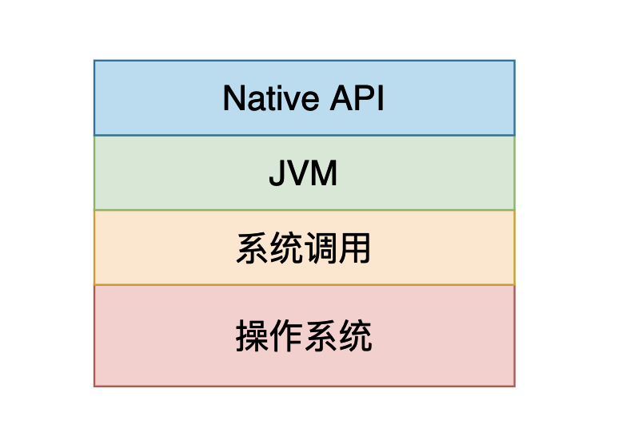
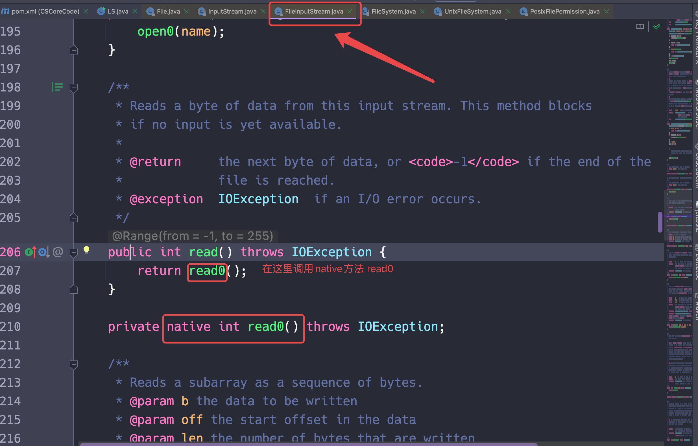
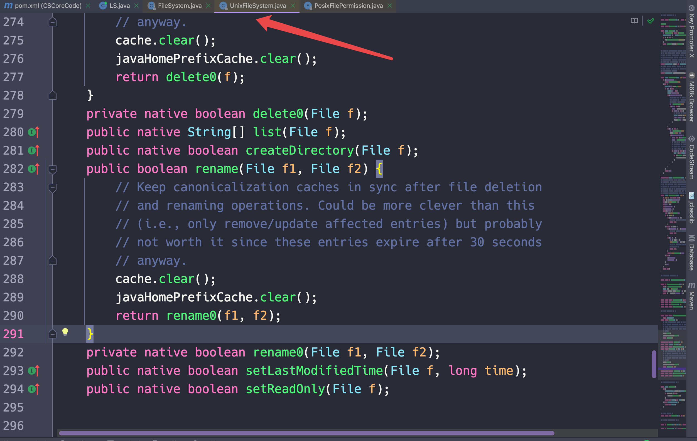
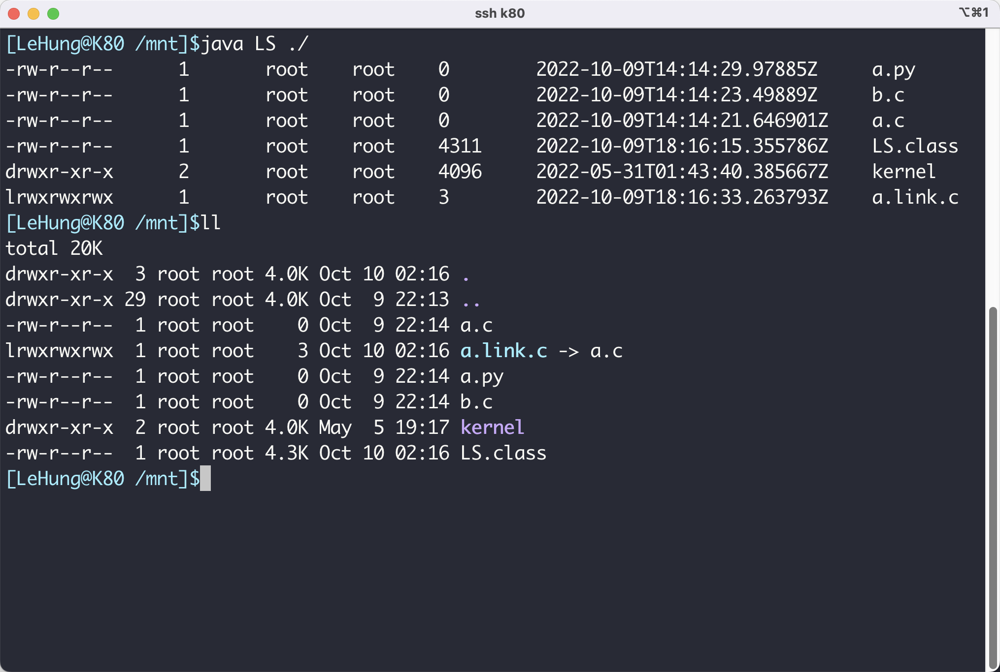

# 自己动手写ls命令——Java版

## 介绍

在前面的文章[Linux命令系列之ls——原来最简单的ls这么复杂](https://mp.weixin.qq.com/s?__biz=Mzg3ODgyNDgwNg==&mid=2247486970&idx=1&sn=fa7635fbad831a1081ce789b59a45e2a&chksm=cf0c91f3f87b18e5cbaf2e61b3115141f33a480a132546e10021ff48bc0705cbbec4549c5072&token=952740120&lang=zh_CN#rd)当中，我们仔细的介绍了关于ls命令的使用和输出结果，在本篇文章当中我们用Java代码自己实现ls命令，更加深入的了解ls命令。

## 代码实现

### 文件操作的基本原理

如果我们使用Java实现一个简单的ls命令其实并不难，因为Java已经给我们提供了一些比较方便和文件系统相关的api了，困难的是理解api是在做什么事儿！

事实上这些api都是操作系统给我们提供的，然后Java进行了一些列的封装，将这些操作给我们进行提供，我们仔细来看一下封装的层次，首先操作系统会给我们提供很多系统调用用于和设备（磁盘、CPU）进行交互，比如说和文件的交互就是读写数据，当然我们的Java程序也需要这些操作，因此JVM也需要给我们提供这些操作，因此JVM就对系统调用进行了一系列的封装，在Java当中具体的形式就是用native修饰的方法。



如果你是一个比较有经验Java程序员那么一定见过Java当中的`native`方法，这些方法都是Java给我们封装的底层接口，比如说在`FileInputStream`当中有一个`read`方法，这个方法就是读取文件当中的内容，我们看一下这个方法是如何实现的：

```java
    public int read() throws IOException {
        return read0();
    }
```

这里让大家的感受更加深入一点😂，我在这里贴一张`FileInputStream`的源代码图片：



从上面的图看当我们调用`FileInputStream`方法的时候确实调用了native方法。我们再来看一些与文件操作相关的api，他们也是使用Java给我们封装的native方法实现的。



上面主要谈了一些基本的文件操作过程的原理，简要说明了Java将很多系统操作封装成native方法供我们调用，现在我们来看看要想实现ls命令，我们需要哪些api。

### 查看一个目录下面有哪些文件和目录

在Java当中给我们提供了一个类`File`，我们可以使用这个类去得到一个目录下面有哪些文件和目录。

```java
  public void fileTest() {
    File file = new File("./");
    // file.listFiles() 将当前 file 对应的目录下所有的文件和目录都得到
    for (File listFile : file.listFiles()) {
      System.out.println(listFile.getName()); // 将文件或者目录的名字打印
    }
```

### 查看文件和目录的元数据

在Java当中给我们提供了一个工具类查看文件的一些元信息(metadata)，比如说文件的uid（用户id）、gid（用户组id）、文件的大小和文件的链接数目(nlink)。

```java
  Path path = Paths.get(".");
  System.out.println(Files.getAttribute(path, "unix:dev")); // 打印存储当前目录数据的设备的设备id
  System.out.println(Files.getAttribute(path, "unix:ino")); // 打印存储当前目录数据inode号
  System.out.println(Files.getAttribute(path, "unix:mode"));// 打印存储当前目录数据的mode数据 这个数据主要用于表示文件的类型
  System.out.println(Files.getAttribute(path, "unix:uid")); // 打印存储当前目录所属用户的用户id
  System.out.println(Files.getAttribute(path, "unix:gid")); // 打印存储当前目录所属组的组id
  System.out.println(Files.getAttribute(path, "unix:size"));// 打印存储当前目录数据所占的空间大小
  System.out.println(Files.getAttribute(path, "unix:nlink"));// 打印存储当前目录数据的链接数
```

除了上面的方式，我们还可以使用下面的方式去得到文件的元数据：

```java
  public void attrTest02() throws IOException {
    Path path = Paths.get("."); // 传入的参数就是文件或者目录的路径 这个传入的就是当前目录
    PosixFileAttributes attr = Files.readAttributes(path, PosixFileAttributes.class, NOFOLLOW_LINKS);
    System.out.println(attr.owner()); // 打印用户名
    System.out.println(attr.group()); // 打印用户组名
    System.out.println(attr.isRegularFile()); // 是不是一般文件
    System.out.println(attr.isSymbolicLink()); // 是不是一个符号链接
    System.out.println(attr.isDirectory()); // 是否是目录
    System.out.println(attr.isOther()); //其他类型
    System.out.println(attr.permissions()); // 打印文件的权限 是否可读 可写 可执行
    System.out.println(attr.lastAccessTime()); // 上一次访问时间
    System.out.println(attr.creationTime()); // 创建时间
    System.out.println(attr.lastModifiedTime()); // 上一次修改时间
    System.out.println(attr.fileKey()); // 打印文件其他相关参数 主要是设备id和inode编号
    System.out.println(attr.size()); // 文件的大小
  }
```

```java
root // 这里是用户名
root // 这里是用户组名
false
false
true
false
[GROUP_READ, OTHERS_EXECUTE, OWNER_WRITE, OWNER_EXECUTE, OTHERS_READ, OWNER_READ, GROUP_EXECUTE]
2022-10-09T18:08:47.791072133Z
2022-10-09T13:10:51Z
2022-10-09T18:08:23.746949182Z
(dev=1000012,ino=16176823)
192

```

### 文件权限

在Java当中给我们提供了一个类表示文件的9中权限（文件的作者的读写执行，作者所在组的读写执行，和其他人的读写执行，一共九种权限）：

```java
package java.nio.file.attribute;

public enum PosixFilePermission {

    /**
     * Read permission, owner. 作者读权限
     */
    OWNER_READ,

    /**
     * Write permission, owner. 作者写权限
     */
    OWNER_WRITE,

    /**
     * Execute/search permission, owner. 作者的执行权限
     */
    OWNER_EXECUTE,

    /**
     * Read permission, group. 作者所在组的读权限
     */
    GROUP_READ,

    /**
     * Write permission, group.作者所在组的写权限
     */
    GROUP_WRITE,

    /**
     * Execute/search permission, group.
     */
    GROUP_EXECUTE,

    /**
     * Read permission, others. 其他人读权限
     */
    OTHERS_READ,

    /**
     * Write permission, others. 其他人写权限
     */
    OTHERS_WRITE,

    /**
     * Execute/search permission, others. 其他人执行权限
     */
    OTHERS_EXECUTE;
}

```

在上面查看文件或者目录的元数据的时候我们已经得到的文件的所有权限信息：

```java
System.out.println(attr.permissions());
//[GROUP_READ, OTHERS_EXECUTE, OWNER_WRITE, OWNER_EXECUTE, OTHERS_READ, OWNER_READ, GROUP_EXECUTE]
```

函数返回的是一个集合`set`，里面存放的就是文件的各种权限的信息，比如在我们的例子当中我们可以看到，有组读，其他人执行，作者自己写，作者执行，其他人读，作者读权限，如果我们想判断某种权限，只需要看看集合当中是否包含即可。

### 完整代码实现

在上面我们已经谈到了所有的关于实现 ls 命令的细节了，接下来看一下我们的代码实现：

```java


import java.io.File;
import java.io.IOException;
import java.nio.file.Files;
import java.nio.file.Path;
import java.nio.file.Paths;
import java.nio.file.attribute.PosixFileAttributes;
import java.nio.file.attribute.PosixFilePermission;
import java.util.Objects;
import java.util.Set;

import static java.nio.file.LinkOption.NOFOLLOW_LINKS;

public class LS {

  public static boolean hasRight(Set<PosixFilePermission> set, PosixFilePermission
                                 permission) {
    return set.contains(permission);
  }

  public static void echoCharacter(Set<PosixFilePermission> set) {
    // user
    if (hasRight(set, PosixFilePermission.OWNER_READ))
      System.out.print('r');
      else
      System.out.print('-');
    if (hasRight(set, PosixFilePermission.OWNER_WRITE))
      System.out.print('w');
    else
      System.out.print('-');
    if (hasRight(set, PosixFilePermission.OWNER_EXECUTE))
      System.out.print('x');
    else
      System.out.print('-');

    // group
    if (hasRight(set, PosixFilePermission.GROUP_READ))
      System.out.print('r');
    else
      System.out.print('-');
    if (hasRight(set, PosixFilePermission.GROUP_WRITE))
      System.out.print('w');
    else
      System.out.print('-');
    if (hasRight(set, PosixFilePermission.GROUP_EXECUTE))
      System.out.print('x');
    else
      System.out.print('-');

    // others
    if (hasRight(set, PosixFilePermission.OTHERS_READ))
      System.out.print('r');
    else
      System.out.print('-');
    if (hasRight(set, PosixFilePermission.OTHERS_WRITE))
      System.out.print('w');
    else
      System.out.print('-');
    if (hasRight(set, PosixFilePermission.OTHERS_EXECUTE))
      System.out.print('x');
    else
      System.out.print('-');
  }

  public static void echoType(PosixFileAttributes attributes) {
    if (attributes.isDirectory())
      System.out.print('d');
    else if (attributes.isRegularFile())
      System.out.print('-');
    else if (attributes.isSymbolicLink())
      System.out.print('l');
    else
      System.out.print('o');
  }

  public static void echoFileInformation(String args) throws IOException {
    Path path = Paths.get(args);
    PosixFileAttributes attributes = Files.readAttributes(path, PosixFileAttributes.class, NOFOLLOW_LINKS);
    echoType(attributes);
    echoCharacter(attributes.permissions());

    System.out.printf("\t%-2d", Files.getAttribute(path, "unix:nlink"));
    System.out.print("\t" + attributes.owner().getName());
    System.out.print("\t" + attributes.group().getName());
    System.out.printf("\t%-5d", attributes.size());
    System.out.printf("\t %10s", attributes.lastAccessTime());
    System.out.println("\t" + path.getFileName());
  }

  public static void main(String[] args) throws IOException {

    File file = new File(args[0]);
    for (File listFile : Objects.requireNonNull(file.listFiles())) {
      echoFileInformation(listFile.toString());
    }
  }
}

```

上面的代码很短，如果大家了解了上main所谈到的api的话，就应该很容易理解了。下面我们看看程序的输出结果：



可以看到我们的程序的输出结果和ls命令的输出结果是一样的，只是在时间的表示上有所差别而已，这一点没什么关系。

---

以上就是本篇文章的所有内容了，我是**LeHung**，我们下期再见！！！更多精彩内容合集可访问项目：<https://github.com/Chang-LeHung/CSCore>

关注公众号：**一无是处的研究僧**，了解更多计算机（Java、Python、计算机系统基础、算法与数据结构）知识。


