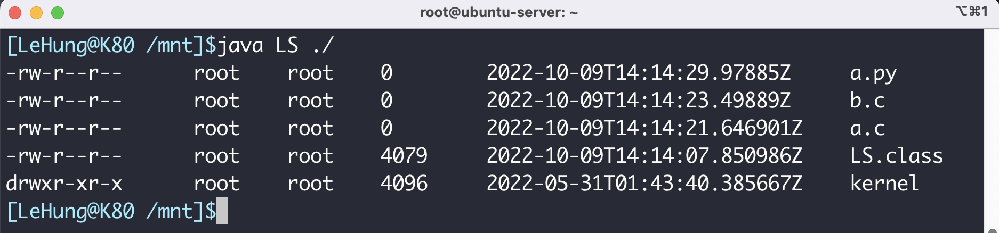

# 自己动手写ls命令——Javaa版

## 介绍

在前面的文章[Linux命令系列之ls——原来最简单的ls这么复杂](https://mp.weixin.qq.com/s?__biz=Mzg3ODgyNDgwNg==&mid=2247486970&idx=1&sn=fa7635fbad831a1081ce789b59a45e2a&chksm=cf0c91f3f87b18e5cbaf2e61b3115141f33a480a132546e10021ff48bc0705cbbec4549c5072&token=952740120&lang=zh_CN#rd)当中，我们仔细的介绍了关于ls命令的使用和输出结果，在本篇文章当中我们用Java代码自己实现ls命令，更加深入的了解ls命令。

## 代码实现

如果我们使用Java实现一个简单的ls命令其实并不难，因为Java已经给我们提供了一些比较方便和文件系统相关的api了，困难的是理解api是在做什么事儿！

事实上这些api都是操作系统给我们提供的，然后Java进行了一些列的封装，将这些操作给我们进行提供，我们仔细来看一下封装的层次：


比如说对于读写文件这些操作来说都是操作系统给我们提供的接口，如果Java想让我们使用这些借口的话，必须对这些方法进行封装，如果你是一个比较有经验Java程序员那么一定见过Java当中的`native`方法，这些方法都是Java给我们封装的底层接口，比如说在`FileInputStream`当中有一个`read`方法，这个方法就是读取文件当中的内容，我们看一下这个方法是如何实现的：

```java
    public int read() throws IOException {
        return read0();
    }
```

这里让大家的感受更加深入一点😂，我在这里贴一张`FileInputStream`的源代码图片：


```java
package cscore.linux.command;


import java.io.File;
import java.io.IOException;
import java.nio.file.Files;
import java.nio.file.Path;
import java.nio.file.Paths;
import java.nio.file.attribute.PosixFileAttributes;
import java.nio.file.attribute.PosixFilePermission;
import java.util.Objects;
import java.util.Set;

public class LS {

  public static boolean hasRight(Set<PosixFilePermission> set, PosixFilePermission
                                 permission) {
    return set.contains(permission);
  }

  public static void echoCharacter(Set<PosixFilePermission> set) {
    // user
    if (hasRight(set, PosixFilePermission.OWNER_READ))
      System.out.print('r');
      else
      System.out.print('-');
    if (hasRight(set, PosixFilePermission.OWNER_WRITE))
      System.out.print('w');
    else
      System.out.print('-');
    if (hasRight(set, PosixFilePermission.OWNER_EXECUTE))
      System.out.print('x');
    else
      System.out.print('-');

    // group
    if (hasRight(set, PosixFilePermission.GROUP_READ))
      System.out.print('r');
    else
      System.out.print('-');
    if (hasRight(set, PosixFilePermission.GROUP_WRITE))
      System.out.print('w');
    else
      System.out.print('-');
    if (hasRight(set, PosixFilePermission.GROUP_EXECUTE))
      System.out.print('x');
    else
      System.out.print('-');

    // others
    if (hasRight(set, PosixFilePermission.OTHERS_READ))
      System.out.print('r');
    else
      System.out.print('-');
    if (hasRight(set, PosixFilePermission.OTHERS_WRITE))
      System.out.print('w');
    else
      System.out.print('-');
    if (hasRight(set, PosixFilePermission.OTHERS_EXECUTE))
      System.out.print('x');
    else
      System.out.print('-');
  }

  public static void echoType(PosixFileAttributes attributes) {
    if (attributes.isDirectory())
      System.out.print('d');
    else if (attributes.isRegularFile())
      System.out.print('-');
    else if (attributes.isSymbolicLink())
      System.out.print('l');
    else
      System.out.print('o');
  }

  public static void echoFileInformation(String args) throws IOException {
    Path path = Paths.get(args);
    PosixFileAttributes attributes = Files.readAttributes(path, PosixFileAttributes.class);
    echoType(attributes);
    echoCharacter(attributes.permissions());
    System.out.print("\t" + attributes.owner().getName());
    System.out.print("\t" + attributes.group().getName());
    System.out.printf("\t%-5d", attributes.size());
    System.out.printf("\t %10s", attributes.lastAccessTime());
    System.out.println("\t" + path.getFileName());
  }

  public static void main(String[] args) throws IOException {

    File file = new File(args[0]);
    for (File listFile : Objects.requireNonNull(file.listFiles())) {
      echoFileInformation(listFile.toString());
    }
  }
}

```


