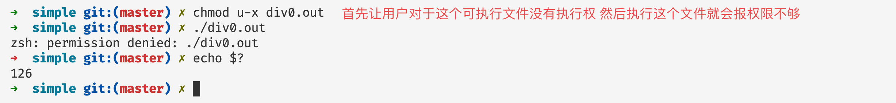
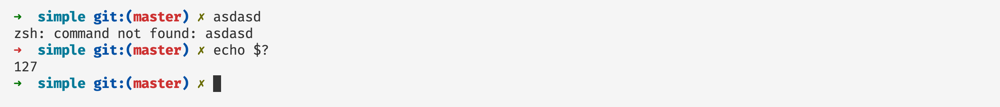

# 程序退出状态码

## 前言

在本篇文章当中主要给大家介绍一个shell的小知识——状态码。这是当我们的程序退出的时候，子进程会将自己程序的退出码传递给父进程，有时候我们可以利用这一操作做一些进程退出之后的事情。

## 状态码简介


上图是一个zsh的截图，当我们执行命令`asdsad`之后，因为没有这个命令，所以zsh（类似于bash的一种shell），输出没有找到这个命令，但是我们发现图中箭头➡️由绿色变成红色，表示程序不是正常退出。现在又一个问题是，zsh是怎么知道程序不是正常退出的呢？其实就可以根据子进程退出的状态推断。在文章的最后我们用C语言实现一下，看看如果在父进程接收子进程的退出的状态。

我们在命令行当中可以通过命令 `echo $?` 查看上一个进程退出时候的退出码：


程序正常退出的时候退出码等于0。

## 退出码表

| 退出码 | 含义                    | 例子                 | 解释                                                      |
| ------ | ----------------------- | -------------------- | --------------------------------------------------------- |
| 1      | 一般的错误              | 除以0                | 一般的除以0的错误，执行没有权限的操作                     |
| 2      | shell 内部操作失败      |                      | 通常是shell操作时候的命令错误，文章后面有一个例子演示     |
| 126    | 执行不能够执行的文件    | /dev/random          | 权限问题或者命令不能够执行                                |
| 127    | 命令没有找到            | 非法或者不存在的命令 | 执行一个系统当中不存在的命令，可以通过设置PATH环境变量    |
| 128+n  | 错误的信号值            | Kill -9 PID          | 杀死进程号为PID的进程，进程的退出码等于 128 + 9           |
| 130    | ctrl+c 之后进程的返回值 |                      | 和上一条一样ctrl+c的信号值等于2                           |
| 其他   | 退出码s不在范围之内     | exit(-1)             | 如果退出码n不在0-255之内，那么程序退出之后的退出码为n&255 |

## 实例说明

### 退出码——1

#### 除以0


#### 执行没有权限的操作


上面直接进入root用户的目录，因为没有权限，查看进程的退出码等于1。

### shell内部操作失败——退出码2

```shell
a=1
if [ $a -eq 1 ]
then
  echo hello world
```

比如对于上面的shell脚本是有语法错误的正确的语法还需要在最后加上fi，现在我们执行上面的脚本查看结果：


### 退出码126

当因为权限问题或者命令不可以执行那么进程的退出码就是126:



### 命令没有找到——退出码127



### 信号值——128+n(信号对应的数值)

我们可以使用`kil -l `命令查看 linux 操作系统当中信号以及对应的数值：

```shell
 1) SIGHUP	 2) SIGINT	 3) SIGQUIT	 4) SIGILL	 5) SIGTRAP
 6) SIGABRT	 7) SIGBUS	 8) SIGFPE	 9) SIGKILL	10) SIGUSR1
11) SIGSEGV	12) SIGUSR2	13) SIGPIPE	14) SIGALRM	15) SIGTERM
16) SIGSTKFLT	17) SIGCHLD	18) SIGCONT	19) SIGSTOP	20) SIGTSTP
21) SIGTTIN	22) SIGTTOU	23) SIGURG	24) SIGXCPU	25) SIGXFSZ
26) SIGVTALRM	27) SIGPROF	28) SIGWINCH	29) SIGIO	30) SIGPWR
31) SIGSYS	34) SIGRTMIN	35) SIGRTMIN+1	36) SIGRTMIN+2	37) SIGRTMIN+3
38) SIGRTMIN+4	39) SIGRTMIN+5	40) SIGRTMIN+6	41) SIGRTMIN+7	42) SIGRTMIN+8
43) SIGRTMIN+9	44) SIGRTMIN+10	45) SIGRTMIN+11	46) SIGRTMIN+12	47) SIGRTMIN+13
48) SIGRTMIN+14	49) SIGRTMIN+15	50) SIGRTMAX-14	51) SIGRTMAX-13	52) SIGRTMAX-12
53) SIGRTMAX-11	54) SIGRTMAX-10	55) SIGRTMAX-9	56) SIGRTMAX-8	57) SIGRTMAX-7
58) SIGRTMAX-6	59) SIGRTMAX-5	60) SIGRTMAX-4	61) SIGRTMAX-3	62) SIGRTMAX-2
63) SIGRTMAX-1	64) SIGRTMAX
```

当我们在命令行使用ctrl+c中断程序的执行的时候，这个正在执行的进程就会接受到SIGINT信号，根据上文这个信号对应的数值为2，因此程序的退出码等于130（128 + 2）。

