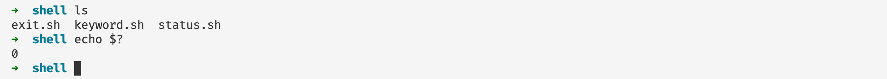
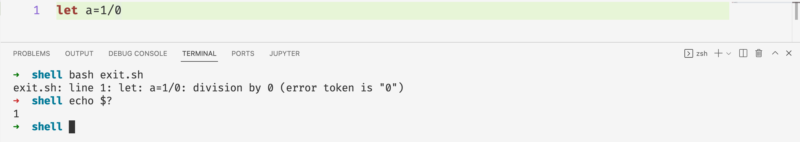
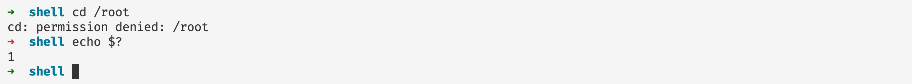

# 程序退出状态码

## 前言

在本篇文章当中主要给大家介绍一个shell的小知识——状态码。这是当我们的程序退出的时候，子进程会将自己程序的退出码传递给父进程，有时候我们可以利用这一操作做一些进程退出之后的事情。

## 状态码简介

上图是一个zsh的截图，当我们执行命令`asdsad`之后，因为没有这个命令，所以zsh（类似于bash的一种shell），输出没有找到这个命令，但是我们发现图中箭头➡️由绿色变成红色，表示程序不是正常退出。现在又一个问题是，zsh是怎么知道程序不是正常退出的呢？其实就可以根据子进程退出的状态推断。在文章的最后我们用C语言实现一下，看看如果在父进程接收子进程的退出的状态。

我们在命令行当中可以通过命令 `echo $?` 查看上一个进程退出时候的退出码：

程序正常退出的时候退出码等于0。

## 退出码表

| 退出码 | 含义                    | 例子                 | 解释                                                      |
| ------ | ----------------------- | -------------------- | --------------------------------------------------------- |
| 1      | 一般的错误              | 除以0                | 一般的除以0的错误，执行没有权限的操作                     |
| 2      | shell 内部操作失败      |                      | 通常是shell操作时候的命令错误，文章后面有一个例子演示     |
| 126    | 执行不能够执行的文件    | /dev/random          | 权限问题或者命令不能够执行                                |
| 127    | 命令没有找到            | 非法或者不存在的命令 | 执行一个系统当中不存在的命令，可以通过设置PATH环境变量    |
| 128    | 无效的退出参数          | exit 3.14159         | Exit 的参数只能是 0 -255 之间的整数                       |
| 128+n  | 错误的信号值            | Kill -9 PID          | 杀死进程号为PID的进程，进程的退出码等于 128 + 9           |
| 130    | ctrl+c 之后进程的返回值 |                      | 和上一条一样ctrl+c的信号值等于2                           |
| 其他   | 退出码s不在范围之内     | exit(-1)             | 如果退出码n不在0-255之内，那么程序退出之后的退出码为n&255 |

## 实例说明

### 退出码——1

#### 除以0

#### 执行没有权限的操作

上面直接进入root用户的目录，因为没有权限，查看进程的退出码等于1。

