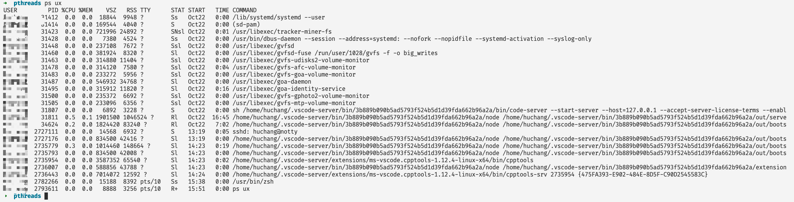

# 这才是使用ps命令的正确姿势

## 前言

在linux系统当中我们通长会使用命令去查看一些系统的进程信息，我们最常使用的就是 ps (process status)。ps 命令主要是用于查看当前正在运行的程序，以及他们相关的的信息，我们可以通过不同的选项进行查看。ps 给我们提供了非常多的选项，这些选项常常令人分辨不清楚，本篇文章我们仔细谈一谈 ps 输出具体的含义。

## ps命令详解

### 只输出跟当前shell有关的进程

当我们在命令行当中直接输入 ps 命令，那么就只能够看到在当前终端当中启动的进程，即使同一个用户启动其他的终端，在这个终端当中也不能看到同一个用户在其他终端启动的进程，如下图所示：


分割线表示上下有两个终端：

- 我们在上一个终端后台启动一个 sleep.out 的程序，我们就能够在上面的终端里面看到我们刚刚启动的程序。
- 但是我们在下面同一个用户的不同终端就不能够看到在上面一个终端启动的程序。

ps 命令输出的含义：

- PID：进程的进程号，有唯一性。
- TTY：用户登陆的时候使用的虚拟终端。
- TIME：程序使用的CPU时间总和。
- CMD：进程启动的时候执行的命令。

### 输出所有的进程

```shell
ps -A
ps -e
```

上面的两个命令输出系统当中所有的进程信息，我们可以使用这个命令统计系统当中一个有多少进程：


### 输出所有进程但是排除终端和session leader

```shell
ps -a
```

上面的命令输出除了 session leader 和跟终端无关的所有进程。

- 跟终端无关的进程很好理解，就是跟终端脱离关系，一般是系统进程和用户的守护进程。
- 而 session leader 就是你登陆终端时候的那个进程，如下图所示：


一个更具体的描述一个 shell 中 session leader 和其他进程的关系如下图所示（图中最左方就是 session leader 进程）：


### 查看所有正在运行的程序

```shell
ps -r
```

### 查看所有当前用户的进程

```shell
ps -u
```

### 查看具体某个进程的信息

```shell
ps -p pid
```


### 输出内容携带用户名

```
ps -u
```

### 查看所有与终端有关的进程

```shell
ps -T
```

### 一个我们非常熟悉的命令

我们在linux操作系统下面我们通常使用 ps 命令的时候，我们会使用如下两个命令：

```shell
ps aux
ps -ef
```

其实在很多情况下我们只想查看与我们自己有关的程序，而上面的两个命令还查看了很多其他用户的进程，因此我们可以修改一下上面两个命令：

```shell
ps xu
```

上面这个命令只会输出与我们自己有关的程序同时输出的内容还算完整。

