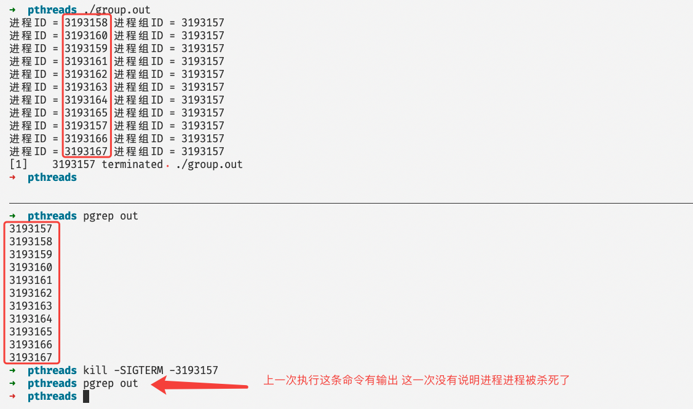
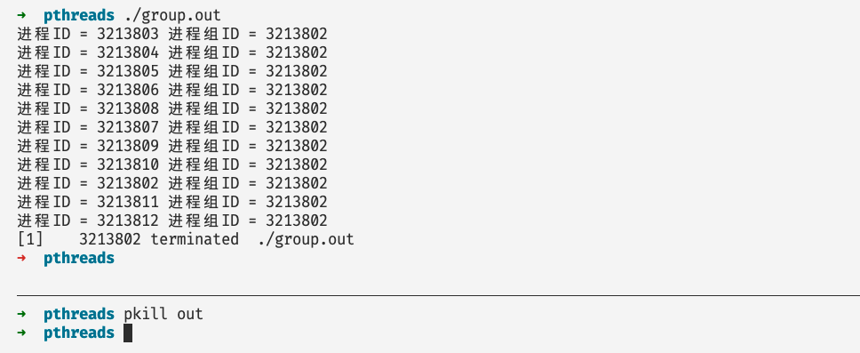
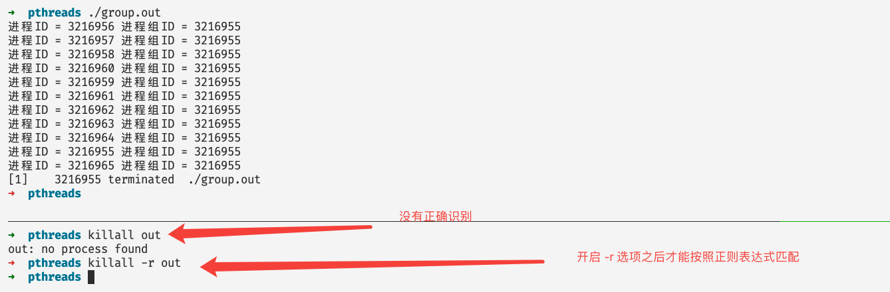
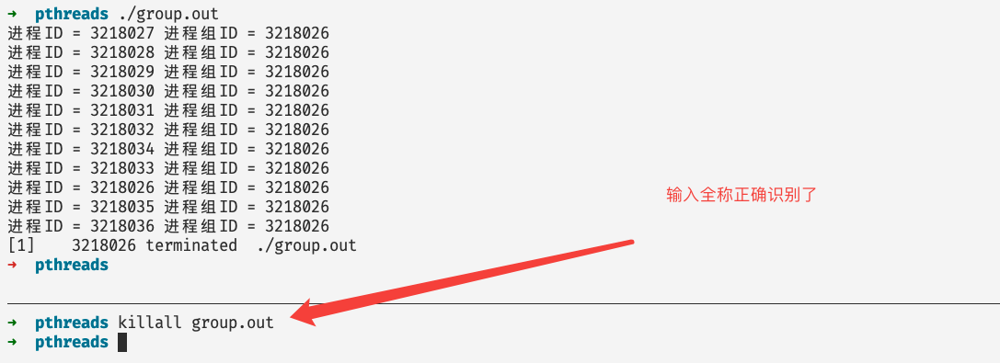
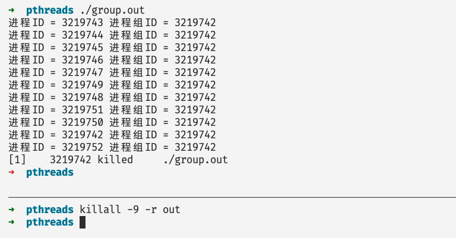

# 如何优雅的杀掉一个进程

## 前言

在我们通常使用linux操作系统的时候，经常会有这样的需求——杀死一个进程，比如说你一不小心启动了一个后台进程或者守护进程，而这个进程是你不需要的，因此你久想杀掉他，在本篇文章当中主要给大家介绍一些杀死进程的方法，以及这隐藏在这后面的原理。

## 你可以杀死哪些进程

在我们杀死一个进程的时候最好不要使用管理员权限，因为你可能会一不小心杀死系统当中一些很重要的进程。同时需要了解，在linux当中有很多与权限相关的操作，如果你只是一个普通的用户，那么你就只能杀死你自己的进程，不能够杀死别的用户的进程。但是root用户或者你有sudo权限，那么你就可以为所欲为了😂。

杀死进程的基本原理：我们使用命令去杀死进程，本质上是通过一个进程（比如说kill命令的那个进程）给另外一个进程发送信号，当进程接收到信号的时候就会进行判断是哪个信号，然后根据不同的信号做出相应的行为。

信号前面表示代表不同信号的数值，比如说我们执行命令 `kill -9 1234` 就是将 9 这个值对应的信号 SIGKILL 发送给进程号等于 1234 的进程，在linux操作系统当中，常见的信号如下所示：

```shell
 1) SIGHUP	 2) SIGINT	 3) SIGQUIT	 4) SIGILL	 5) SIGTRAP
 6) SIGABRT	 7) SIGBUS	 8) SIGFPE	 9) SIGKILL	10) SIGUSR1
11) SIGSEGV	12) SIGUSR2	13) SIGPIPE	14) SIGALRM	15) SIGTERM
16) SIGSTKFLT	17) SIGCHLD	18) SIGCONT	19) SIGSTOP	20) SIGTSTP
21) SIGTTIN	22) SIGTTOU	23) SIGURG	24) SIGXCPU	25) SIGXFSZ
26) SIGVTALRM	27) SIGPROF	28) SIGWINCH	29) SIGIO	30) SIGPWR
31) SIGSYS	34) SIGRTMIN	35) SIGRTMIN+1	36) SIGRTMIN+2	37) SIGRTMIN+3
38) SIGRTMIN+4	39) SIGRTMIN+5	40) SIGRTMIN+6	41) SIGRTMIN+7	42) SIGRTMIN+8
43) SIGRTMIN+9	44) SIGRTMIN+10	45) SIGRTMIN+11	46) SIGRTMIN+12	47) SIGRTMIN+13
48) SIGRTMIN+14	49) SIGRTMIN+15	50) SIGRTMAX-14	51) SIGRTMAX-13	52) SIGRTMAX-12
53) SIGRTMAX-11	54) SIGRTMAX-10	55) SIGRTMAX-9	56) SIGRTMAX-8	57) SIGRTMAX-7
58) SIGRTMAX-6	59) SIGRTMAX-5	60) SIGRTMAX-4	61) SIGRTMAX-3	62) SIGRTMAX-2
63) SIGRTMAX-1	64) SIGRTMAX
```

对于信号来说，进程可以有不同的应对行为，具体来说主要有以下三种：

- 忽略这个信号。
- 使用默认行为去处理这个信号，比如SIGINT和SIGTERM这两个信号的默认行为就是退出程序。
- 自己定义函数捕获这个信号，我们可以自己写一个函数，并且使用系统调用将这个函数进行注册，当收到对应的信号的时候就去执行我们自己实现的函数，但是需要注意的是，并不是所有的信号我们都可以进行捕获的，比如说SIGKILL和SIGSTOP这两个信号。

## 程序的定位

我们通常可以使用 ps 和 top 两个命令进行程序的定位，在前面的两篇文章[Linux命令系列之top——里面藏着很多鲜为人知的宝藏知识](https://mp.weixin.qq.com/s?__biz=Mzg3ODgyNDgwNg==&mid=2247486949&idx=1&sn=428516fe22182f41de4dfed075b03e7a&chksm=cf0c91ecf87b18fad120db8c34c0a22e748ed403991803d114e7e505dbcc6c5d53cff2bbddb0&token=102890258&lang=zh_CN#rd)和[这才是使用ps命令的正确姿势](https://mp.weixin.qq.com/s?__biz=Mzg3ODgyNDgwNg==&mid=2247487127&idx=1&sn=5486fcdac3ea1c251b4e0bc63bf110be&chksm=cf0c929ef87b1b88e4f76559a1b2c271438e89d8e5dbe9aef4cecf8c6f27eb8d695224aa48a1&token=985838262&lang=zh_CN#rd)当中我么已经仔细讨论过这个问题了！因此当我们想要杀死某个程序的时候我们可以通过上述两个命令进行程序的定位，找到我们想要杀死的进程的进程号和进程名字。

在本篇文章当中主要使用一个程序 group.c 作为例子，讲述各种 kill 命令的使用，他会 fork 出几个子进程，子进程的进程名和它的进程名都是 group.out，这个程序的源代码如下所示：

```c


#include <stdio.h>
#include <unistd.h>

int main() {
  for(int i = 0; i < 10; i++) {
    if(!fork())
      break;
  }
  printf("进程ID = %d 进程组ID = %d\n", getpid(), getpgid(0));
  sleep(100);
  return 0;
}
```


## 使用kill命令杀死进程

kill命令的使用方法如下所示：

```shell
kill [option] <pid> [...] # [option] 是参数选项比如 -9 pid 表示进程的进程id
```

发送一个 SIGINT 信号给进程 1234

```shell
kill -SIGINT 1234
或者
kill -2 1234
```

如果进程 1234 执行SIGINT的默认行为的话，那么进程1234就会退出，因为默认行为就是退出程序。

强制杀死进程 1234

```shell
kill -SIGKILL 1234
或者
kill -9 1234
```

因为信号 SIGKILL 是不能够被忽略或者捕获的，这个就是强制杀死程序，这条命令可以保证一定杀死进程，但是我们一般情况下最好不要使用这条命令，因为很多程序有他自己的逻辑，比如清理一些数据和系统资源，但是如果你不关心这些就无所谓了。

杀死所有你有权限杀死的进程

```shell
kill -9 -1
```

上面的命令当中 -1 的意思表示将 -9 这个信号发送给所有你有权限发送的进程，这个命令慎用。

有的时候我们会有一个需求就是杀死一个进程组里面的所有进程，我们可以使用命令

```shell
kill [option] -<pid> [...] # [option] 是参数选项比如 -9 pid 表示进程的进程id
```

就是在pid前面加上-表示杀死这个进程组，比如下面图中的示例：



在 kill 命令当中如果没有指定发送那个信号的话，默认就发送SIGTERM信号，对应的数值等于15。

## pkill和pgrep

pgrep 命令其实就是根据正则表达式列出相应的进程。默认他只会讲符合要求的进程的进程号列出来：

```shell
➜  pthreads pgrep out
3204266
3204268
3204269
3204270
3204271
3204272
3204273
```

比如说，列出所有含有 out 这个字符的进程：

```shell
➜  pthreads pgrep -l out
3204266 group.out
3204268 group.out
3204269 group.out
3204270 group.out
3204271 group.out
3204272 group.out
3204273 group.out
```

```shell
pgrep -l out
```

在上面的命令当中 out 表示一个字符串，我们也可以使用正则表达式，-l 表示列出进程执行的时候的命令。

在 pgrep 当中还有一个比较重要的选项 -u ，这个选项表示根据特定的用户筛选进程，比如说我们只要 abc 这个用户的进程，可以这样：

```shell 
pgrep -u abc out # 也是选择含有 out 字符串的进程
```

 pgrep 还有一个比较重要的选项就是 -v ，这个选项的意思就是除了符合正则表达式要求的其他进程，比如说我们想要将所有不含 out 的进程筛选出来，就可以使用如下命令：

```shell
pgrep -v out
```

如果我们想要统计一下符合要求的进程的个数我们可以使用下面的这个命令：

```shell
pgrep -c out # 统计一下含有 out 字符串的进程的个数
```

pkill 的使用方式和 pgrep 是一样的只不过 pgrep 是将进程的进程号列出来，而pkill是将一个发送给所有符合要求的进程，默认发送的信号是 SIGTERM 对应的值等于 15。



比如在上图当中就发送一个默认信号SIGTERM给所有命令行当中还有字符串 out 的进程。因此 pkill 在批处理场景用的比较多，将还有某个特征的进程全部杀死。

如果你想指定具体发送那个信号格式和 kill 是一样的，比如发送 SIGKILL（-9）信号给含有字符串 out 的进程。

```shell
pkill -9 out
或者
pkill -SIGKILL out
```

## 使用killall命令

Killall 和 pkill 使用方法差不多，而且含义也一致，将符合条件的进程全部杀死。默认发送的信号也是SIGTERM，信号值等于15，但是pkill不同的是 killall 默认不开启正则表达式，我们需要通过 -r 选项启动正则表达式识别。

例子如下所示：



如果我们想在不实用 -r 选项的情况下杀死进程，只能输入进程的全称了。



在killall命令当中还有一些常用的选项：

| 选项            | 含义                                                         |
| --------------- | ------------------------------------------------------------ |
| -u              | 只杀死指定用户的进程，比如说 -u abc 只杀死用户 abc 满足要求的进程 |
| -I              | 字母大小写不敏感                                             |
| -i              | 交互模式，每次杀死进程都会询问是否杀死进程                   |
| -r              | 表示使用正则表达式进行匹配                                   |
| -数字或者信号名 | 发送特定的信号，如下的例子所示                               |
|                 |                                                              |



## 为什么我们不能够捕获所有的信号

在前面的文章当中我们提到了，SIGKILL和SIGSTOP这两个信号是不能够被捕获的！试想一下，在你的系统的当中有一个病毒程序，他会不断的创建新的进程并且不断的申请系统资源，那么你还没有办法杀死他，你只能够眼睁睁的看着你的系统卡死。这种问题 linux 设计者早就想到了，基于这个问题就肯定需要有一种方式能够万无一失的杀掉进程，因此才出现了不能够被捕获的信号。

## 总结

在本篇文章当中主要给大家介绍各种 kill 命令的使用方法以及一些简单的信号含义的介绍，这部分内容在我们平常的学习工作过程当中经常会使用到，希望大家有所收获～

---

以上就是本篇文章的所有内容了，我是**LeHung**，我们下期再见！！！更多精彩内容合集可访问项目：<https://github.com/Chang-LeHung/CSCore>

关注公众号：**一无是处的研究僧**，了解更多计算机（Java、Python、计算机系统基础、算法与数据结构）知识。


