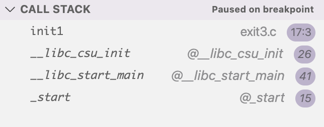
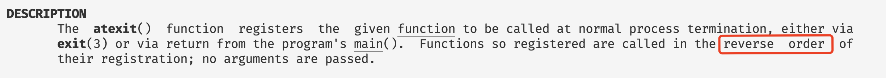

# C语言中这么骚的退出程序的方式你知道几个？

## 前言

在本篇文章当中主要给大家介绍C语言当中一些不常用的特性，比如在`main`函数之前和之后设置我们想要执行的函数，以及各种花式退出程序的方式。

## main函数是最先执行和最后执行的函数吗？

### C语言构造和析构函数

通常我们在写C程序的时候都是从`main`函数开始写，因此我们可能没人有关心过这个问题，事实上是main函数不是程序第一个执行的函数，也不是程序最后一个执行的函数。

```C

#include <stdio.h>

void __attribute__((constructor)) init1() {
  printf("before main funciton\n");
}

int main() {
  printf("this is main funciton\n");
}
```

我们编译上面的代码然后执行，输出结果如下图所示：

```shell
➜  code git:(main) ./init.out 
before main funciton
this is main funciton
```

由此可见main函数并不是第一个被执行的函数，那么程序第一次执行的函数是什么呢？很简单我们看一下程序的调用栈即可。



从上面的结果可以知道，程序第一个执行的函数是`_start`，这是在类Unix操作系统上执行的第一个函数。

那么main函数是程序执行的最后一个函数吗？我们看下面的代码：

```C
#include <stdio.h>

void __attribute__((destructor)) __exit() {
  printf("this is exit\n");
}

void __attribute__((constructor)) init() {
  printf("this is init\n");
}


int main() {
  printf("this is main\n");
  return 0;
}
```

上面程序的输出结果如下：

```shell
➜  code git:(main) ./out.out 
this is init
this is main
this is exit
```

由此可见main函数也不是我们最后执行的函数！事实上我们除了上面的方法之外我们也可以在libc当中注册一些函数，让程序在main函数之后，退出执行前执行这些函数。

### on_exit和atexit函数

我们可以使用上面两个函数进行函数的注册，让程序退出之前执行我们指定的函数

```C

#include <stdio.h>
#include <stdlib.h>

void __attribute__((destructor)) __exit() {
  printf("this is exit\n");
}

void __attribute__((constructor)) init() {
  printf("this is init\n");
}

void on__exit() {
  printf("this in on exit\n");
}

void at__exit() {
  printf("this in at exit\n");
}

int main() {
  on_exit(on__exit, NULL);
  atexit(at__exit);
  printf("this is main\n");
  return 0;
}
```

```shell
this is init
this is main
this in at exit
this in on exit
this is exit
```

我们可以仔细分析一下上面程序执行的顺序。首先是执构造函数，然后执行 atexit 注册的函数，再执行 on_exit 注册的函数，最后执行析构函数。从上面程序的输出我们可以知道我们注册的函数生效了，但是需要注意一个问题，先注册的函数后执行，不管是使用 atexit 还是 on_exit 函数。我们现在看下面的代码：

```C

#include <stdio.h>
#include <stdlib.h>

void __attribute__((destructor)) __exit() {
  printf("this is exit\n");
}

void __attribute__((constructor)) init() {
  printf("this is init\n");
}

void on__exit() {
  printf("this in on exit\n");
}

void at__exit() {
  printf("this in at exit\n");
}

int main() {
  // 调换下面两行的顺序
  atexit(at__exit);
  on_exit(on__exit, NULL);
  printf("this is main\n");
  return 0;
}
```

上面的代码输出如下：

```shell
this is init
this is main
this in on exit
this in at exit
this is exit
```

从输出的结果看确实和上面我们提到的规则一样，先注册的函数后执行。这一点再linux程序员开发手册里面也提到了。



但是这里有一点需要注意的是我们应该尽可能使用atexit函数，而不是使用on_exit函数，因为atexit函数是标准规定的，而on_exit并不是标准规定的。

### exit和_exit函数

其中exit函数是libc给我们提供的函数，我们可以使用这个函数正常的终止程序的执行，而且我们在前面注册的函数还是能够被执行。比如在下面的代码当中：

```C

#include <stdio.h>
#include <stdlib.h>
#include <unistd.h>

void __attribute__((destructor)) __exit1() {
  printf("this is exit1\n");
}

void __attribute__((destructor)) __exit2() {
  printf("this is exit2\n");
}


void __attribute__((constructor)) init1() {
  printf("this is init1\n");
}


void __attribute__((constructor)) init2() {
  printf("this is init2\n");
}

void on__exit1() {
  printf("this in on exit1\n");
}

void at__exit1() {
  printf("this in at exit1\n");
}

void on__exit2() {
  printf("this in on exit2\n");
}

void at__exit2() {
  printf("this in at exit2\n");
}


int main() {
  // _exit(1);
  on_exit(on__exit1, NULL);
  on_exit(on__exit2, NULL);
  atexit(at__exit1);
  atexit(at__exit2);
  printf("this is main\n");
  exit(1);
  return 0;
}
```

上面的函数执行结果如下所示：

```shell
this is init1
this is init2
this is main
this in at exit2
this in at exit1
this in on exit2
this in on exit1
this is exit2
this is exit1
```

可以看到我们的代码被正常执行啦。

但是_exit是一个系统调用，当执行这个方法的时候程序会被直接终止，我们看下面的代码：

```c

#include <stdio.h>
#include <stdlib.h>
#include <unistd.h>

void __attribute__((destructor)) __exit1() {
  printf("this is exit1\n");
}

void __attribute__((destructor)) __exit2() {
  printf("this is exit2\n");
}


void __attribute__((constructor)) init1() {
  printf("this is init1\n");
}


void __attribute__((constructor)) init2() {
  printf("this is init2\n");
}

void on__exit1() {
  printf("this in on exit1\n");
}

void at__exit1() {
  printf("this in at exit1\n");
}

void on__exit2() {
  printf("this in on exit2\n");
}

void at__exit2() {
  printf("this in at exit2\n");
}


int main() {
  // _exit(1);
  on_exit(on__exit1, NULL);
  on_exit(on__exit2, NULL);
  atexit(at__exit1);
  atexit(at__exit2);
  printf("this is main\n");
  _exit(1); // 只改了这个函数 从 exit 变成 _exit
  return 0;
}
```

上面的代码输出结果如下所示：

```shell
this is init1
this is init2
this is main
```

可以看到我们注册的函数和最终的析构函数都没有被执行，程序直接退出啦。

