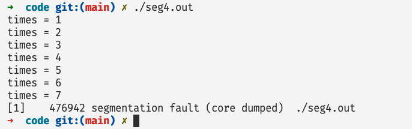

# 你的哪些骚操作会导致Segmentation Fault😂

## 前言

如果你是一个写过一些C程序的同学，那么很大可能你会遇到魔幻的**segmentation fault**，可能一时间抓耳挠腮，本篇文章主要介绍一些常见的导致segmentation fault的代码问题，希望能够帮助大家快速定位问题！

## 出现Segmentation Fault的常见操作

### 写只读数据

```c

#include <stdio.h>

char* str= "hello world";

int main() {
  printf("%s\n", str);
  *str = '1';
  return 0;
}
```

在上面的程序当中，`str`是一个全局变量，一个指向只读数据`hello world`的指针，因为指向的数据存放在只读数据区，如下图所示（rodata区域）：


### 数组下标越界

```c

#include <stdio.h>

int main() {

  int arr[10];
  arr[1 << 20] = 100; // 会导致 segmentation fault
  printf("arr[12] = %d\n", arr[1 << 20]); // 会导致 segmentation fault
  return 0;
}
```

### 栈溢出 stakc_overflow

我们可以使用`ulimit -a`命令查看，系统的一些参数设置，比如说栈的最大大小：

```shell
➜  code git:(main) ✗ ulimit -a
-t: cpu time (seconds)              unlimited
-f: file size (blocks)              unlimited
-d: data seg size (kbytes)          unlimited
-s: stack size (kbytes)             8192
-c: core file size (blocks)         0
-m: resident set size (kbytes)      unlimited
-u: processes                       2061578
-n: file descriptors                1048576
-l: locked-in-memory size (kbytes)  65536
-v: address space (kbytes)          unlimited
-x: file locks                      unlimited
-i: pending signals                 2061578
-q: bytes in POSIX msg queues       819200
-e: max nice                        0
-r: max rt priority                 0
-N 15:                              unlimited
```

上面的参数你可以通过重新编译linux进行更改。在上面的参数当中我们的栈能够申请的最大空间等于`8192kb = 8M`，我们现在写一个程序来测试一下：

```c

#include <stdio.h>

void stakc_overflow(int times) {
  printf("times = %d\n", times);
  char data[1 << 20]; // 每次申请 1 Mega 数据
  stakc_overflow(++times);
}

int main() {

  stakc_overflow(1);
  return 0;
}

```

上面的程序输出结果如下所示：



当我们低8次调用`stakc_overflow`函数的时候，程序崩溃了，因为这个时候我们再申请数组的时候，就一定会超过8M，因为在前面的 7 次调用当中已经申请的 7M 的空间，除此之外还有其他的数据需要使用一定的栈空间，因此会有栈溢出，然后报 segmentation failt 错误。

### 解引用空指针或者野指针

```c
#include <stdio.h>

int main() {

  int* p; 
  printf("%d\n", *p);
  return 0;
}
```

当我们去解引用一个空指针或者一个野指针的时候就汇报segmentation fault，其实本质上还是解引用访问的页面没有分配或者没有权限访问，比如下面代码我们可以解引用一个不存在空间。

```c

#include <stdio.h>
#include <stdint.h>

uint64_t find_rbp() {
  uint64_t rbp;
  asm(
    "movq %%rbp, %0;"
    :"=m"(rbp)::
  );
  return rbp;
}

int main() {

  uint64_t rbp =  find_rbp();
  printf("rbp = %lx\n", rbp);
  // long* p = 0x7ffd4ea724a0;
  printf("%ld\n", *(long*)rbp);
  return 0;
}
```

