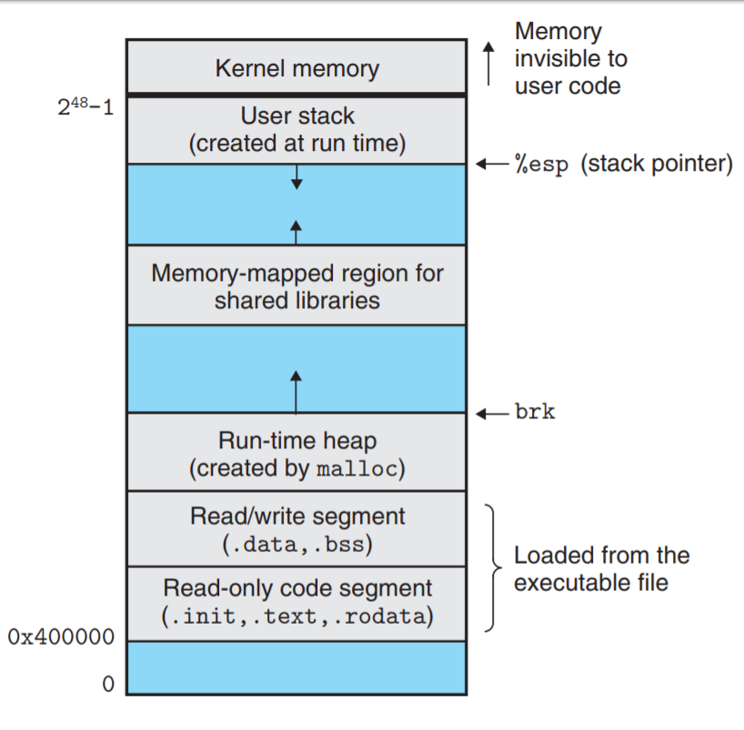

# 你的哪些骚操作会导致Segmentation Fault😂

## 前言

如果你是一个写过一些C程序的同学，那么很大可能你会遇到魔幻的**segmentation fault**，可能一时间抓耳挠腮，本篇文章主要介绍一些常见的导致segmentation fault的代码问题，希望能够帮助大家快速定位问题！

## 出现Segmentation Fault的常见操作

### 写只读数据

```c

#include <stdio.h>

char* str= "hello world";

int main() {
  printf("%s\n", str);
  *str = '1';
  return 0;
}
```

在上面的程序当中，`str`是一个全局变量，一个指向只读数据`hello world`的指针，因为指向的数据存放在只读数据区，如下图所示（rodata区域）：

