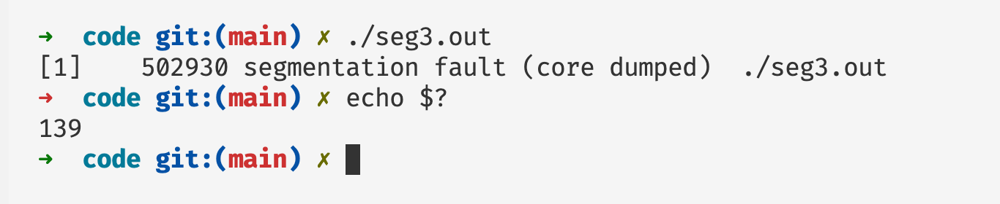

# 深入剖析Sgementation fault原理

## 前言

我们在日常的编程当中，我们很容易遇到的一个程序崩溃的错误就是`segmentation fault`，在本篇文章当中将主要分析段错误发生的原因！

## Sgementation fault发生的原因

发生Sgementation fault的直接原因是，程序收到一个来自内核的SIGSEGV信号，如果是你的程序导致的内核给进程发送这个信号的话，那么就是你的程序正在读或者写一个没有分配的页面或者你没有读或者写的权限。这个信号的来源有两个：

- 程序的非法访问，自身程序的指令导致的Sgementation fault。
- 另外一种是由别的程序直接发送SIGSEGV信号给这个进程。

在类Linux系统中，内核给进程发送的信号为SIGGEV，信号对应数字为11，在Linux当中信号对应的数字情况大致如下所示：

```shell
 1) SIGHUP	 2) SIGINT	 3) SIGQUIT	 4) SIGILL	 5) SIGTRAP
 6) SIGABRT	 7) SIGBUS	 8) SIGFPE	 9) SIGKILL	10) SIGUSR1
11) SIGSEGV	12) SIGUSR2	13) SIGPIPE	14) SIGALRM	15) SIGTERM
16) SIGSTKFLT	17) SIGCHLD	18) SIGCONT	19) SIGSTOP	20) SIGTSTP
21) SIGTTIN	22) SIGTTOU	23) SIGURG	24) SIGXCPU	25) SIGXFSZ
26) SIGVTALRM	27) SIGPROF	28) SIGWINCH	29) SIGIO	30) SIGPWR
31) SIGSYS	34) SIGRTMIN	35) SIGRTMIN+1	36) SIGRTMIN+2	37) SIGRTMIN+3
38) SIGRTMIN+4	39) SIGRTMIN+5	40) SIGRTMIN+6	41) SIGRTMIN+7	42) SIGRTMIN+8
43) SIGRTMIN+9	44) SIGRTMIN+10	45) SIGRTMIN+11	46) SIGRTMIN+12	47) SIGRTMIN+13
48) SIGRTMIN+14	49) SIGRTMIN+15	50) SIGRTMAX-14	51) SIGRTMAX-13	52) SIGRTMAX-12
53) SIGRTMAX-11	54) SIGRTMAX-10	55) SIGRTMAX-9	56) SIGRTMAX-8	57) SIGRTMAX-7
58) SIGRTMAX-6	59) SIGRTMAX-5	60) SIGRTMAX-4	61) SIGRTMAX-3	62) SIGRTMAX-2
63) SIGRTMAX-1	64) SIGRTMAX
```

当一个程序发生 segmentation fault 的时候，这个程序的退出码 exitcode 等于 139！



发生 segmentation fault 的一个主要的原因是我们自己的程序发生非法访问内存，同时别的程序给这个进程发送 SIGSGEV 信号也会导致我们的程序发生 segmentation fault 错误。

比如下面的程序就是自己发生的段错误（发生了越界访问）：

```c
#include <stdio.h>

int main() {

  int arr[10];
  arr[1 << 20] = 100; // 会导致 segmentation fault
  printf("arr[12] = %d\n", arr[1 << 20]); // 会导致 segmentation fault
  return 0;
}
```

下面是一个别的程序给其他程序发送SIGSGEV信号会导致其他进程出现段错误（下面的终端给上面终端的进程号等于504092的程序发送了一个信号值等于11（就是SIGGSGEV）信号，让他发生段错误）：


## 自定义信号处理函数

操作系统允许我们自己定义函数，当某些信号被发送到进程之后，进程就会去执行这些函数，而不是系统默认的程序（比如说SIGSEGV默认函数是退出程序）。下面来看我们重写SIGINT信号的处理函数：

```c

#include <stdio.h>
#include <unistd.h>
#include <stdlib.h>
#include <signal.h>
#include <string.h>

void sig(int n) { // 参数 n 表示代表信号的数值
  char* str = "signal number = %d\n";
  char* out = malloc(128);
  sprintf(out, str, n);
  write(STDOUT_FILENO, out, strlen(out));
  free(out);
}

int main() {
  signal(SIGINT, sig); // 这行代码就是注册函数 当进程收到 SIGINT 信号的时候就执行 sig 函数
  printf("pid = %d\n", getpid());
  while (1)
  {
    sleep(1);
  }
  
  return 0;
}
```


首先我们需要知道，当我们在终端启动一个程序之后，如果我们在终端按下ctrl+c终端会给当前正在运行的进程以及他的子进程发送SIGINT信号，SIGINT信号的默认处理函数就是退出程序，但是我们可以捕获这个信号，重写处理函数。在上面的程序当中我们就自己重写了SIGINT的处理函数，当进程接收到 SIGINT 信号的时候就会出发函数 sig 。上面程序的输出印证了我们的结果。

我们在终端当中最常用的就是ctrl+c 和 ctrl + z 去中断当前终端正在执行的程序，其实这些也是给我们的程序发送信号，ctrl+c发送SIGINT信号ctrl+z发送SIGTSTP信号。因此和上面的机制类似，我们可以使用处理函数重写的方式，覆盖对应的信号的行为，比如下面的程序就是使用处理函数重写的方式进行信号处理：

```c

#include <stdio.h>
#include <signal.h>
#include <string.h>
#include <stdlib.h>
#include <fcntl.h>
#include <unistd.h>

void sig(int no) {
  char out[128];
  switch(no) {
    case SIGINT:
      sprintf(out, "received SIGINT signal\n");
      break;
    case SIGTSTP:
      sprintf(out, "received SIGSTOP signal\n");
      break;
  }
  write(STDOUT_FILENO, out, strlen(out));
}

int main() {
  signal(SIGINT, sig);
  signal(SIGTSTP, sig);
  while(1) {sleep(1);}
  return 0;
}
```

现在我们执行这个程序然后看看当我们输入ctrl+z和ctrl+c会出现有什么输出。


从上面的输出我们可以看到实现了我们想要的输出结果，说明我们的函数重写生效了。

## 段错误的魔幻

这里有另外一个程序，我们看看这个程序的输出是什么：

```c

#include <stdio.h>
#include <unistd.h> 
#include <signal.h>

void sig(int n) {
  write(STDOUT_FILENO, "a", 1); // 这个函数就是向标准输出输出一个字符 a 
}

int main() {
  signal(SIGSEGV, sig); // 这个是注册一个 SIGSEGV 错误的处理函数 当操作系统给进程发送一个 SIGSEGV 信号之后这个函数就会被执行
  int* p; 
  printf("%d\n", *p); // 解引用一个没有定义的指针 造成 segementation fault
  return 0;
}
```

我们知道上面的程序肯定会产生 segementation fault 错误，会收到 SIGSGEV 信号，肯定会执行到函数`sig`。但是上面的程序会不断的输出`a`产生死循环。


我们需要了解操作系统是如何处理 segementation fault 的，了解这个处理过程之后对上面程序的输出就很容易理解了。

## 信号处理函数的执行过程

当我们的进程接收到信号回去执行我们重写的信号处理函数，如果在我们的信号处理函数当中没有退出程序或者转移程序的执行流(可以使用setjmp和longjmp实现)，即调用函数正常返回。信号处理函数返回之后会重新执行信号发生位置的指令，也就是说哪条指令导致操作系统给进程发送信号，那条条指令在信号处理函数返回的时候仍然会被执行，因此我们才看到了上面的输出结果。

那么我们如何修正我们的代码，让程序不进入死循环，让程序能够得到我们的接管呢。有两种办法：

- 一种是在信号处理函数当中进行一些逻辑处理之后然后，使用系统调用退出。
- 另外一种使用setjmp和longjmp进行执行流的跳转

