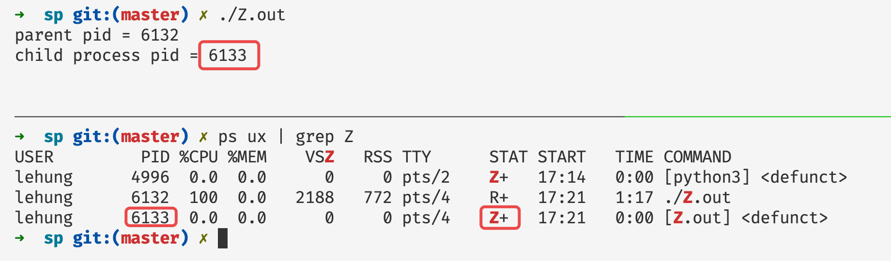
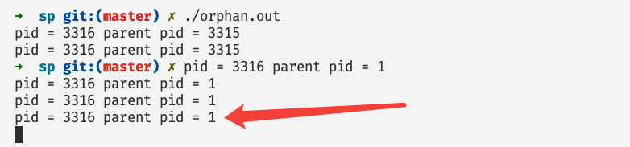
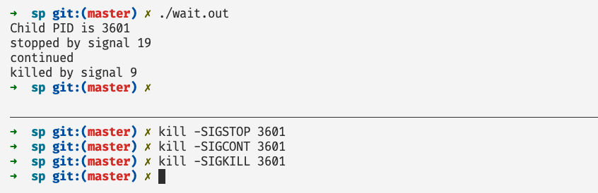
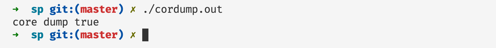
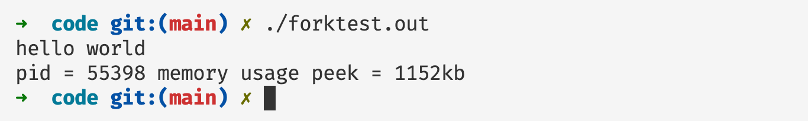
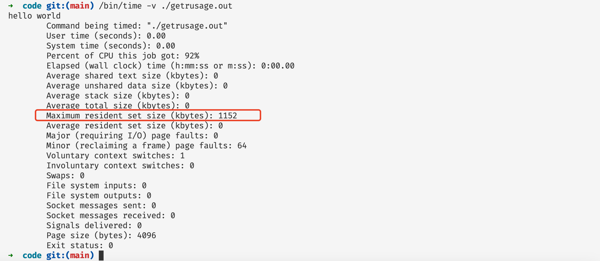

# 进程最后的遗言

## 前言

在本篇文章当中主要给大家介绍父子进程之间的关系，以及他们之间的交互以及可能造成的状态，帮助大家深入理解父子进程之间的关系，以及他们之间的交互。

## 僵尸进程和孤儿进程

### 僵尸进程

在 Unix 操作系统和类 Unix 操作系统当中，当子进程退出的时候，父进程可以从子进程当中获取子进程的退出信息，因此在 类 Unix 操作系统当中只有父进程通过 wait 系统调用读取子进程的退出状态信息之后，子进程才会完全退出。那么子进程在程序执行完成之后（调用 _exit 系统调用之后），到父进程执行 wait 系统调用获取子进程退出状态信息之前，这一段时间的进程的状态是僵尸进程的状态。

正式定义：在 Unix 或者类 Unix 操作系统当中，僵尸进程就是哪些已经完成程序的执行（完成_exit 系统调用退出了程序），但是在内核当中还有属于这个进程的进程表项。这个表项的作用主要是让父进程读取子进程的退出状态信息 (exit status)。

在后文当中我们有一个例子详细分析这个退出状态的相关信息。一旦父进程通过 wait 系统调用读取完子进程的 exit statis 信息之后，僵尸进程的进程表项就会从进程表（process table）当中被移除，这个进程就算是彻底消亡了（reaped）。

如果系统当中有很多处于僵尸状态的进程而父进程又没有使用 wait 系统调用去得到子进程的退出状态，那么系统当中就会有很多内存没有被释放，这就会导致资源泄露。

下面是一个僵尸进程的例子，对应的代码名称为 Z.c：

```c
#include <stdio.h>
#include <unistd.h>


int main() {
  printf("parent pid = %d\n", getpid());
  if(fork()) {
    while(1);
  }
  printf("child process pid = %d\n", getpid());
  return 0;
}
```

上面C语言对应的python代码如下：

```python
import os

if __name__ == "__main__":
    print(f"parent pid = {os.getpid()}")
    pid = os.fork()
    if pid != 0:
        # parent process will never exit
        while True:
            pass
    # child process will exit
    print(f"child process pid = {os.getpid()}")
```

现在执行上面的程序，得到的结果如下所示：



从上图当中我们可以看到父进程一直在进行死循环的操作，而子进程退出了程序，而现在应该处于僵尸进程状态。而我们通过 ps 命令得到的进程状态的结果，根据进程号得到子进程的状态为 `Z+`，这个状态就表示这个进程就是一个僵尸进程。我们在这里再简要谈一下命令 ps 对进程的状态的各种表示：

`STAT` 当中字母的含义表：

| 条目 | 含义                                                         |
| ---- | ------------------------------------------------------------ |
| D    | 表示不能够被中断的睡眠操作，比如说IO操作                     |
| I    | 内核当中的空闲线程                                           |
| R    | 正在执行或者处于就绪队列当中的进程                           |
| S    | 可以被中断的睡眠，一般是等待某个事件触发                     |
| T    | 被其他的进程发送的信号给停下来了                             |
| t    | 被调试或者tracing中                                          |
| Z    | 表示这个进程是一个僵尸进程                                   |
| <    | 表示高优先级                                                 |
| N    | 表示低优先级                                                 |
| L    | 有页面被所在内存当中，也就是说这个页面不会被操作系统换出道对换区当中 |
| s    | 表示这个进程是一个 session leader                            |
| l    | 是一个多线程程序                                             |
| +    | 表示在前台进程组当中                                         |

大家可以根据上表当中的内容对应一下程序的状态，就发现子进程目前处于僵尸状态。

### 孤儿进程

孤儿进程：当一个进程还在执行，但是他的父进程已经退出了，那么这个进程就变成了一个孤儿进程，然后他会被 init 进程（进程ID=1）"收养"，然后 init 进程会调用 wait 系统调用回收这个进程的资源。

下面是一个孤儿进程的例子，我们可以看看子进程的父进程的输出是什么：

```c
#include <stdio.h>
#include <unistd.h>
#include <stdlib.h>

int main() {
  if(fork()) {
    sleep(1);
    // 父进程退出
    exit(0);
  }
  while(1) {
    printf("pid = %d parent pid = %d\n", getpid(), getppid());
    sleep(1);
  }
  return 0;
}
```

对应的python代码如下：

```py
import os
import time


if __name__ == "__main__":
    pid = os.fork()

    if pid == 0:
        while True:
            print(f"pid = {os.getpid()} parent pid = {os.getppid()}")
            time.sleep(1)
```

程序执行结果如下所示：



可以看到子进程的父进程发生了变化，当父进程退出之后，子进程的父进程变成了 init 进程，进程号等于1。

## wait系统调用

### waitpid 及其参数分析

在前文当中我们主要谈到了两种比较不一样的进程，其中更是主要谈到了 wait 系统调用对于僵尸进程的重要性。在 linux 当中与 wait 相关的主要有下面两个系统调用：

```c
pid_t waitpid(pid_t pid, int *wstatus, int options);
pid_t wait(int *wstatus);
```

其中 wait 系统调用是 waitpid 系统调用的一个特例，我们首先解释一下 waipit 系统调用。上面两个系统调用主要是用于等待子进程的状态变化的，并且从子进程当中取出额外的状态信息（status information）。只有当子进程的状态发生变化了 wait 系统调用才能返回，主要有以下几种状态：

- 子进程结束了。
- 子进程被别的进程发送的信号停止运行了（SIGSTOP和SIGTSTP可以让一个进程被挂起停止执行）。
- 停止运行的进程被信号唤醒继续执行了（SIGCONT可以唤醒进程继续执行）。

当有子进程出现上面的状态的时候 wait 或者 waitpid 系统调用会马上返回，否则 wait 或者 waitpid 系统调用就会一致阻塞。waitpid 的几个参数：

- pid:
  - pid < -1 表示等待任何进程组 -pid 当中的该进程的子进程。
  - pid == -1 表示等待任何一个子进程。
  - pid == 0 表示等待子进程，这些子进程的进程组号（process group id） 等于这个进程（调用 waitpid 函数的这个进程）的进程号。
  - pid > 0 表示等待进程号等于 pid 的子进程。
- options：
  - WNOHANG：如果 options 等于这个值的话，表示如果还没有子进程结束执行就立即返回，不进行等待。
  - WUNTRACED：如果子进程被其他进程发送的信号 stop 了，wait 函数也返回。
  - WCONTINUED：如果子进程被其他进程发送的信号（SIGCONT）恢复执行了，wait 函数也返回。
  - 根据上面的分析， waitpid(-1, &wstatus, 0) == wait( &wstatus)
- wstatus：是我们传入给 wait 或者 waitpid 函数的一个指针，系统调用会将子进程的很多状态信息放入到 wstatus 指针指向的数据当中，我们可以使用下面的一些宏去判断一些信息。
  - WIFEXITED(wstatus)：如果子进程正常退出（使用 exit 、_exit或者直接从main函数返回）这行代码就返回为 true。
  - WEXITSTATUS(wstatus)：这个宏主要是返回程序退出的退出码，关于退出码的内容，可以参考这篇文章[Shell揭秘——程序退出状态码](https://mp.weixin.qq.com/s?__biz=Mzg3ODgyNDgwNg==&mid=2247487102&idx=1&sn=32f21013fc7974346a80056d56f60376&chksm=cf0c9277f87b1b612b22a3005ed5667b42fb6e450ee2f24e0073892a8086eb8fbdfec00f35a8&token=308651918&lang=zh_CN#rd)。
  - WIFSIGNALED(wstatus)：表示子进程是否是其他进程发送信号导致程序退出的。
  - WTERMSIG(wstatus)：如果子进程是其他进程发送信号导致程序退出的话，我们可以使用这个宏去得到具体的信号值。
  - WCOREDUMP(wstatus)：表示子进程是否发生 core dump 然后退出的。
  - WIFSTOPPED(wstatus)：当子进程接收到了一个其他进程发送的信号导致程序被挂起，这个宏就返回 true。
  - WSTOPSIG(wstatus)：返回挂起信号的具体的信号值。
  - WIFCONTINUED(wstatus): 返回 true 如果子进程接收到了一个SIGCONT信号恢复程序的执行。

### 示例说明

下面是一个几乎综合了上面所有的信息的一个例子，我们仔细看看这个程序的输出：

```c


#include <sys/wait.h>
#include <stdint.h>
#include <stdlib.h>
#include <unistd.h>
#include <stdio.h>


int main(int argc, char *argv[])
{
    pid_t cpid, w;
    int wstatus;

    cpid = fork();
    if (cpid == -1) {
        perror("fork");
        exit(EXIT_FAILURE);
    }

    if (cpid == 0) {            /* Code executed by child */
        printf("Child PID is %jd\n", (intmax_t) getpid());
        if (argc == 1)
            pause();   // 子进程会在这里等待接收信号 直到信号的处理函数返回                  /* Wait for signals */
        _exit(atoi(argv[1]));

    } else {                    /* Code executed by parent */
        do {
            w = waitpid(cpid, &wstatus, WUNTRACED | WCONTINUED);
            if (w == -1) {
                perror("waitpid");
                exit(EXIT_FAILURE);// EXIT_FAILURE 是一个宏 等于 1
            }
						// 程序是否是正常退出
            if (WIFEXITED(wstatus)) {
                printf("exited, status=%d\n", WEXITSTATUS(wstatus));
            } else if (WIFSIGNALED(wstatus)) { // 是否是被信号杀死
                printf("killed by signal %d\n", WTERMSIG(wstatus));
            } else if (WIFSTOPPED(wstatus)) { // 是否被 stop 
                printf("stopped by signal %d\n", WSTOPSIG(wstatus));
            } else if (WIFCONTINUED(wstatus)) { // 是否处于 stop 状态再被唤醒
                printf("continued\n");
            }
          // 判断程序是否退出 正常退出和因为信号退出 如果程序是退出了 父进程就退出 while 循环
        } while (!WIFEXITED(wstatus) && !WIFSIGNALED(wstatus));
        exit(EXIT_SUCCESS); // EXIT_SUCCESS 是一个宏 等于 0
    }
}
```



在上图的例子当中，我们在上面的终端先执行 wait.out 程序，然后在下面一个终端我们首先发送一个 SIGSTOP 信号给子进程，先让进程停下来，然后在发送一个 SIGCONT 信号让进程继续执行，最后发送了一个 SIGKILL 信号让子进程退出，可以看到我们上面提到的宏操作都一一生效了，在父进程当中信号和退出状态都一一接受了。

我们再来演示一个 coredump 的例子：

```c
#include <stdio.h>
#include <sys/types.h>
#include <sys/wait.h>
#include <unistd.h>

int main() {

  if(fork()) {
    int s;
    wait(&s);
    if(WCOREDUMP(s)) {
      printf("core dump true\n");
    }
  }else{
    int a = *(int*)NULL;
  }
}
```

子线程解引用NULL会造成segmentation fault (core dump)，然后父进程接收子进程的退出状态，然后对状态进行判断，是否是 coredump 导致的退出：



我们在父进程对子进程的退出码进行了判断，如果子进程退出的原因是 core dump 的话就进行打印输出，而在上面的程序输出当中我们看到了程序进行了输出，因此父进程可以判断子进程是因为 core dump 而退出程序的。

## 从子进程获取系统资源信息

出了上面所谈到的等在子进程退出的方法之外，我们还有可以获取子进程执行时候的状态信息，比如说运行时占用的最大的内存空间，进程有多少次上下文切换等等。主要有下面两个系统调用：

```c
pid_t wait3(int *wstatus, int options,
                   struct rusage *rusage);
pid_t wait4(pid_t pid, int *wstatus, int options,
                   struct rusage *rusage);
```

其中 3 和 4 表示对应的函数的参数的个数。在上面的两个函数当中有一个比较重要的数据类型 `struct rusage` ，我们看一下这个结构体的内容和对应字段的含义：

```c
struct rusage {
  struct timeval ru_utime; /* user CPU time used */ // 程序在用户态的时候使用了多少的CPU时间
  struct timeval ru_stime; /* system CPU time used */ // 程序在内核态的时候使用了多少CPU时间
  long   ru_maxrss;        /* maximum resident set size */ // 使用的内存的峰值 单位 kb
  long   ru_ixrss;         /* integral shared memory size */ // 暂时没有使用
  long   ru_idrss;         /* integral unshared data size */ // 暂时没有使用
  long   ru_isrss;         /* integral unshared stack size */ // 暂时没有使用
  long   ru_minflt;        /* page reclaims (soft page faults) */ // 没有IO操作时候 page fault 的次数
  long   ru_majflt;        /* page faults (hard page faults) */ // 有 IO 操作的时候 page fault 的次数
  long   ru_nswap;         /* swaps */ // 暂时没有使用
  long   ru_inblock;       /* block input operations */ // 文件系统写操作次数
  long   ru_oublock;       /* block output operations */ // 文件系统读操作次数
  long   ru_msgsnd;        /* IPC messages sent */// 暂时没有使用
  long   ru_msgrcv;        /* IPC messages received */ // 暂时没有使用
  long   ru_nsignals;      /* signals received */ // 暂时没有使用
  long   ru_nvcsw;         /* voluntary context switches */ // 主动上下文切换的次数
  long   ru_nivcsw;        /* involuntary context switches */ // 非主动上下文切换的次数
};
```

下面我们用一个例子看看是如何从子进程当中获取子进程执行时候的一些详细数据信息的：

下面是子进程的代码，我们在 fork 之后使用 execv 加载下面的程序：

```c

#include <stdio.h>


int main() {
  printf("hello world\n");
  return 0;
}
```

父进程代码：

```c

#include <sys/time.h>
#include <stdio.h>
#include <sys/resource.h>
#include <unistd.h>
#include <sys/wait.h>

int main(int argc, char* argv[]) {
  if(fork() != 0) {
    struct rusage usage; // 定义一个统计资源的结构体
    int pid = wait4(-1, NULL, 0, &usage); // 将这个结构体的地址传入 好让内核能讲对应的信息存在指针所指向的地方
    // 打印内存使用的峰值
    printf("pid = %d memory usage peek = %ldkb\n", pid, usage.ru_maxrss);
  }else {
    execv("./getrusage.out", argv);
  }
  return 0;
}
```

上面程序执行结果如下图所示：



可以看出我们得到了内存使用的峰值，其实我们还可以使用 time 命令去查看一个进程执行时候的这些数据值。



从上面的结果可以看到使用 time 命令得到的结果和我们自己使用程序得到的结果是一样的，这也从侧面验证了我们的程序。如果要达到上面的效果的话，需要注意使用绝对地址命令，因为 time 是shell的保留字。

## 总结

在本篇文章当中主要给大家详细介绍了僵尸进程、孤儿进程、父进程从子进程获取进程退出信息，以及他们形成的原因，并且使用实际的例子进行了验证，这一部分知识练习比较紧密，希望大家有所收获！

---

以上就是本篇文章的所有内容了，我是**LeHung**，我们下期再见！！！更多精彩内容合集可访问项目：<https://github.com/Chang-LeHung/CSCore>

关注公众号：**一无是处的研究僧**，了解更多计算机（Java、Python、计算机系统基础、算法与数据结构）知识。


