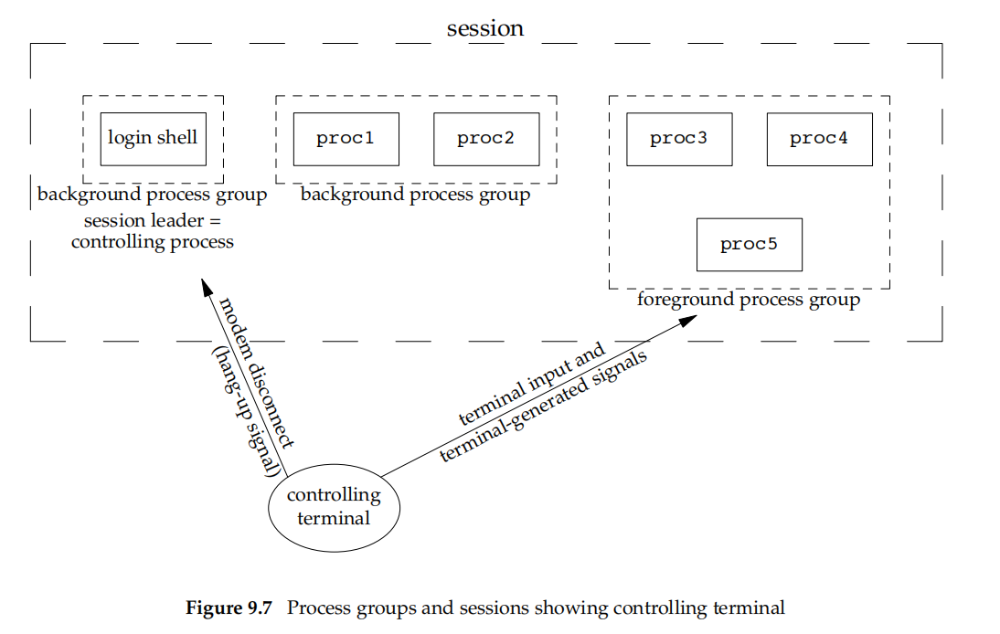
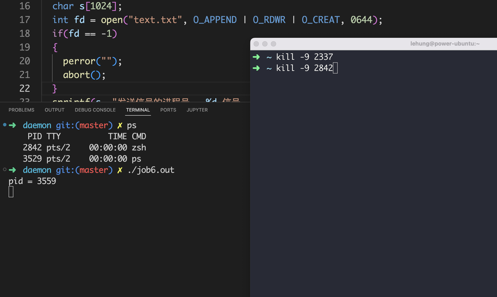
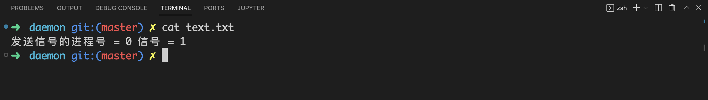
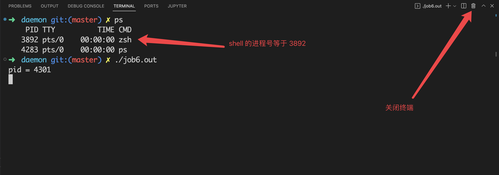
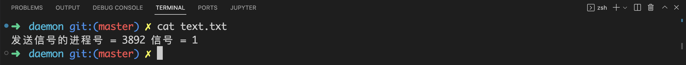

# 你在终端启动的进程，最后都是什么下场？（上）

## 前言

在本篇文章当中，主要给大家介绍我们在终端启动的进程都是怎么结束的，在我们登录终端和退出终端都发生了什么？

## 基本介绍

首先我们需要了解的概念就是当我们使用 ssh 登录服务器的时候就会产生一个会话。当我们在终端启动一个程序之后会创建一个新的进程组，进程组的首进程为要执行的程序，这个进程组可以是一个进程也可以是多个进程，整个进程组在 shell 看来也是一个作业（Job）。如果你不使用 & 符号去执行一个程序，那么 shell 就会执行这个程序，然后这个程序就成为一个前台进程组（可以是一个进程也可以是多个进程），当我们在终端当中执行的命令加上 & 符号，那么这个作业（Job）就会成为一个后台进程组。

会话、前台进程组和后台进程组他们之间的关系大致如下图所示：



从上面的图当中我们可以看出，一个会话当中有很多个进程组，分为前台进程组和后台进程组，但是后台进程组可以有多个，前台呢进程组最多只能有一个，而且每一个进程组当中可以有多个进程（当你在执行的程序当中 fork 出子进程的时候，就是一个含有多个进程的进程组）。

现在我们使用一个例子具体去了解一下：

```c

#include <stdio.h>
#include <unistd.h>

int main()
{
  // 打印进程的 id 号
  printf("process id = %d\n", getpid());
  // 打印进程的进程组号 0 表示返回当前进程的进程组号
  printf("process group id = %d\n", getpgid(0));
  // 打印进程的父进程号
  printf("parent process id = %d\n", getppid());
  // 打印父进程的进程组号
  printf("parent process group id = %d\n", getpgid(getppid()));
  return 0;
}
```

上面的程序的输出结果如下所示：
```shell
➜  daemon git:(master) ✗ ./job1.out 
process id = 3773445
process group id = 3773445
parent process id = 3766993
parent process group id = 3766993
```

从上面程序的输出结果我们可以看到程序的进程组号和父进程的进程组号是不一样的，我们需要了解到的是，job1 的父进程就是 shell ，但是他与 shell 的进程组是不一样的，shell 在执行新的程序的时候会创建一个子进程，然后修改子进程的进程组号，而且新的进程组的组号为子进程的进程号。

或者我们直接在终端输入命令也可以发现 shell 的子进程的进程组号和 shell 的进程组号是不一样的：

```shell
➜  daemon git:(master) ✗ ps -o pid,ppid,pgid,tty,cmd
    PID    PPID    PGID TT       CMD
3766993 3757891 3766993 pts/1    /usr/bin/zsh -i
3772829 3766993 3772829 pts/1    ps -o pid,ppid,pgid,tty,cmd
```

在上面的输出当中，PID，PPID，PGID 分别表示进程的进程号，父进程号和进程组号，CMD 表示执行程序时候的命令。首先我们知道的是 ps 命令进程是 shell 进程的子进程（上面的进程号等于 3766993 的进程就是 shell 进程），从上面的输出结果也可以得知这一点（ ps 的 PPID 就是 shell 的 PID）。

通过上面两个例子我们可以知道，确实当我们执行程序的时候 shell 会创建一个新的进程组，事实上只要是在终端里面执行的程序，都会创建一个新的进程组。如果你熟悉 linux 的话，那么肯定用过 & 符号，这个符号就是将任务放在后台执行，这样创建的进程组就是后台进程组。

## 前台进程的死亡情况列表

前台进程组的死亡一般来说有四种情况：

- 程序正常结束，比如你在终端输入 ls 命令，执行完成✅之后他就正常结束了。
- 当你在终端输入 ctrl + c 之类的字符的时候内核会给前台进程组发送 SIGINT 之类的信号。
- 当控制进程 也就是 shell 进程终止(比如说被杀掉了)的时候，内核会发送 SIGHUP 信号给前台进程组中的所有进程。
- 当退出终端的时候，shell 会发送 SIGHUP 信号给前台进程组。

## 初探信号

大家如果经常使用 linux 的话，一定会有过这种情况：当你在终端执行一个程序的时候，你突然遇到某些问题不想执行他了，然后你会疯狂按 ctrl + c ，让这个程序退出。那当你在终端按下 ctrl + c 的时候程序一定会停止嘛？如果程序退出了，那是什么原因导致他退出的呢？事实上，当你在终端按下 ctrl + c 的时候，内核会想前台进程组所有的进程发送一个 SIGINT 信号，注意这里是前台进程组中的所有进程，但是通常我们在终端里执行的就是一个单进程任务，但是如果我们执行的程序是多进程的话，那么这个进程组里面的所有进程都会收到一个来自操作系统内核的 SIGINT 信号。

为了后面我们进行验证的时候大家能够了解清楚程序的行为，我们首先介绍一下信号处理函数的使用，所谓信号处理函数就是，当进程收到一个由其他进程或者操作系统内核发送的信号的时候，我们可以定义一个函数去处理信号，也就是定义收到信号的行为：

```c

#include <stdio.h>
#include <signal.h>
#include <unistd.h>
#include <string.h>

void sig(int signo) // signo 这个参数就是对应信号的数字表示 SIGINT 信号对应的数字为 2
{
  char* s = "received a signal\n";
  write(STDOUT_FILENO, s, strlen(s));
}

int main()
{
  // 注册收到 SIGINT 信号的时候，我们应该使用什么处理函数
  // 当进程收到 SIGINT 信号的时候，会调用函数 sig 
  signal(SIGINT, sig);
  while(1);
  return 0;
}
```

上面的程序的输出结果如下所示：

```shell
➜  daemon git:(master) ✗ ./job4.out 
^Creceived a signal
^Creceived a signal
^Creceived a signal
^Creceived a signal
^Creceived a signal
^Creceived a signal
^Creceived a signal
```

从上面的终端的输出结果我们可以知道，当我们在终端输入 SIGINT 的时候，进程会收到一个 SIGINT 信号，然后会调用信号处理函数 sig ，并且执行函数体。

现在我们执行一个多进程的任务试试：

```c

#include <stdio.h>
#include <signal.h>
#include <unistd.h>
#include <string.h>

void sig(int signo) // signo 这个参数就是对应信号的数字表示 SIGINT 信号对应的数字为 2
{
  char s[1024];
  sprintf(s, "received a signal %d\n", getpid()); // 输出内容并且答应进程的进程号
  write(STDOUT_FILENO, s, strlen(s));
}

int main()
{
  // 注册收到 SIGINT 信号的时候，我们应该使用什么处理函数
  // 当进程收到 SIGINT 信号的时候，会调用函数 sig 
  signal(SIGINT, sig);
  fork();
  fork();
  while(1);
  return 0;
}
```

在上面的程序当中，我们 fork 的两次，一共有四个进程，上面的程序输出的结果如下所示：

```shell
➜  daemon git:(master) ✗ ./job5.out 
^Creceived a signal 3702
received a signal 3703
received a signal 3705
received a signal 3704
^Creceived a signal 3703
received a signal 3702
received a signal 3705
received a signal 3704
^Creceived a signal 3703
received a signal 3704
received a signal 3705
received a signal 3702
```

从上面的输出结果我们可以看到，前台进程组的所有进程都收到了 SIGINT 信号。

事实上，我们有如下规则：

>在任一时刻，会话（当我们登录服务器的时候就会产生一个会话，我们使用一些远程登录软件的时候通常会看到 session 的字样们就是表示会话）中的其中一个进程组会成为终端的前台进程组，其他进程组会成为后台进程组。只有前台进程组中的进程才能从控制终端中读取输入。当用户在控制终端中输入其中一个信号生成终端字符之后，该信号会被发送到前台进程组中的所有成员。这些字符包括生成 SIGINT 的中断字符（通常是 Control-C）、生成 SIGQUIT 的退出字符（通常是 Control-\）、生成 SIGSTP 的挂起字符（通常是 Control-Z）。

## 是谁给前台进程组发送的 SIGINT 信号

在上面的内容当中我们提到了：

- 当我们按下中断字符（ctrl + c）的时候，所有的前台进程都会收到一个 SIGINT 信号。
- 当我们按下退出字符（ctrl + \）的时候，所有的前台进程都会收到一个 SIGQUIT 信号。
- 当我们按下挂起字符（ctrl + Z）的时候，所有的前台进程都会收到一个 SIGTSTP 信号。

现在的问题来了，是谁发送的这些信号呢？事实上是 0 号进程发送的这些信号，我们可以使用程序去验证这一点。

```c

#define _GNU_SOURCE
#include <unistd.h>
#include <error.h>
#include <errno.h>
#include <fcntl.h>
#include <stdio.h>
#include <time.h>
#include <string.h>
#include <stdlib.h>
#include <signal.h>

void my_handler (int signo, siginfo_t *si, void*ucontext)
{
  char s[1024];
  // si->si_pid 是发送信号的进程的进程号
  sprintf(s, "发送信号的进程号 = %d 信号 = %d\n", si->si_pid, signo);
  write(STDOUT_FILENO, s, strlen(s));
  _exit(0);
}

int main()
{
  printf("pid = %d\n", getpid());
  struct sigaction demo;
  demo.sa_sigaction = my_handler; // 保存信号处理函数
  demo.sa_flags |= SA_SIGINFO; // 这个表示使用三个参数的信号处理函数 之前使用 signal 的信号处理函数值有一个参数
  sigaction(SIGINT, &demo, NULL);
  sigaction(SIGQUIT, &demo, NULL);
  sigaction(SIGTSTP, &demo, NULL);
  while(1);
  return 0;
}
```

上面的程序的输出结果如下所示：

```shell
➜  daemon git:(master) ✗ ./job2.out 
pid = 12842
^C发送信号的进程号 = 0 信号 = 2
```

在上面的程序当中我们使用 sigaction 去定义我们自己的信号处理函数，在之前我们是使用 signal 这个函数去定义信号处理函数，其实 signal 也是通过 sigaction 实现的，sigaction 可以让我们定义一些更加细节的处理。

从上面的函数定义来看，sigaction 和 signal 不一样的地方在于信号处理函数有三个参数，然后我们定义了三个信号 SIGINT、SIGQUIT和SIGTSTP，他们的信号处理函数都是 my_handler 。

从上面程序的输出结果我们可以知道是进程号等于 0 的进程发送的，哎我们知道的 init 的进程号是等于 1 ，那么进程号等于 0 的进程是啥呢？


事实上这个 0 号进程就是位于内核的终端驱动程序，init 的进程号是 1 ，内核的进程号等于 0 ，是不是可以理解呢？😂

## Shell 被杀掉导致前台进程死亡

当 shell 进程被杀掉退出的时候，内核会发送 SIGHUP 给所有的前台进程，接下来我们复现一下这个结果。

在前面的文章当中我们提到了，当一个终端终止执行，比如说被 kill -9 杀死，那么内核就会发送 SIGHUP 信号给前台进程组当中的所有的进程，现在我们使用下面的程序来复现这个现象：

```c

#define _GNU_SOURCE
#include <unistd.h>
#include <error.h>
#include <errno.h>
#include <fcntl.h>
#include <stdio.h>
#include <time.h>
#include <string.h>
#include <stdlib.h>
#include <signal.h>
#include <assert.h>

void my_handler (int signo, siginfo_t *si, void*ucontext)
{
  char s[1024];
  int fd = open("text.txt", O_APPEND | O_RDWR | O_CREAT, 0644);
  if(fd == -1)
  {
    perror("");
    abort();
  }
  sprintf(s, "发送信号的进程号 = %d 信号 = %d\n", si->si_pid, signo);
  write(fd, s, strlen(s));
  close(fd);
  fsync(fd);
  _exit(0);
}

int main()
{
  printf("pid = %d\n", getpid());
  struct sigaction demo;
  demo.sa_sigaction = my_handler;
  demo.sa_flags |= SA_SIGINFO;
  demo.sa_flags &= ~SA_RESETHAND;
  sigaction(SIGINT, &demo, NULL);
  sigaction(SIGHUP, &demo, NULL);
  while(1);
  return 0;
}
```

在上面的程序当中我们给 SIGHUP 定义了一个信号处理器 my_handler ，当进程收到 SIGHUP 信号的时候就会调用这个函数，然后往 text.txt 文件当中写入数据，我们再次查看文件就能够知道是哪个进程给前台进程组发送的信号了。

在下面的图片当中，首先我们启动一个 shell 进程，进程号等于 2842，然后启动程序 job6.out（就是上面的代码），然后在右侧的终端执行 kill -9 命令，杀死左侧的终端程序，最终 job6.out 会收到一个来自内核的 SIGHUP 信号，因此会在 text.txt 文件当中写入信息。



我们现在再次查看 text.txt 文件当中的信息：



从上面的 text.txt 文件的输出结果我们就可以知道了，确实是内核发送的 SIGHUP 信号，SIGHUP 信号对应的信号数值就是 1，这个输出结果符合我们的预期。

## 退出终端导致前台进程组死亡

我们已经在前文当中提到了，当我们退出终端的时候 shell 会给所有的前台进程组发送 SIGHUP 信号，现在我们来复现一下这个现象。

在下面的图片当中我们使用 ps 命令得到当前 shell 的进程号，从图片的结果来看当前的 shell 的进程号等于 3892，然后我们在终端执行程序 job6.out ，和上个例子的是同一个程序，然后我们退出终端，根据前面我们所谈到的在退出终端之后 shell 会给所有的前台进程组发送 SIGHUP 信号，那么 job6.out 就会调用信号处理函数，然后将信息写入 text.txt 。



我们现在来看一下 text.txt 当中的内容：



从上面的输出结果来看 job6.out 确实收到了一个 SIGHUP 信号，对应的信号值等于 1，而且发送信号的进程号等于 3892，确实是上图当中显示的 shell 的进程号。

## 总结

在本篇文章当中主要给大家介绍了前台进程组当中的进程退出的几种情况，并且使用程序复现了他们，总的来说深入去了解其中的过程对我们来说还是很有裨益的，希望大家有所收获！

---

以上就是本篇文章的所有内容了，我是**LeHung**，我们下期再见！！！更多精彩内容合集可访问项目：<https://github.com/Chang-LeHung/CSCore>

关注公众号：**一无是处的研究僧**，了解更多计算机（Java、Python、计算机系统基础、算法与数据结构）知识。


