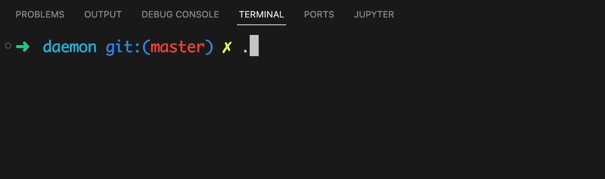

# 你在终端启动的进程，最后都是什么下场？（下）

在上期文章[你在终端启动的进程，最后都是什么下场？（上）](https://mp.weixin.qq.com/s?__biz=Mzg3ODgyNDgwNg==&mid=2247487367&idx=1&sn=430b3afe8399ed32cf832d942b305a5d&chksm=cf0c938ef87b1a9803b2db922463612e5729579802d733ad6fd778d0c0d8439766b43af2801e&token=1948688554&lang=zh_CN#rd)当中我们介绍了前台进程最终结束的几种情况，在本篇文章当中主要给大家介绍后台进程号和孤儿进程可能被杀死的集中情况。

## 揭秘nohup——后台进程的死亡

如果大家有过让程序在后台持续的运行，当你退出终端之后想让你的程序继续在后台运行，我们通常会使用命令 nohup。那么现在问题来了，为什么我们让程序在后台运行需要 nohup 命令，nohup 命令又做了什么？

在前面的文章[你在终端启动的进程，最后都是什么下场？（上）](https://mp.weixin.qq.com/s?__biz=Mzg3ODgyNDgwNg==&mid=2247487367&idx=1&sn=430b3afe8399ed32cf832d942b305a5d&chksm=cf0c938ef87b1a9803b2db922463612e5729579802d733ad6fd778d0c0d8439766b43af2801e&token=1948688554&lang=zh_CN#rd)当中我们已经谈到了，当你退出终端之后 shell 会发送 SIGHUP 信号给前台进程组的所有进程，然后这些进程在收到这个信号之后如果没有重写 SIGHUP 信号的 handler 或者也没有忽略这个信号，那么就会执行这个信号的默认行为，也就是退出程序的执行。

事实上当你退出终端之后 shell 不仅给前台进程组的所有进程发送 SIGHUP 信号，而且也会给所有的后台进程组发送 SIGHUP 信号，因此当你退出终端之后你启动的所有后台进程都会收到一个 SIGHUP 信号，注意 shell 是给所有的后台进程组发送的信号，因此如果你的后台进程是一个多进程的程序的话，那么你这个多进程程序的每一个进程都会收到这个信号。

根据上面的分析我们就可以知道了当我们退出终端之后，shell 会给后台进程发送一个 SIGHUP 信号。在我们了解了 shell 的行为之后我们应该可以理解为什么我么需要 nohup 命令，因为我们正常的程序是没有处理这个 SIGHUP 信号的，因此当我们退出终端之后所有的后台进程都会收到这个信号，然后终止执行。

看到这里你应该能够理解 nohup 命令的原理和作用了，这个命令的作用就是让程序忽略 SIGHUP 这个信号，我们可以通过 nohup 的源代码看出这一点。

nohup 的核心代码如下所示：

```c
int
main(int argc, char *argv[])
{
	int exit_status;

	while (getopt(argc, argv, "") != -1)
		usage();
	argc -= optind;
	argv += optind;
	if (argc < 1)
		usage();

	if (isatty(STDOUT_FILENO))
		dofile();
	if (isatty(STDERR_FILENO) && dup2(STDOUT_FILENO, STDERR_FILENO) == -1)
		/* may have just closed stderr */
		err(EXIT_MISC, "%s", argv[0]);

	(void)signal(SIGHUP, SIG_IGN); // 在这里忽略 SIGHUP 这个信号

	execvp(*argv, argv); // 执行我们在命令行当中指定的程序
	exit_status = (errno == ENOENT) ? EXIT_NOTFOUND : EXIT_NOEXEC;
	err(exit_status, "%s", argv[0]);
}
```

在上面的程序当中我们可以看到，在 main 函数当中，nohup 首先创建使用 signal 命令忽略了 SIGHUP 信号，SIG_IGN 就是忽略这个信号，然后使用 execvp 执行我们在命令行当中指定的程序。

这里需要注意一点的是关于 execvp 函数，也就是 execve 这一类系统调用，只有当我们使用 SIG_IGN 忽略信号的时候，才会在 execvp 系列函数当中起作用，如果是我们自己定义的信号处理器 (handler)，那么在我们执行完 execvp 这个系统调用之后，所有的我们自己定义的信号处理器的行为都将失效，所有被重新用新的函数定义的信号都会恢复成信号的默认行为。

比如说下面这个程序：

```c
#include <stdio.h>
#include <signal.h>
#include <unistd.h>
#include <string.h>

void sig(int no)
{
  char* s = "Hello World\n";
  write(STDOUT_FILENO, s, strlen(s));
  sync();
}

int main(int argc, char* argv[], char* argvp[])
{

  signal(SIGINT, sig);
  execvp(argv[1], argv);
}
```

在上面的程序当中我们定义了一个信号处理器 sig 函数，如果接受到 SIGINT 信号那么就会执行 sig 函数，但是我们前面说了，因为只有 SIG_IGN 才能在 execvp 函数执行之后保持，如果是自定函数的话，那么这个信号的行为就会被重置成默认行为，SIGINT 的默认行为是退出程序，现在我们使用上面的程序去加载执行一个死循环的程序，执行结果如下：


从上面的程序的输出结果我们就可以知道，在我们按下 ctrl + c 之后进程会收到一个来自内核的 SIGINT 信号，但是并没有执行我们设置的函数 sig ，因此验证了我们在上文当中谈到的结论！

有心的同学可能会发现当我们在终端使用 nohup 命令的时候会生成一个 "nohup.out" 文件，记录我们的程序的输出内容，我们可以在 nohup 的源代码当中发现一点蛛丝马迹，我们可以看一下 nohup 命令的完整源代码：

```c
#if 0
#ifndef lint
static const char copyright[] =
"@(#) Copyright (c) 1989, 1993\n\
	The Regents of the University of California.  All rights reserved.\n";
#endif /* not lint */

#ifndef lint
static char sccsid[] = "@(#)nohup.c	8.1 (Berkeley) 6/6/93";
#endif /* not lint */
#endif
#include <sys/cdefs.h>
__FBSDID("FreeBSD");

#include <sys/param.h>
#include <sys/stat.h>

#include <err.h>
#include <errno.h>
#include <fcntl.h>
#include <signal.h>
#include <stdio.h>
#include <stdlib.h>
#include <string.h>
#include <unistd.h>

static void dofile(void);
static void usage(void);

#define	FILENAME	"nohup.out" // 定义输出文件的文件名
/*
 * POSIX mandates that we exit with:
 * 126 - If the utility was found, but failed to execute.
 * 127 - If any other error occurred. 
 */
#define	EXIT_NOEXEC	126
#define	EXIT_NOTFOUND	127
#define	EXIT_MISC	127

int
main(int argc, char *argv[])
{
	int exit_status;

	while (getopt(argc, argv, "") != -1)
		usage();
	argc -= optind;
	argv += optind;
	if (argc < 1)
		usage();

	if (isatty(STDOUT_FILENO))
		dofile();
	if (isatty(STDERR_FILENO) && dup2(STDOUT_FILENO, STDERR_FILENO) == -1)
		/* may have just closed stderr */
		err(EXIT_MISC, "%s", argv[0]);

	(void)signal(SIGHUP, SIG_IGN);

	execvp(*argv, argv);
	exit_status = (errno == ENOENT) ? EXIT_NOTFOUND : EXIT_NOEXEC;
	err(exit_status, "%s", argv[0]);
}

static void
dofile(void)
{
	int fd;
	char path[MAXPATHLEN];
	const char *p;

	/*
	 * POSIX mandates if the standard output is a terminal, the standard
	 * output is appended to nohup.out in the working directory.  Failing
	 * that, it will be appended to nohup.out in the directory obtained
	 * from the HOME environment variable.  If file creation is required,
	 * the mode_t is set to S_IRUSR | S_IWUSR.
	 */
	p = FILENAME;
  // 在这里打开 nohup.out 文件
	fd = open(p, O_RDWR | O_CREAT | O_APPEND, S_IRUSR | S_IWUSR);
	if (fd != -1)
    // 如果文件打开成功直接进行文件描述符的替代，将标准输出重定向到文件 nohup.out 
		goto dupit;
	if ((p = getenv("HOME")) != NULL && *p != '\0' &&
	    (size_t)snprintf(path, sizeof(path), "%s/%s", p, FILENAME) <
	    sizeof(path)) {
		fd = open(p = path, O_RDWR | O_CREAT | O_APPEND,
		    S_IRUSR | S_IWUSR);
		if (fd != -1)
			goto dupit;
	}
	errx(EXIT_MISC, "can't open a nohup.out file");

dupit:
	if (dup2(fd, STDOUT_FILENO) == -1)
		err(EXIT_MISC, NULL);
	(void)fprintf(stderr, "appending output to %s\n", p);
}

static void
usage(void)
{
	(void)fprintf(stderr, "usage: nohup [--] utility [arguments]\n");
	exit(EXIT_MISC);
}
```

在源代码当中的宏 FILENAME 定义的文件名就是 nohup.out，在上面的代码当中，如果判断当前进程的标准输出是一个终端设备就会打开文件 nohup.out 然后将进程的标准输出重定向到文件 nohup.out ，因此我们在程序当中使用 printf 的输出就都会被重定向到文件 nohup.out 当中，看到这里就破案了，原来如此。

## 后台进程和终端的纠缠

后台进程是不能够从终端读取内容的，当我们从终端当中读的时候内核就会给这个后台进程发送一个 SIGTTIN 信号，这个条件主要是避免多个不同的进程都读终端。如果后台进程从终端当中进行读，那么这个进程就会收到一个 SIGTTIN 信号，这个信号的默认行为就是退出程序。

我们可以使用下面的程序进程测试：

```c

#define _GNU_SOURCE
#include <stdio.h>
#include <unistd.h>
#include <signal.h>
#include <string.h>


void sig(int no, siginfo_t* si, void* ucontext)
{
  char s[1024];
  sprintf(s, "signal number = %d sending pid = %d\n", no, si->si_pid);
  write(STDOUT_FILENO, s, strlen(s));
  sync();
  _exit(0);
}

int main()
{
  struct sigaction action;
  action.sa_flags |= SA_SIGINFO;
  action.sa_sigaction = sig;
  action.sa_flags &= ~(SA_RESETHAND);
  sigaction(SIGTTIN, &action, NULL);
  while(1)
  {
    char c = getchar();
  }
  return 0;
}
```

然后我们在终端输入命令，并且对应的输出如下：

```shell
➜  daemon git:(master) ✗ ./job11.out&
[1] 47688
signal number = 21 sending pid = 0                                                                                
[1]  + 47688 done       ./job11.out
```

从上面程序的输出结果我们可以知道，当我们在程序当中使用函数 getchar 读入字符的时候，程序就会收到来自内核的信号 SIGTTIN，根据下面的信号名和编号表可以知道，内核发送的信号位 SIGTTIN。


当我们在终端当中进行写操作的时候会收到信号 SIGTTOU，但是默认后台进程是可以往终端当中写的，如果我们想要进程不能够往终端当中写，当进程往终端当中写数据的时候就收到信号 SIGTTOU，我们可以使用命令 stty 进行设置。我们使用一个例子看看具体的情况：

```c

#define _GNU_SOURCE
#include <stdio.h>
#include <unistd.h>
#include <signal.h>
#include <string.h>


void sig(int no, siginfo_t* si, void* ucontext)
{
  char s[1024];
  sprintf(s, "signal number = %d sending pid = %d\n", no, si->si_pid);
  write(STDOUT_FILENO, s, strlen(s));
  sync();
  _exit(0);
}

int main()
{
  struct sigaction action;
  action.sa_flags |= SA_SIGINFO;
  action.sa_sigaction = sig;
  action.sa_flags &= ~(SA_RESETHAND);
  sigaction(SIGTTOU, &action, NULL);
  while(1)
  {
    sleep(1);
    printf("c");
    fflush(stdout);
  }
  return 0;
}
```

上面是一个比较简单的信号程序，不断的往终端当中输出字符 `c`，我们可以看一下程序的执行情况（job12 就是上面的代码）：

```shell
➜  daemon git:(master) ✗ ./job12.out
ccccccccccccccccccccccccccccc^C
➜  daemon git:(master) ✗ stty TOSTOP
stty: invalid argument ‘TOSTOP’
Try 'stty --help' for more information.
➜  daemon git:(master) ✗ stty tostop 
➜  daemon git:(master) ✗ ./job12.out&
[1] 48467
➜  daemon git:(master) ✗ signal number = 22 sending pid = 0

[1]  + 48467 done       ./job12.out
```



