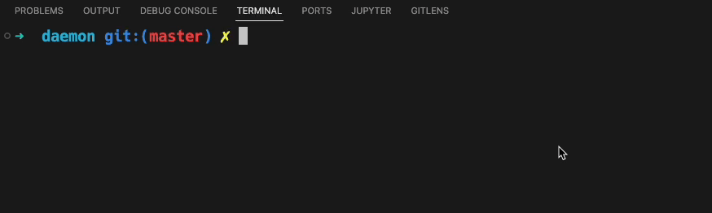

# 孤儿进程与终端的关系

## 孤儿进程

在本篇文章当中主要给大家介绍一下有关孤儿进程和终端之间的关系。

首先我们的需要知道什么是孤儿进程，简单的来说就是当一个程序还在执行，但是他的父进程已经退出了，这种进程叫做孤儿进程，因为父进程死亡了，因此被叫做孤儿进程。孤儿进程会被进程号等于 1 的 init 进程收养，也就是说他的新的父进程的进程号等于 1，我们可以使用下面的代码进行验证：

```c


#include <stdio.h>
#include <unistd.h>
#include <err.h>

int main()
{
  pid_t pid = fork();
  if(pid == -1)
  {
    perror("fork:");
  }
  printf("pid = %d ppid = %d\n", getpid(), getppid());
  if(pid == 0)
  {
    do
    {
      sleep(1);
      printf("pid = %d ppid = %d\n", getpid(), getppid());
    } while (1);
    
  }

  return 0;
}
```

上面的程序的输出结果如下所示：
```shell
➜  daemon git:(master) ✗ ./orphan.out 
pid = 25835 ppid = 25251
pid = 25836 ppid = 25835
➜  daemon git:(master) ✗ pid = 25836 ppid = 1
pid = 25836 ppid = 1
pid = 25836 ppid = 1
pid = 25836 ppid = 1
pid = 25836 ppid = 1
```

从上面终端的输出结果我们可以知道当父进程还没有退出的时候，子进程 25836 的父进程号还是 25835，但是当父进程退出之后，子进程的父进程号已经变成了 1 ，也就是 init 进程，这与我们在上面的分析的结果表现是一致的。

## 孤儿进程组和终端的关系

在前面我们提到了当一个进程的父进程退出之后，这个进程就会变成一个孤儿进程，其实与孤儿进程对应的有一个孤儿进程组，所谓孤儿进程组就是：一个进程组当中的进程要么是孤儿进程，要么父进程也在这个进程组当中，要么父进程在其他的会话当中，满足上述条件的进程组就是孤儿进程组。

事实上内核在一种情况下也会发送 SIGHUP 信号给孤儿进程组，这个情况如下：

- 父进程程序执行完成退出了，但是子进程还没有结束，而且被挂起了。
- 当父进程退出的时候，shell 会在他内部维护的作业列表（job list）将退出的作业删除掉。子进程被 init 进程收养变成了孤儿进程，根据上文当中提到了孤儿进程组的概念，这是一个孤儿进程组，因为这个进程组当中的所有进程（如果不是多进程程序，只有一个）的父进程要么退出，要么父进程也在这个进程组当中，要么父进程在其他的会话当中。条件已经满足，因此这个进程组是一个孤儿进程组。
- 现在有一个问题是，这个被挂起的孤儿进程没有谁去唤醒啊，理论上来说，在父进程退出之前，子进程被挂起，应该是父进程去收拾好这个烂摊子，但是现在父进程退出了，被挂起的孤儿进程没有在运行，那么就一直会占着他对应的系统资源，如果这样的进程过多的话，那么系统的资源将会被消耗殆尽。

因此为了解决这种问题：如果一个进程组变成了孤儿进程组并且拥有已停止执行的成员，比如说被挂起来的进程，那么内核会向进程组中的所有成员发送一个 SIGHUP 信号通知它们已经与会话断开连接了，之后再发送一个 SIGCONT 信号确保它们恢复执行。如果孤儿进程组不包含被停止的成员，那么就不会发送任何信号。

我们可以使用下面的例子去验证这一点：

```c

#define _GNU_SOURCE
#include <stdio.h>
#include <signal.h>
#include <string.h>
#include <fcntl.h>
#include <unistd.h>

void sig(int no, siginfo_t *info, void* context)
{
  char s[1024];
  int fd = open("text.txt", O_RDWR | O_CREAT, 0644);
  sprintf(s, "No = %d pid = %d\n", no , info->si_pid);
  write(fd, s, strlen(s));
  close(fd);
  sync();
  _exit(0);
}

int main()
{
  struct sigaction action;
  action.sa_sigaction = sig;
  action.sa_flags |= SA_SIGINFO;
  action.sa_flags |= ~(SA_RESETHAND);
  sigaction(SIGHUP, &action, NULL);
  pid_t pid = fork();
  if(pid == -1)
  {
    perror("fork:");
  }
  if(pid != 0)
  {
    kill(pid, SIGSTOP); // 父进程执行 给子进程发送 SIGSTOP 信号 让子进程停止执行
  }
  else
  {
    while(1); // 子进程执行
  }
  sleep(1);
  return 0;
}
```

在上面的程序当中，我们 fork 出一个子进程，然后子进程不断的进行死循环，父进程会给子进程发送一个 SIGSTOP 信号，然后子进程会停止执行，因此父进程退出之后，那么子进程就会成为孤儿进程，子进程所在的进程组就会变成孤儿进程组，在这种情况下内核就会发送一个 SIGHUP 信号给这个孤儿进程，同时也会发送一个 SIGCONT 信号，保证孤儿进程在执行，而不是被挂起。我们在终端当中执行上面的程序会发现 text.txt 当中的内容如下所示：

```shell
No = 1 pid = 0
```

pid = 0 表示这个信号是内核发送的，发送的信号为 1 ，对应的信号名字为 SIGHUP，因此这验证了我们在上面所谈到的内容。



## 孤儿进程组和终端的读和写

在前面的文章当中我们已经谈到了，当后台进程试图从控制终端中调用 read()时将会收到 SIGTTIN 信号，当后台进程试图向设置了 TOSTOP 标记的控制终端调用 write()时会收到 SIGTTOU 信号。但向一个孤儿进程组发送这些信号毫无意义，因为一旦被停止之后，它将再也无法恢复了。基于此，在进行 read()和 write()调用时内核会返回 EIO 的错误，而不是发送 SIGTTIN 或 SIGTTOU 信号。基于类似的原因，如果 SIGTSTP、SIGTTIN 以及 SIGTTOU 信号的分送会导致停止孤儿进程组中的成员，那么这个信号会被毫无征兆地丢弃。这种行为不会因为信号发送方式（如信号可能是由内核产生的或由显式地调用 kill()而发送）的改变而改变。

## 总结

在本篇文章当中主要给大家介绍了关于孤儿进程和孤儿进程组的相关知识，总体来说比之前的两篇文章相对简单一点。

---

以上就是本篇文章的所有内容了，我是**LeHung**，我们下期再见！！！更多精彩内容合集可访问项目：<https://github.com/Chang-LeHung/CSCore>

关注公众号：**一无是处的研究僧**，了解更多计算机（Java、Python、计算机系统基础、算法与数据结构）知识。


