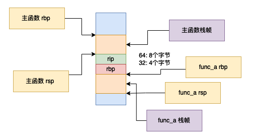

# gcc 好玩的 builtin 函数

## 前言

在本篇文章当中主要想给大家介绍一些在 gcc 编译器当中给我们提供的一些好玩的内嵌函数 (builtin function)🤣🤣🤣 。

## __builtin_frame_address

### 使用内嵌函数实现

```c
__builtin_frame_address(x) // 其中 x 一个整数
```

 这个函数主要是用于得到函数的栈帧的，更具体的来说是得到函数的 rbp （如果是 x86_64 的机器，在 32 位系统上就是 ebp）的值，也就是栈帧的栈底的值。


我们现在使用一个例子来验证测试一下：

```c

#include <stdio.h>

void func_a()
{
  void* p = __builtin_frame_address(0);
  printf("fun_a frame address = %p\n", p);
}


int main()
{
  void* p = __builtin_frame_address(0);
  printf("main frame address = %p\n", p);
  func_a();
  return 0;
}
```

上面的程序的输出结果如下所示：

```
main frame address = 0x7ffcecdd7a00
fun_a frame address = 0x7ffcecdd79d0
```

上面输出的结果就是每个函数的栈帧中栈底 rbp/ebp 寄存器的值，可能你会有疑问，凭什么说这个值就是 rbp 的值😂😂😂。我们现在来证明一下，我们可以使用代码获取得到 rbp 的值。

### 使用内敛汇编实现

```c


#include <stdio.h>
#include <sys/types.h>

u_int64_t rbp;

#define frame_address                   \
        asm volatile(                   \
          "movq %%rbp, %0;"             \
          :"=m"(rbp)::                  \
        );                              \
        printf("rbp = %p from inline assembly\n", (void*) rbp);

void bar()
{
  void* rbp = __builtin_frame_address(0);
  printf("rbp = %p\n", rbp);
  frame_address
}

int main()
{
  bar();
  return 0;
}
```

在上面的程序当中，我们使用一段宏可以得到寄存器 rbp 的值（在上面的代码当中，我们使用内敛汇编得到 rbp 的值，并且将这个值存储到变量 rbp 当中），我们将这个值和 builtin 函数的返回值进行对比，我们就可以知道返回的是不是寄存器 rbp 的值了，上面的程序执行结果如下所示：

```
rbp = 0x7ffe9676ac00
rbp = 0x7ffe9676ac00 from inline assembly
```

从上面的结果我们可以知道，内置函数返回的确实是寄存器 rbp 的值。

事实上我们除了可以获取当前函数的栈帧之外，我们还可以获取调用函数的栈帧，具体根据 x 的值进行确定：

- x = 0 : 获取当前函数的栈帧，也就是栈底的位置。
- x = 1 : 获取调用函数的栈帧。
- x = 2 : 获取调用函数的调用函数的栈帧。
- ......

比如说下面的程序：

```c
#include <stdio.h>

void func_a()
{
  void* p = __builtin_frame_address(1);
  printf("caller frame address = %p\n", p);
}


int main()
{
  void* p = __builtin_frame_address(0);
  printf("main frame address = %p\n", p);
  func_a();
  return 0;
}
```

上面程序的输出结果如下所示：

```
main frame address = 0x7ffda7a4b460
caller frame address = 0x7ffda7a4b460
```

从上面的输出结果我们可以看到当参数的值等于 1 的时候，返回的是调用函数的栈帧。

```c

#include <stdio.h>

void func_a()
{
  printf("In func_a\n");
  void* p = __builtin_frame_address(2);
  printf("caller frame address = %p\n", p);
}

void func_b()
{
  printf("In func_b\n");
  void* p = __builtin_frame_address(1);
  printf("caller frame address = %p\n", p);

  func_a();
}


int main()
{
  void* p = __builtin_frame_address(0);
  printf("main frame address = %p\n", p);
  func_b();
  return 0;
}
```

上面的程序的输出结果如下所示：

```
main frame address = 0x7ffdadbe6ff0
In func_b
caller frame address = 0x7ffdadbe6ff0
In func_a
caller frame address = 0x7ffdadbe6ff0
```

在上方的程序当中我们在主函数调用函数 func_b ，然后在函数 func_b 当中调用函数 func_a ，我们可以看到根据参数 x 的不同，返回的栈帧的层级也是不同的，根据前面参数 x 的意义我们可以知道，他们得到的都是主函数的栈帧。

## __builtin_return_address

### 使用内嵌函数实现

这个内嵌函数的主要作用就是得到函数的返回地址，首先我们需要知道的是，当我们进行函数调用的时候我们需要知道当这个函数执行完成之后返回到什么地方，因为 cpu 只会一条指令一条指令的执行，我们需要告诉 cpu 下一条指令的位置，因此当我们进行函数调用的时候需要保存调用函数的 call 指令下一条指令的位置，并且将它保存在栈上，当被调用函数执行完成之后继续回到调用函数的下一条指令的位置执行，因为我们已经将这个下一条指令的地址放到栈上了，当调用函数执行完成之后直接从栈当中取出这个值即可。

__builtin_return_address 的签名如下：

```c
__builtin_return_address(x) // x 是一个整数
```

其中 x 和前面的 __builtin_frame_address 含义相似：

- x = 0 : 表示当前函数的返回地址。
- x = 1 : 表示当前函数的调用函数的返回地址，比如说 main 函数调用 func_a 如果在 func_a 里面调用这个内嵌方法，那么返回的就是 main 函数的返回值。
- x = 2 : 表示当前函数的调用函数的调用函数的返回地址。

```c

#include <stdio.h>

void func_a()
{
  void* p = __builtin_return_address(0);
  printf("fun_a return address = %p\n", p);

  p = __builtin_return_address(1);
  printf("In func_a main return address = %p\n", p);
}


int main()
{
  void* p = __builtin_return_address(0);
  printf("main return address = %p\n", p);
  func_a();
  return 0;
}
```

上面的程序输出的结果如下：

```
main return address = 0x7fc5c57c90b3
fun_a return address = 0x400592
In func_a main return address = 0x7fc5c57c90b3
```

从上面的输出结果我们可以知道

### 使用内敛汇编实现

如果我们调用一个函数的时候（在x86里面执行 call 指令）首先会将下一条指令的地址压栈（在 32 位系统上就是将 eip 压栈，在 64 位系统上就是将 rip 压栈），然后形成调用函数的栈帧。然后将 rbp 寄存器的值指向下图当中的位置。


```c

#include <stdio.h>
#include <sys/types.h>

#define return_address            \
    u_int64_t rbp;                \
    asm volatile(                 \
      "movq %%rbp, %0":"=m"(rbp)::\
    );                            \
    printf("From inline assembly return address = %p\n", (u_int64_t*)*(u_int64_t*)(rbp + 8));

void func_a()
{
  printf("In func_a\n");
  void* p = __builtin_return_address(0);
  printf("fun_a return address = %p\n", p);
  return_address
}

int main()
{
  printf("In main function\n");
  void* p = __builtin_return_address(0);
  printf("main return address = %p\n", p);
  return_address
  func_a();
  return 0;
}
```

上面的程序的输出结果如下所示：

```c
In main function
main return address = 0x7fe6a7b050b3
From inline assembly return address = 0x7fe6a7b050b3
In func_a
fun_a return address = 0x4005d2
From inline assembly return address = 0x4005d2
```

从上面的输出结果我们可以看到，我们自己使用内敛汇编直接得到寄存器 rbp 的和内嵌函数返回的值是一致的，这也从侧面反映出来了内嵌函数的作用。在上面的代码当中定义定义的宏 return_address 的作用就是将寄存器 rbp 的值保存到变量 rbp 当中。

除了得到当前栈帧的 rbp 的值之外我们还可以，函数的调用函数的 rbp，调用函数的调用函数的 rbp，当然可以直接使用 builtin 函数实现，除此之外我们还可以使用内敛汇编去实现这一点：

```c

#include <stdio.h>
#include <sys/types.h>

#define return_address            \
    u_int64_t rbp;                \
    asm volatile(                 \
      "movq %%rbp, %%rcx;"        \
      "movq (%%rcx), %%rcx;"      \
      "movq %%rcx, %0;"           \
      :"=m"(rbp)::"rcx"           \
    );                            \
    printf("From inline assembly main return address = %p\n", (u_int64_t*)*(u_int64_t*)(rbp + 8));

void func_a()
{
  printf(">>>>>>>>>>>>>>>>>>>>>>>>>>>>>>>>>> In func_a\n");
  void* p = __builtin_return_address(1);
  printf("main return address = %p\n", p);
  return_address
  printf("<<<<<<<<<<<<<<<<<<<<<<<<<<<<<<<<<< Out func_a\n");
}


int main()
{
  func_a();
  void* p = __builtin_return_address(0);
  printf("main function return address = %p\n", p);
  return 0;
}
```

上面的程序的输出结果如下所示

```c
>>>>>>>>>>>>>>>>>>>>>>>>>>>>>>>>>> In func_a
main return address = 0x7f9aec6c80b3
From inline assembly main return address = 0x7f9aec6c80b3
<<<<<<<<<<<<<<<<<<<<<<<<<<<<<<<<<< Out func_a
main function return address = 0x7f9aec6c80b3
```

我们可以看到上面的输出，我们自己用内敛汇编实现的结果和 __builtin_return_address 的返回结果是一样的，这也验证了我们实现的正确性。要想理解上面的代码首先我们需要理解函数调用的时候形成的栈帧，如下图所示：



根据上图我们可以知道在 func_a 函数当中，rbp 指向的地址存放的是上一个函数的 rbp 寄存器的值，因此我们可以使用间接寻址，找到调用 func_a 的主函数的 rbp 的值，即以在函数 func_a 当中 rbp 寄存器的值为地址，找到这个地址的值就是主函数的 rbp 的值。

至此我们已经知道了，__builtin_return_address 的返回结果是当前函数的返回地址，也就是当前函数执行完成返回之后执行的下一条指令，我们可以利用这一点做出一个非常好玩的东西，直接跳转到返回地址执行不执行当前函数的后续代码：

```c

#include <stdio.h>

void func_a()
{
  void* p        = __builtin_return_address(0); // 得到当前函数的返回地址
  void* rbp      = __builtin_frame_address(0);  // 得到当前函数的栈帧的栈底
  void* last_rbp = __builtin_frame_address(1);	// 得到调用函数的栈帧的栈底
  asm volatile(
    "leaq 16(%1), %%rsp;" // 恢复 rsp 寄存器的值 ⓷
    "movq %2, %%rbp;"     // 恢复 rbp 寄存器的值 ⓸
    "jmp *%0;"            // 直接跳转						⓹
    ::"r"(p), "r"(rbp), "r"(last_rbp): 
  );
  printf("finished in func_a\n"); // ①
}


int main()
{
  void* p = __builtin_return_address(0);
  printf("main return address = %p\n", p);
  func_a(); // ②
  printf("finished in main function \n");
  // 打印九九乘法表
  int i, j;
  for(i = 1; i < 10; ++i) 
  {
    for(j = 1; j <= i; ++j) {
      printf("%d x %d = %d\t", i, j, i * j);
    }
    printf("\n");
  }
  return 0;
}
```

上面的程序的输出结果如下所示：

```c
main return address = 0x7f63e05c60b3
finished in main function 
1 x 1 = 1
2 x 1 = 2       2 x 2 = 4
3 x 1 = 3       3 x 2 = 6       3 x 3 = 9
4 x 1 = 4       4 x 2 = 8       4 x 3 = 12      4 x 4 = 16
5 x 1 = 5       5 x 2 = 10      5 x 3 = 15      5 x 4 = 20      5 x 5 = 25
6 x 1 = 6       6 x 2 = 12      6 x 3 = 18      6 x 4 = 24      6 x 5 = 30      6 x 6 = 36
7 x 1 = 7       7 x 2 = 14      7 x 3 = 21      7 x 4 = 28      7 x 5 = 35      7 x 6 = 42      7 x 7 = 49
8 x 1 = 8       8 x 2 = 16      8 x 3 = 24      8 x 4 = 32      8 x 5 = 40      8 x 6 = 48      8 x 7 = 56      8 x 8 = 64
9 x 1 = 9       9 x 2 = 18      9 x 3 = 27      9 x 4 = 36      9 x 5 = 45      9 x 6 = 54      9 x 7 = 63      9 x 8 = 72      9 x 9 = 81
```

从上面程序的输出结果来看，上面的程序并没有执行语句 ① ，但是却执行了主函数 ② 之后的程序，并且正确输出字符串和九九乘法表。这就相当于我们提前进行了跳转。要想得到这样的结果，我们只需要在函数 func_a 内部恢复上一个函数的栈帧，并且将 rip 指向函数 func_a 的返回地址即可。

上方的程序发生转移的代码就是那段内敛汇编代码，在内敛汇编代码当中我们首先恢复 main 函数的栈帧（主要是正确恢复寄存器 rbp 和 rsp ）的值，然后直接跳转到返回地址继续执行，所以才正确执行了主函数后续的代码。

恢复主函数的 rbp 寄存器的值很好理解，因为我们只需要通过内嵌函数直接得到即可，但是主函数的 rsp 寄存器的值可能有一点复杂，s首先我们需要知道，主函数和 func_a 的两个与栈帧有关的寄存器的指向，他们的指向如下图所示：


- 根据上文的分析我们可以直接通过在函数 func_a 当中直接使用 __builtin_frame_address(1) 得到主函数的 rbp 值，然后将其直接赋值给 rbp 寄存器就可以了，我们就恢复了主函数栈底的值，对应的语句位上面代码的 ⓸。
- 根据上文的分析我们可以直接通过在函数 func_a 当中直接使用 __builtin_return_address(0) 得到 func_a 的返回地址，我们可以直接 jmp 到这条指令执行，但是在 jmp 之前我们需要先恢复主函数的栈帧，对应的语句位上面的 ⓹。
- 根据上图我们可以分析到主函数 rsp 的值就是函数 func_a 中 rbp 寄存器的值加上 16，因为 rip 和 rbp 分别占 8 个字节，因此我们通过 ⓷ 恢复主函数的 rsp 的值。

根据上面的分析我就大致就可以理解了上述的代码的流程了。

## 与二进制相关的内嵌函数

### __builtin_popcount 

在 gcc 内部给我们提供了很多用于比特操作的内嵌函数，比如说如果我们想统计一下一个数据二进制表示有多少个为 1 的比特位。

- __builtin_popcount :  统计一个数据的二进制表示有多少个为 1 的比特位。

```c
#include <stdio.h>

int main()
{
  int i = -1;
  printf("bits = %d\n", __builtin_popcount(i));
  i = 15;
  printf("bits = %d\n", __builtin_popcount(i));
  return 0;
}
```

上面程序的输出结果如下所示：

```c
bits = 32
bits = 4
```

-1 和 15 的二进制表示如下：

```c
-1 = 1111_1111_1111_1111_1111_1111_1111_1111
15 = 0000_0000_0000_0000_0000_0000_0000_1111
```

因此统计一下对应数字的比特位等于 1 的个数可以知道，内嵌函数 __builtin_popcount 的输出结果是没错的。

-  \_\_builtin_popcountl 和 \_\_builtin_popcountl，这两个函数的作用和 __builtin_popcount 的作用是一样的，但是这两个函数是用于 long 和 long long 类型的参数。

### __builtin_ctz

- __builtin_ctz : 从右往左数，统计一个数据尾部比特位等于 0 的个数，具体是在遇到第一个 1 之前，已经遇到了几个 1 。

```c
#include <stdio.h>

int main()
{
  printf("%d\n", __builtin_ctz(1)); // ctz = count trailing zeros. 
  printf("%d\n", __builtin_ctz(2));
  printf("%d\n", __builtin_ctz(3));
  printf("%d\n", __builtin_ctz(4));
  return 0;
}
```

上面的程序的输出结果如下所示：

```
0
1
0
2
```

1，2，3，4 对应的二进制表示如下所示：

```c
1 = 0000_0000_0000_0000_0000_0000_0000_0001 // 到第一个 1 之前 有 0 个 0
2 = 0000_0000_0000_0000_0000_0000_0000_0010 // 到第一个 1 之前 有 0 个 1
3 = 0000_0000_0000_0000_0000_0000_0000_0011 // 到第一个 1 之前 有 0 个 0
4 = 0000_0000_0000_0000_0000_0000_0000_0100 // 到第一个 1 之前 有 0 个 2
```

根据上面不同数据的二进制表示以及上方程序的输出结果可以知道 __builtin_ctz 的输出就是尾部等于 0 的个数。

- \_\_builtin_ctzl 和 \_\_builtin_ctzll 与 __builtin_ctz 的作用是一样的，但是这两个函数是用于 long 和 long long 类型的数据。

上面谈到的 __builtin_ctz 这个内嵌函数我们可以用于求一个数据的 lowbit 的值，我们知道一个数据的 lowbit 就是最低位的比特所表示的数据，他的求解函数如下：

```c
int lowbit(int x)
{
  return (x) & (-x);
}
```

我们也可以使用上面的内嵌函数去实现，看下面的代码，我们使用上面的内嵌函数定义一个宏去实现 lowbit：

```c
#include <stdio.h>

#define lowbit(x) (1 << (__builtin_ctz(x)))

int lowbit(int x)
{
  return (x) & (-x);
}

int main()
{
  for(int i = 0; i < 16; ++i)
  {
    printf("macro = %d function = %d\n", lowbit(i), lowbit2(i));
  }
  return 0;
}
```

上面的程序的输出结果如下所示：

```c
macro = 1 function = 0
macro = 1 function = 1
macro = 2 function = 2
macro = 1 function = 1
macro = 4 function = 4
macro = 1 function = 1
macro = 2 function = 2
macro = 1 function = 1
macro = 8 function = 8
macro = 1 function = 1
macro = 2 function = 2
macro = 1 function = 1
macro = 4 function = 4
macro = 1 function = 1
macro = 2 function = 2
macro = 1 function = 1
```

可以看到我们使用内嵌函数和自己定义的 lowbit 函数实现的结果是一样的。

### __builtin_clz

这个是用于统计一个数据的二进制表示，从左往右数遇到第一个比特位等于 1 之前已经遇到了多少个 0。

```c

#include <stdio.h>

int main()
{
  for(int i = 1; i < 16; ++i) 
  {
    printf("i = %2d and result = %2d\n", i, __builtin_clz(i));
  }
  printf("i = %2d and result = %2d\n", -1, __builtin_clz(-1));
  return 0;
}
```

上面的程序输出结果如下所示：

```c
i =  1 and result = 31 // 高位有 31 个 0
i =  2 and result = 30 // 高位有 30 个 0
i =  3 and result = 30
i =  4 and result = 29
i =  5 and result = 29
i =  6 and result = 29
i =  7 and result = 29
i =  8 and result = 28
i =  9 and result = 28
i = 10 and result = 28
i = 11 and result = 28
i = 12 and result = 28
i = 13 and result = 28
i = 14 and result = 28
i = 15 and result = 28
i = -1 and result =  0 // 高位没有 0
```

我们可以将上面的数据 i 对应他的二进制表示，就可以知道从左往右数遇到第一个等于 1 的比特位之前会有多少个 0 ，我们拿 -1 进行分析，因为在计算机当中数据的都是使用补码进行表示，而 -1 的补码如下所示：

```c
-1 = 1111_1111_1111_1111_1111_1111_1111_1111
```

因此 高位没有 0，所以返回的结果等于 0。

## 总结

在本篇文章当中主要给大家介绍一些在 gcc 当中比较有意思的内嵌函数，大家可以玩一下～～～～😂

---

更多精彩内容合集可访问项目：<https://github.com/Chang-LeHung/CSCore>

关注公众号：一无是处的研究僧，了解更多计算机（Java、Python、计算机系统基础、算法与数据结构）知识。


