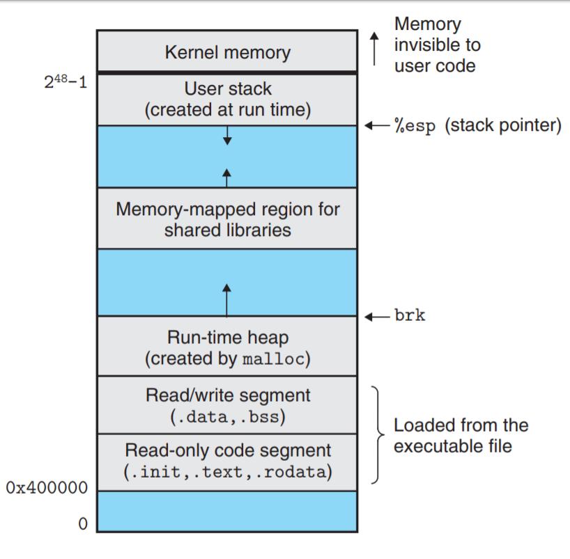

# gcc 好玩的 builtin 函数

## 前言

在本篇文章当中主要想给大家介绍一些在 gcc 编译器当中给我们提供的一些好玩的内嵌函数 (builtin function)🤣🤣🤣 。

## __builtin_frame_address

```c
__builtin_frame_address(x) // 其中 x 一个整数
```

 这个函数主要是用于得到函数的栈帧的，更具体的来说是得到函数的 rbp （如果是 x86_64 的机器，在 32 位系统上就是 ebp）的值，也就是栈帧的栈底的值。



我们现在使用一个例子来验证测试一下：

```c

#include <stdio.h>

void func_a()
{
  void* p = __builtin_frame_address(0);
  printf("fun_a frame address = %p\n", p);
}


int main()
{
  void* p = __builtin_frame_address(0);
  printf("main frame address = %p\n", p);
  func_a();
  return 0;
}
```

上面的程序的输出结果如下所示：

```
main frame address = 0x7ffcecdd7a00
fun_a frame address = 0x7ffcecdd79d0
```

上面输出的结果就是每个函数的栈帧中栈底 rbp/ebp 寄存器的值，可能你会有疑问，凭什么说这个值就是 rbp 的值😂😂😂。我们现在来证明一下，我们可以使用代码获取得到 rbp 的值。

```c


#include <stdio.h>
#include <sys/types.h>

u_int64_t rbp;

#define frame_address                   \
        asm volatile(                   \
          "movq %%rbp, %0;"             \
          :"=m"(rbp)::                  \
        );                              \
        printf("rbp = %p from inline assembly\n", (void*) rbp);\

void bar()
{
  void* rbp = __builtin_frame_address(0);
  printf("rbp = %p\n", rbp);
  frame_address
}

int main()
{
  bar();
  return 0;
}
```

在上面的程序当中，我们使用一段宏可以得到寄存器 rbp 的值，我们将这个值和builtin函数的返回值进行对比，我们就可以知道返回的是不是寄存器 rbp 的值了，上面的程序执行结果如下所示：

```
rbp = 0x7ffe9676ac00
rbp = 0x7ffe9676ac00 from inline assembly
```

从上面的结果我们可以知道，内置函数返回的确实是寄存器 rbp 的值。