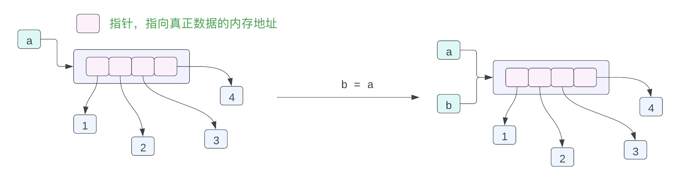
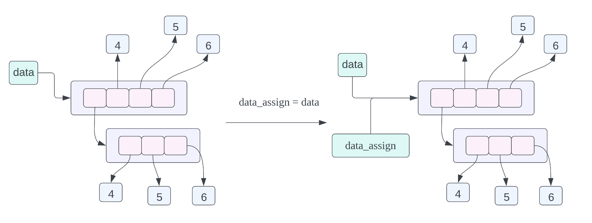
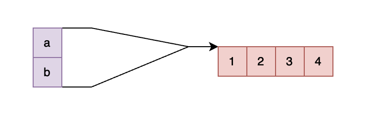
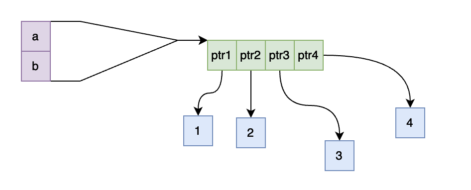

# 深入理解 Python 的对象拷贝和内存布局

## 前言

在本篇文章当中主要给大家介绍 python 当中的拷贝问题，话不多说我们直接看代码，你知道下面一些程序片段的输出结果吗？

```python
a = [1, 2, 3, 4]
b = a
print(f"{a = } \t|\t {b = }")
a[0] = 100
print(f"{a = } \t|\t {b = }")
```

```python
a = [1, 2, 3, 4]
b = a.copy()
print(f"{a = } \t|\t {b = }")
a[0] = 100
print(f"{a = } \t|\t {b = }")
```

```python
a = [[1, 2, 3], 2, 3, 4]
b = a.copy()
print(f"{a = } \t|\t {b = }")
a[0][0] = 100
print(f"{a = } \t|\t {b = }")
```

```python
a = [[1, 2, 3], 2, 3, 4]
b = copy.copy(a)
print(f"{a = } \t|\t {b = }")
a[0][0] = 100
print(f"{a = } \t|\t {b = }")
```

```python
a = [[1, 2, 3], 2, 3, 4]
b = copy.deepcopy(a)
print(f"{a = } \t|\t {b = }")
a[0][0] = 100
print(f"{a = } \t|\t {b = }")
```

在本篇文章当中我们将对上面的程序进行详细的分析。

## Python 对象的内存布局

首先我们介绍一下一个比较好用的关于数据在内存上的逻辑分布的网站，https://pythontutor.com/visualize.html#mode=display

我们在这个网站上运行第一份代码：


从上面的输出结果来看 a 和 b 指向的是同一个内存当中的数据对象。因此第一份代码的输出结果是相同的。我们应该如何确定一个对象的内存地址呢？在 Python 当中给我们提供了一个内嵌函数 id() 用于得到一个对象的内存地址：

```python
a = [1, 2, 3, 4]
b = a
print(f"{a = } \t|\t {b = }")
a[0] = 100
print(f"{a = } \t|\t {b = }")
print(f"{id(a) = } \t|\t {id(b) = }")
# 输出结果
# a = [1, 2, 3, 4] 	|	 b = [1, 2, 3, 4]
# a = [100, 2, 3, 4] 	|	 b = [100, 2, 3, 4]
# id(a) = 4393578112 	|	 id(b) = 4393578112
```

事实上上面的对象内存布局是有一点问题的，或者说是不够准确的，但是也是能够表示出各个对象之间的关系的，我们现在来深入了解一下。在 Cpython 里你可以认为每一个变量都可以认为是一个指针，指向被表示的那个数据，这个指针保存的就是这个 Python 对象的内存地址。

在 Python 当中，实际上列表保存的指向各个 Python 对象的指针，而不是实际的数据，因此上面的一小段代码，可以用如下的图表示对象在内存当中的布局：



变量 a 指向内存当中的列表 `[1, 2, 3, 4]`，列表当中有 4 个数据，这四个数据都是指针，而这四个指针指向内存当中 1，2，3，4 这四个数据。可能你会有疑问，这不是有问题吗？都是整型数据为什么不直接在列表当中存放整型数据，为啥还要加一个指针，再指向这个数据呢？

事实上在 Python 当中，列表当中能够存放任何 Python 对象，比如下面的程序是合法的：

```python
data = [1, {1:2, 3:4}, {'a', 1, 2, 25.0}, (1, 2, 3), "hello world"]
```

在上面的列表当中第一个到最后一个数据的数据类型为：整型数据，字典，集合，元祖，字符串，现在来看为了实现  Python 的这个特性，指针的特性是不是符合要求呢？每个指针所占用的内存是一样的，因此可以使用一个数组去存储 Python 对象的指针，然后再将这个指针指向真正的 Python 对象！

### 牛刀小试

在经过上面的分析之后，我们来看一下下面的代码，他的内存布局是什么情况：

```python
data = [[1, 2, 3], 4, 5, 6]
data_assign = data
data_copy = data.copy()
```




- `data_assign = data`，关于这个赋值语句的内存布局我们在之前已经谈到过了，不过我们也在复习一下，这个赋值语句的含义就是 data_assign 和 data 指向的数据是同一个数据，也就是同一个列表。
- `data_copy = data.copy()`，这条赋值语句的含义是将 data 指向的数据进行浅拷贝，然后让 data_copy 指向拷贝之后的数据，这里的浅拷贝的意思就是，对列表当中的每一个指针进行拷贝，而不对列表当中指针指向的数据进行拷贝。从上面的对象的内存布局图我们可以看到 data_copy 指向一个新的列表，但是列表当中的指针指向的数据和 data 列表当中的指针指向的数据是一样的，其中 data_copy 使用绿色的箭头进行表示，data 使用黑色的箭头进行表示。

## 撕开 Python 对象的神秘面纱



