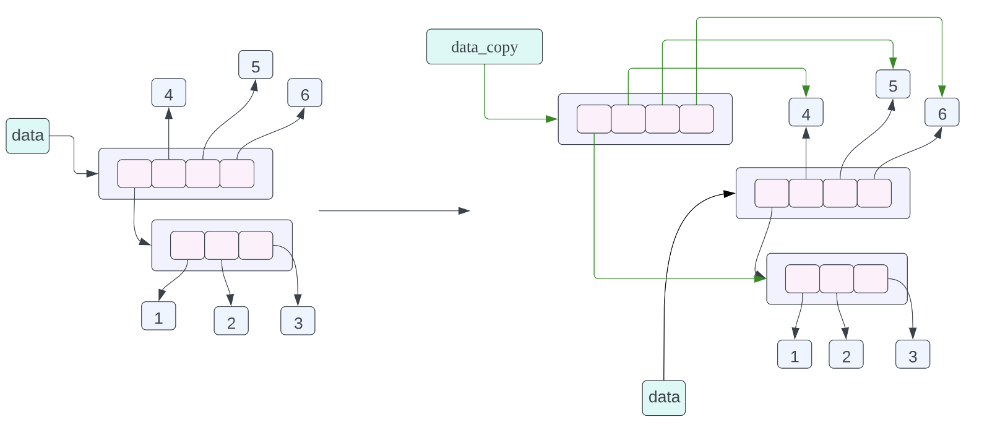
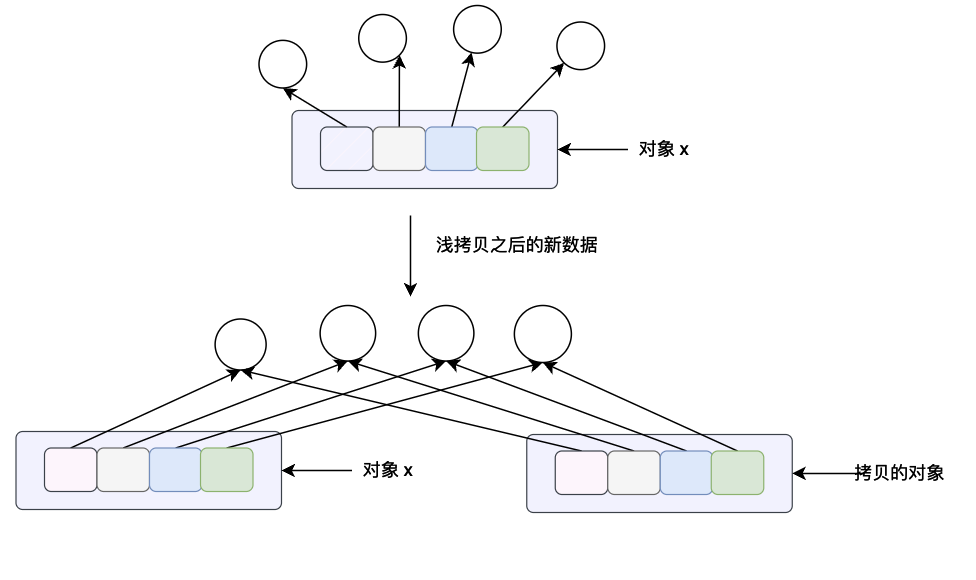

# 深入理解 Python 的对象拷贝和内存布局

## 前言

在本篇文章当中主要给大家介绍 python 当中的拷贝问题，话不多说我们直接看代码，你知道下面一些程序片段的输出结果吗？

```python
a = [1, 2, 3, 4]
b = a
print(f"{a = } \t|\t {b = }")
a[0] = 100
print(f"{a = } \t|\t {b = }")
```

```python
a = [1, 2, 3, 4]
b = a.copy()
print(f"{a = } \t|\t {b = }")
a[0] = 100
print(f"{a = } \t|\t {b = }")
```

```python
a = [[1, 2, 3], 2, 3, 4]
b = a.copy()
print(f"{a = } \t|\t {b = }")
a[0][0] = 100
print(f"{a = } \t|\t {b = }")
```

```python
a = [[1, 2, 3], 2, 3, 4]
b = copy.copy(a)
print(f"{a = } \t|\t {b = }")
a[0][0] = 100
print(f"{a = } \t|\t {b = }")
```

```python
a = [[1, 2, 3], 2, 3, 4]
b = copy.deepcopy(a)
print(f"{a = } \t|\t {b = }")
a[0][0] = 100
print(f"{a = } \t|\t {b = }")
```

在本篇文章当中我们将对上面的程序进行详细的分析。

## Python 对象的内存布局

首先我们介绍一下一个比较好用的关于数据在内存上的逻辑分布的网站，https://pythontutor.com/visualize.html#mode=display

我们在这个网站上运行第一份代码：


从上面的输出结果来看 a 和 b 指向的是同一个内存当中的数据对象。因此第一份代码的输出结果是相同的。我们应该如何确定一个对象的内存地址呢？在 Python 当中给我们提供了一个内嵌函数 id() 用于得到一个对象的内存地址：

```python
a = [1, 2, 3, 4]
b = a
print(f"{a = } \t|\t {b = }")
a[0] = 100
print(f"{a = } \t|\t {b = }")
print(f"{id(a) = } \t|\t {id(b) = }")
# 输出结果
# a = [1, 2, 3, 4] 	|	 b = [1, 2, 3, 4]
# a = [100, 2, 3, 4] 	|	 b = [100, 2, 3, 4]
# id(a) = 4393578112 	|	 id(b) = 4393578112
```

事实上上面的对象内存布局是有一点问题的，或者说是不够准确的，但是也是能够表示出各个对象之间的关系的，我们现在来深入了解一下。在 Cpython 里你可以认为每一个变量都可以认为是一个指针，指向被表示的那个数据，这个指针保存的就是这个 Python 对象的内存地址。

在 Python 当中，实际上列表保存的指向各个 Python 对象的指针，而不是实际的数据，因此上面的一小段代码，可以用如下的图表示对象在内存当中的布局：


变量 a 指向内存当中的列表 `[1, 2, 3, 4]`，列表当中有 4 个数据，这四个数据都是指针，而这四个指针指向内存当中 1，2，3，4 这四个数据。可能你会有疑问，这不是有问题吗？都是整型数据为什么不直接在列表当中存放整型数据，为啥还要加一个指针，再指向这个数据呢？

事实上在 Python 当中，列表当中能够存放任何 Python 对象，比如下面的程序是合法的：

```python
data = [1, {1:2, 3:4}, {'a', 1, 2, 25.0}, (1, 2, 3), "hello world"]
```

在上面的列表当中第一个到最后一个数据的数据类型为：整型数据，字典，集合，元祖，字符串，现在来看为了实现  Python 的这个特性，指针的特性是不是符合要求呢？每个指针所占用的内存是一样的，因此可以使用一个数组去存储 Python 对象的指针，然后再将这个指针指向真正的 Python 对象！

### 牛刀小试

在经过上面的分析之后，我们来看一下下面的代码，他的内存布局是什么情况：

```python
data = [[1, 2, 3], 4, 5, 6]
data_assign = data
data_copy = data.copy()
```




- `data_assign = data`，关于这个赋值语句的内存布局我们在之前已经谈到过了，不过我们也在复习一下，这个赋值语句的含义就是 data_assign 和 data 指向的数据是同一个数据，也就是同一个列表。
- `data_copy = data.copy()`，这条赋值语句的含义是将 data 指向的数据进行浅拷贝，然后让 data_copy 指向拷贝之后的数据，这里的浅拷贝的意思就是，对列表当中的每一个指针进行拷贝，而不对列表当中指针指向的数据进行拷贝。从上面的对象的内存布局图我们可以看到 data_copy 指向一个新的列表，但是列表当中的指针指向的数据和 data 列表当中的指针指向的数据是一样的，其中 data_copy 使用绿色的箭头进行表示，data 使用黑色的箭头进行表示。

## 查看对象的内存地址

在前面的文章当中我们主要分析了一下对象的内存布局，在本小节我们使用 python 给我们提供一个非常有效的工具去验证这一点。在 python 当中我们可以使用 id() 去查看对象的内存地址，id(a) 就是查看对象 a 所指向的对象的内存地址。

- 看下面的程序的输出结果：

```python
a = [1, 2, 3]
b = a
print(f"{id(a) = } {id(b) = }")
for i in range(len(a)):
    print(f"{i = } {id(a[i]) = } {id(b[i]) = }")
```

根据我们之前的分析，a 和 b 指向的同一块内存，也就说两个变量指向的是同一个 Python 对象，因此上面的多有输出的 id 结果 a 和 b 都是相同的，上面的输出结果如下：

```python
id(a) = 4392953984 id(b) = 4392953984
i = 0 id(a[i]) = 4312613104 id(b[i]) = 4312613104
i = 1 id(a[i]) = 4312613136 id(b[i]) = 4312613136
i = 2 id(a[i]) = 4312613168 id(b[i]) = 4312613168
```

- 看一下浅拷贝的内存地址：

```python
a = [[1, 2, 3], 4, 5]
b = a.copy()
print(f"{id(a) = } {id(b) = }")
for i in range(len(a)):
    print(f"{i = } {id(a[i]) = } {id(b[i]) = }")
```

根据我们在前面的分析，调用列表本身的 copy 方法是对列表进行浅拷贝，只拷贝列表的指针数据，并不拷贝列表当中指针指向的真正的数据，因此如果我们对列表当中的数据进行遍历得到指向的对象的地址的话，列表 a 和列表 b 返回的结果是一样的，但是和上一个例子不同的是 a 和 b 指向的列表的本身的地址是不一样的（因为进行了数据拷贝，可以参照下面浅拷贝的结果进行理解）。


可以结合下面的输出结果和上面的文字进行理解：

```python
id(a) = 4392953984 id(b) = 4393050112 # 两个对象的输出结果不相等
i = 0 id(a[i]) = 4393045632 id(b[i]) = 4393045632 # 指向的是同一个内存对象因此内存地址相等 下同
i = 1 id(a[i]) = 4312613200 id(b[i]) = 4312613200
i = 2 id(a[i]) = 4312613232 id(b[i]) = 4312613232
```

## copy模块

在 python 里面有一个自带的包 copy ，主要是用于对象的拷贝，在这个模块当中主要有两个方法 copy.copy(x) 和 copy.deepcopy()。

- copy.copy(x) 方法主要是用于浅拷贝，这个方法的含义对于列表来说和列表本身的 x.copy() 方法的意义是一样的，都是进行浅拷贝。这个方法会构造一个新的 python 对象并且会将对象 x 当中所有的数据引用（指针）拷贝一份。



- copy.deepcopy(x)  这个方法主要是对对象 x 进行深拷贝，这里的深拷贝的含义是会构造一个新的对象，会递归的查看对象 x 当中的每一个对象，如果递归查看的对象是一个不可变对象将不会进行拷贝，如果查看到的对象是可变对象的话，将重新开辟一块内存空间，将原来的在对象 x 当中的数据拷贝的新的内存当中。（关于可变和不可变对象我们将在下一个小节仔细分析）
- 根据上面的分析我们可以知道深拷贝的花费是比浅拷贝多的，尤其是当一个对象当中有很多子对象的时候，会花费很多时间和内存空间。
- 对于 python 对象来说进行深拷贝和浅拷贝的区别主要在于复合对象（对象当中有子对象，比如说列表，元祖、类的实例等等）。这一点主要是和下一小节的可变和不可变对象有关系。

## 可变和不可变对象与对象拷贝

在 python 当中主要有两大类对象，可变对象和不可变对象，所谓可变对象就是对象的内容可以发生改变，不可变对象就是对象的内容不能够发生改变。

- 可变对象：比如说列表(list)，字典(dict)，集合(set)，字节数组(bytearray)，类的实例对象。
- 不可变对象：整型(int)，浮点型(float)，复数(complex)，字符串，元祖(tuple)，不可变集合(frozenset)，字节(bytes)。

看到这里你可能会有疑问了，整数和字符串不是可以修改吗？

```python
a = 10
a = 100
a = "hello"
a = "world"
```

比如下面的代码是正确的，并不会发生错误，但是事实上其实 a 指向的对象是发生了变化的，第一个对象指向整型或者字符串的时候，如果重新赋一个新的不同的整数或者字符串对象的话，python 会创建一个新的对象，我们可以使用下面的代码进行验证：

```python
a = 10
print(f"{id(a) = }")
a = 100
print(f"{id(a) = }")
a = "hello"
print(f"{id(a) = }")
a = "world"
print(f"{id(a) = }")
```

上面的程序的输出结果如下所示：

```python
id(a) = 4365566480
id(a) = 4365569360
id(a) = 4424109232
id(a) = 4616350128
```

可以看到的是当重新赋值之后变量指向的内存对象是发生了变化的（因为内存地址发生了变化），这就是不可变对象，虽然可以对变量重新赋值，但是得到的是一个新对象并不是在原来的对象上进行修改的！

我们现在来看一下可变对象列表发生修改之后内存地址是怎么发生变化的：

```python
data = []
print(f"{id(data) = }")
data.append(1)
print(f"{id(data) = }")
data.append(1)
print(f"{id(data) = }")
data.append(1)
print(f"{id(data) = }")
data.append(1)
print(f"{id(data) = }")
```

上面的代码输出结果如下所示：

```python
id(data) = 4614905664
id(data) = 4614905664
id(data) = 4614905664
id(data) = 4614905664
id(data) = 4614905664
```

从上面的输出结果来看可以知道，当我们往列表当中加入新的数据之后（修改了列表），列表本身的地址并没有发生变化，这就是可变对象。

我们在前面谈到了深拷贝和浅拷贝，我们现在来分析一下下面的代码：

```python
data = [1, 2, 3]
data_copy = copy.copy(data)
data_deep = copy.deepcopy(data)
print(f"{id(data ) = } | {id(data_copy) = } | {id(data_deep) = }")
print(f"{id(data[0]) = } | {id(data_copy[0]) = } | {id(data_deep[0]) = }")
print(f"{id(data[1]) = } | {id(data_copy[1]) = } | {id(data_deep[1]) = }")
print(f"{id(data[2]) = } | {id(data_copy[2]) = } | {id(data_deep[2]) = }")
```

上面的代码输出结果如下所示：

```python
id(data ) = 4620333952 | id(data_copy) = 4619860736 | id(data_deep) = 4621137024
id(data[0]) = 4365566192 | id(data_copy[0]) = 4365566192 | id(data_deep[0]) = 4365566192
id(data[1]) = 4365566224 | id(data_copy[1]) = 4365566224 | id(data_deep[1]) = 4365566224
id(data[2]) = 4365566256 | id(data_copy[2]) = 4365566256 | id(data_deep[2]) = 4365566256
```

看到这里你肯定会非常疑惑，为什么深拷贝和浅拷贝指向的内存对象是一样的呢？前列我们可以理解，因为浅拷贝拷贝的是引用，因此他们指向的对象是同一个，但是为什么深拷贝之后指向的内存对象和浅拷贝也是一样的呢？这正是因为列表当中的数据是整型数据，他是一个不可变对象，如果对 data 或者 data_copy 指向的对象进行修改，那么将会指向一个新的对象并不会直接修改原来的对象，因此对于不可变对象其实是不用开辟一块新的内存空间在重新赋值的，因为这块内存中的对象是不会发生改变的。

我们在来看一个可拷贝的对象：

```python
data = [[1], [2], [3]]
data_copy = copy.copy(data)
data_deep = copy.deepcopy(data)
print(f"{id(data ) = } | {id(data_copy) = } | {id(data_deep) = }")
print(f"{id(data[0]) = } | {id(data_copy[0]) = } | {id(data_deep[0]) = }")
print(f"{id(data[1]) = } | {id(data_copy[1]) = } | {id(data_deep[1]) = }")
print(f"{id(data[2]) = } | {id(data_copy[2]) = } | {id(data_deep[2]) = }")
```

上面的代码输出结果如下所示：

```python
id(data ) = 4619403712 | id(data_copy) = 4617239424 | id(data_deep) = 4620032640
id(data[0]) = 4620112640 | id(data_copy[0]) = 4620112640 | id(data_deep[0]) = 4620333952
id(data[1]) = 4619848128 | id(data_copy[1]) = 4619848128 | id(data_deep[1]) = 4621272448
id(data[2]) = 4620473280 | id(data_copy[2]) = 4620473280 | id(data_deep[2]) = 4621275840
```

从上面程序的输出结果我们可以看到，当列表当中保存的是一个可变对象的时候，如果我们进行深拷贝将创建一个全新的对象（深拷贝的对象内存地址和浅拷贝的不一样）。

## 代码片段分析

经过上面的学习对于在本篇文章开头提出的问题对于你来说应该是很简单的，我们现在来分析一下这几个代码片段：

```python
a = [1, 2, 3, 4]
b = a
print(f"{a = } \t|\t {b = }")
a[0] = 100
print(f"{a = } \t|\t {b = }")
```

这个很简单啦，a 和 b 不同的变量指向同一个列表，a 中间的数据发生变化，那么 b 的数据也会发生变化，输出结果如下所示：

```python
a = [1, 2, 3, 4] 	|	 b = [1, 2, 3, 4]
a = [100, 2, 3, 4] 	|	 b = [100, 2, 3, 4]
id(a) = 4614458816 	|	 id(b) = 4614458816
```

我们再来看一下第二个代码片段

```python
a = [1, 2, 3, 4]
b = a.copy()
print(f"{a = } \t|\t {b = }")
a[0] = 100
print(f"{a = } \t|\t {b = }")
```

因为 b 是 a 的一个浅拷贝，所以 a 和 b 指向的是不同的列表，但是列表当中数据的指向是相同的，但是由于整型数据是不可变数据，当a[0] 发生变化的时候，并不会修改原来的数据，而是会在内存当中创建一个新的整型数据，因此列表 b 的内容并不会发生变化。因此上面的代码输出结果如下所示：

```python
a = [1, 2, 3, 4] 	|	 b = [1, 2, 3, 4]
a = [100, 2, 3, 4] 	|	 b = [1, 2, 3, 4]
```

再来看一下第三个片段：

```python
a = [[1, 2, 3], 2, 3, 4]
b = a.copy()
print(f"{a = } \t|\t {b = }")
a[0][0] = 100
print(f"{a = } \t|\t {b = }")
```

这个和第二个片段的分析是相似的，但是 a[0] 是一个可变对象，因此进行数据修改的时候，a[0] 的指向没有发生变化，因此 a 修改的内容会影响 b。

```python
a = [[1, 2, 3], 2, 3, 4] 	|	 b = [[1, 2, 3], 2, 3, 4]
a = [[100, 2, 3], 2, 3, 4] 	|	 b = [[100, 2, 3], 2, 3, 4]
```

最后一个片段：

```python
a = [[1, 2, 3], 2, 3, 4]
b = copy.deepcopy(a)
print(f"{a = } \t|\t {b = }")
a[0][0] = 100
print(f"{a = } \t|\t {b = }")
```

深拷贝会在内存当中重新创建一个和a[0]相同的对象，并且让 b[0] 指向这个对象，因此修改 a[0]，并不会影响 b[0]，因此输出结果如下所示：

```python
a = [[1, 2, 3], 2, 3, 4] 	|	 b = [[1, 2, 3], 2, 3, 4]
a = [[100, 2, 3], 2, 3, 4] 	|	 b = [[1, 2, 3], 2, 3, 4]
```

## 撕开 Python 对象的神秘面纱

我们现在简要看一下 Cpython 是如何实现 list 数据结构的，在 list 当中到底定义了一些什么东西：

```c
typedef struct {
    PyObject_VAR_HEAD
    /* Vector of pointers to list elements.  list[0] is ob_item[0], etc. */
    PyObject **ob_item;

    /* ob_item contains space for 'allocated' elements.  The number
     * currently in use is ob_size.
     * Invariants:
     *     0 <= ob_size <= allocated
     *     len(list) == ob_size
     *     ob_item == NULL implies ob_size == allocated == 0
     * list.sort() temporarily sets allocated to -1 to detect mutations.
     *
     * Items must normally not be NULL, except during construction when
     * the list is not yet visible outside the function that builds it.
     */
    Py_ssize_t allocated;
} PyListObject;
```

在上面定义的结构体当中 ：

- allocated 表示分配的内存空间的数量，也就是能够存储指针的数量，当所有的空间用完之后需要再次申请内存空间。
- ob_item 指向内存当中真正存储指向 python 对象指针的数组，比如说我们想得到列表当中第一个对象的指针的话就是 list->ob_item[0]，如果要得到真正的数据的话就是 *(list->ob_item[0])。
- PyObject_VAR_HEAD 是一个宏，会在结构体当中定一个子结构体，这个子结构题的定义如下：

```c
typedef struct {
    PyObject ob_base;
    Py_ssize_t ob_size; /* Number of items in variable part */
} PyVarObject;
```

- 这里我们不去谈对象 PyObject 了，主要说一下 ob_size，他表示列表当中存储了多少个数据，这个和 allocated 不一样，allocated 表示 ob_item 指向的数组一共有多少个空间，ob_size 表示这个数组存储了多少个数据 ob_size <= allocated。

在了解列表的结构体之后我们现在应该能够理解之前的内存布局了，所有的列表并不存储真正的数据而是存储指向这些数据的指针。

## 总结

在本篇文章当中主要给大家介绍了 python 当中对象的拷贝和内存布局，以及对对象内存地址的验证，最后稍微介绍了一下 cpython 内部实现列表的结构体，帮助大家深入理解列表对象的内存布局。

---

以上就是本篇文章的所有内容了，我是**LeHung**，我们下期再见！！！更多精彩内容合集可访问项目：<https://github.com/Chang-LeHung/CSCore>

关注公众号：**一无是处的研究僧**，了解更多计算机（Java、Python、计算机系统基础、算法与数据结构）知识。


