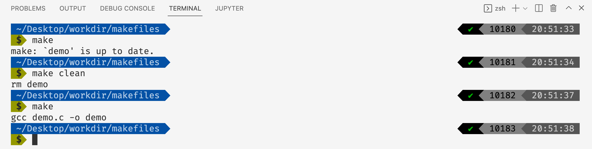
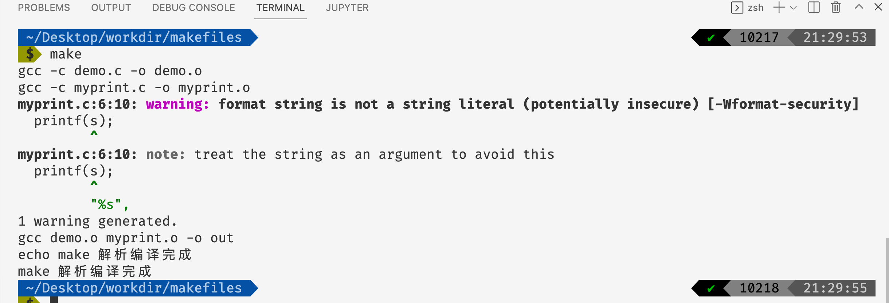
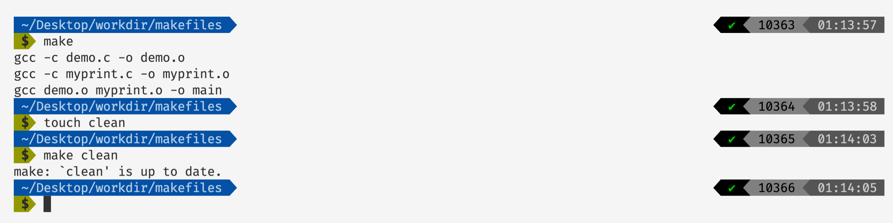
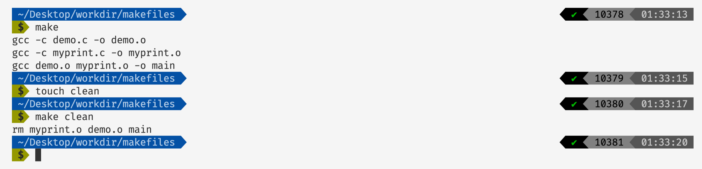
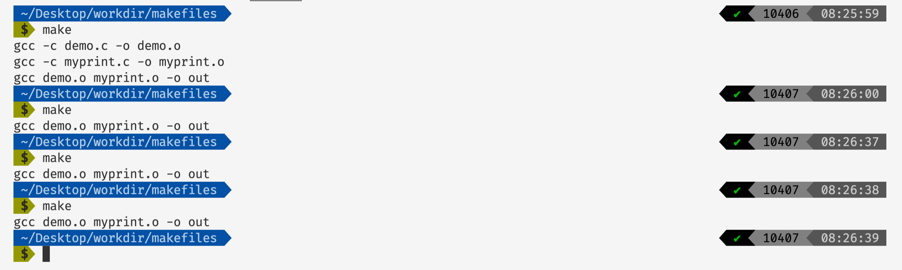
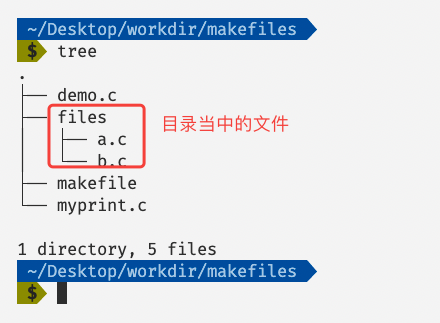
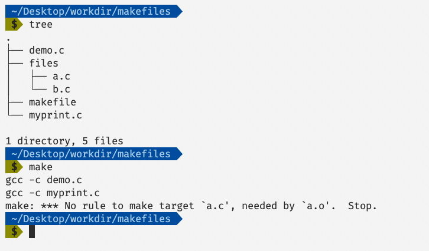

# 彻底掌握Makefile（一）

## 介绍

makefile就是一个可以被make命令解析的文件，他定义了一系列编译的规则，帮助我们更加方便、简洁的去完成编译的过程。在一个大工程当中我们会有各种各样的文件，我们可能会分模块去存放各种文件，可能有些文件还依赖其他的文件，因此我们在编译的时候需要先将被依赖的文件先编译，其他文件后编译，而我们使用makefile就可以更好的去完成这件事儿。

## Makefile基础

在很多情况下我们在C/C++的项目当中使用makefile，其实在其他语言的项目也可以使用make和makefile，它不局限于语言的。现在写一个基本的例子：

```makefile
demo: demo.c
	gcc demo.c -o demo

clean:
	rm demo
```

上面是一个makefile的例子，我们简要说明一下makefile的书写规则：

```makefile
编译目标:依赖文件
	编译命令
```

然后我们使用`make`命令去解释执行`makefile`，我们可以使用`make 编译目标`去执行特定的语句，比如在上面的例子当中我们执行`make demo`的话就会执行`gcc demo.c -o demo`命令。


其实上面我们也可以直接使用`make`命令，不需要指定编译目标，因为`make`会自己寻找第一个目标作为被执行的目标。



在上面的代码当中我们当我们执行`make`的时候寻找到`makefile`文件的第一个目标`demo`，但是因为我没有改动`demo.c`这个文件，而且这个文件已经编译过了，因此我们没有必要再去编译这个文件，这也是`make`给我们提供的一个非常好的特性，我们不需要重新编译已经编译好的文件，这在一个大型项目当中是非常有用的，当我们的项目当中有成千上万的文件的时候，如果我们重新编译每一个文件的话，那么编译的时间消耗是非常大的。因此我们在执行`make`执行执行`clean`编译目标先删除`demo`这个编译结果，然后在执行`make`这次它再找到`demo`目标，而此时`demo`已经被删除了，因此会重新编译。

## Make命令的工作流程

当我们在命令行当中输入`make`的时候他的执行流程如下：

- make命令首先会在当前目录下面寻找makefile或者Makefile文件。
- 寻找到makefile文件之后，他会在文件当中寻找到一个编译目标，比如在上面的makefile文件当中他会找到`demo`这个编译目标，而不是`clean`这个目标，因为`clean`是第二个编译目标。
- 然后make会解析编译目标的依赖，如果这个依赖是其他的编译目标A的话，那么make会先完成它依赖的编译目标A的命令，如果它依赖的编译目标A也存在依赖B的话，make就会去执行依赖的B的编译命令，如此的递归下去，知道有所得依赖目标都存在了，才会完成第一个编译目标的编译，这个也很好理解，只有依赖文件都存在了我们才能够完成正确的编译过程。

make编译的过程为寻找编译目标，依赖关系，如果依赖的文件还存在依赖那么make会一层一层的寻找下去，只要所有的依赖都被成功解析了，才会最终执行第一个编译目标的编译命令。但是在makefile当中不被第一个编译目标的目标的编译命令是不会被执行的，比如上面我们执行make的时候会执行`demo`编译目标，但是不会执行`clean`编译目标。

下面我们写一个例子了解make解析依赖的过程：

```makefile

main: demo.o myprint.o
	gcc demo.o myprint.o -o out
	echo make 解析编译完成

demo.o: demo.c 
	gcc -c demo.c -o demo.o

myprint.o: myprint.c 
	gcc -c myprint.c -o myprint.o

clean:
	rm myprint.o demo.o out
```

执行make之后的结果如下图所示：



因为我们没有指定编译的目标，因此make会寻找一个编译目标，也就是`main`，但是在`main`当中依赖两个文件`demo.o`和`myprint.o`，因此make会再去执行`demo.o`和`myprint.o`两个编译目标，当这两个编译目标被完成之后才能执行`main`的编译，根据make的输出结果我们可以得到这一个结果的印证。

## Makefilex小技巧

### Makefile当中的变量

在makefile当中我们可以定义一些我们的变量这样就可以避免反复输入了。比如我们经常会变编译文件的时候增加一些编译选项，比如像下面这样：

```makefile

cflags=-c
main: demo.o myprint.o
	gcc demo.o myprint.o -o out

demo.o: demo.c 
	gcc $(cflags) demo.c -o demo.o

myprint.o: myprint.c 
	gcc $(cflags) myprint.c -o myprint.o

clean:
	rm myprint.o demo.o out

```

在上面的makefile当中我们定义了一个变量`cflags`并且在编译命令当中使用，我们定义变量的方法其实和shell差不多，我们直接使用`=`可以定义变量，然后使用`$(变量名)`可以使用变量，因为上面的例子当中`cflag=-c`比较短，比较简单，但是如果当我们的编译参数很多很长的时候使用变量就非常有效了，而且如果在一个项目当中如果有成千上万个文件我们像统一改变编译时候的参数的话，我们一个一个改是很麻烦的，但是如果我们使用变量就可以做到一改全改。

### Makefile当中的include命令

在makefile当中我们也可以使用include命令去包含其他的makefile文件，比如我们将上面的makefile文件分成两个部分`makefile`和`submakefile`:

makefile:

```makefile

include submakefile

demo.o: demo.c 
	gcc $(cflags) demo.c -o demo.o

myprint.o: myprint.c 
	gcc $(cflags) myprint.c -o myprint.o

clean:
	rm myprint.o demo.o out
```

submakefile:

```makefile

cflags=-c
main: demo.o myprint.o
	gcc demo.o myprint.o -o out
```

然后在目录下执行make命令， 得到的效果和前文当中提到的makefile结果是一样的，这就相当于将submakefile的内容放到include语句的位置。

### Makefile中的PHONY

在上面谈到的makefile当中有一个`clean`的编译目标用于清除我们编译的结果文件，现在我们在当前的目录下面增加一个文件`clean`在执行make命令，我们的makefile文件如下：

```makefile
cflags=-c
main: demo.o myprint.o
	gcc demo.o myprint.o -o main

demo.o: demo.c 
	gcc $(cflags) demo.c -o demo.o

myprint.o: myprint.c 
	gcc $(cflags) myprint.c -o myprint.o

clean:
	rm myprint.o demo.o main
```

然后执行下面的命令（touch命令是新增一个文件，touch clean 就是往目录中增加一个名字为clean的文件）：



我们可以看到当目录下面增加一个clean文件之后，我们使用`make clean`命令的时候，make给我们的提示信息为clean文件是最新的了。这是因为当执行`make 编译目标`，make首先会检查当前目录下面是否存在clean文件如果不存在则执行编译目标clean的命令。如果存在clean文件的话，make会检查编译目标clean的依赖文件是否发生更改，如果发生更改了那么就会执行clean对应的命令，但是在上面的makefile当中clean没有依赖文件，因此相当于他的依赖文件没有发生改变，make不会执行编译目标clean对应的命令了。

但是我们的需求是仍然希望执行clean之后的命令，这个时候我们就可以使用PHONY了，他可以保证即使存在clean文件的时候，make命令依然会执行编译目标clean对应的命令。

```makefile

cflags=-c
main: demo.o myprint.o
	gcc demo.o myprint.o -o main

demo.o: demo.c 
	gcc $(cflags) demo.c -o demo.o

myprint.o: myprint.c 
	gcc $(cflags) myprint.c -o myprint.o

clean:
	rm myprint.o demo.o main
.PHONY: clean # 增加这一行
```

执行结果如下图所示：



我们现在来测试一下当我们命令生成的文件和编译目标不同名的时候，make是如何解释执行makefile的，makefile的内容如下：

```makefile

cflags=-c
main: demo.o myprint.o
	gcc demo.o myprint.o -o out # 这里的输出文件是 out 而不是 main 输出文件名字和目标不同名

demo.o: demo.c 
	gcc $(cflags) demo.c -o demo.o

myprint.o: myprint.c  
	gcc $(cflags) myprint.c -o myprint.o

clean:
	rm myprint.o demo.o main
.PHONY: clean
```

执行结果：



从上面的结果我们可以发现，当我们编译的结果文件(out)和编译目标(main)不同名的时候make每次都回去执行这个目标，因为make在进行检测的时候没有发现main这个文件，因此每次执行make命令的时候都会去执行这个编译目标。

### Makefile的通配符

我们现在修改前面的makefile，修改的结果如下（当前目录下面有两个文件demo.c和myprint.c）：

```makefile

cflags=-c

main: demo.o myprint.o
	gcc demo.o myprint.o -o main

%.o: %.c 
	gcc $(cflags) $<
clean:
	rm myprint.o demo.o main
.PHONY: clean
```

上面的makefile当中有一个通配符%，其中%.c表示当前目录下面的所有的以.c结尾的文件。上面的makefile与下面的makefile的效果是一样的：

```makefile

cflags=-c

main: demo.o myprint.o
	gcc demo.o myprint.o -o main

demo.o:demo.c
	gcc $(cflags) demo.c 

myprint.o:myprint.c
	gcc $(cflags) myprint.c 

clean:
	rm myprint.o demo.o main
.PHONY: clean

```

在上面的makefile当中 $< 表示第一个依赖文件，上面的%就是一个通配符，%.c可以匹配任何以.c结尾的文件，你可能会有疑问%.c匹配不是所有的.c文件吗？那么等价的结果不应该是：

```makefile

cflags=-c

main: demo.o myprint.o
	gcc demo.o myprint.o -o main

demo.o myprint.o:demo.c myprint.c
	gcc $(cflags) demo.c 

clean:
	rm myprint.o demo.o main
.PHONY: clean

```

事实上你可以认为make会将通配符匹配的文件一一展开，有几个文件就将产生对应数目的编译目标，而不是将他们都放在一起。

### Makefile文件自动搜索

在一个工程项目当中我们可以会有许多的目录以及源文件，而make命令只会自动搜索当前目录下的文件，如果当前目录下没有那么make命令就会产生错误。因此make也给我们提供了一种文件搜索的功能。

在makefile当中，我们可以使用`VAPTH`指定make去搜索文件的路径。我们先来测试一下当我们没有使用`VPATH`的时候指定其他目录下的文件会出现什么情况，我们的文件目录结构如下图所示：



我们的makefile内容如下（先把VPATH的那一行注释掉）：

```makefile

cflags=-c

# VAPTH=./files

main: demo.o myprint.o a.o b.o
	gcc demo.o myprint.o a.o b.o -o main

demo.o:demo.c
	gcc $(cflags) demo.c 

myprint.o:myprint.c
	gcc $(cflags) myprint.c 
a.o: a.c
	gcc $(cflags) a.c
b.o: b.c 
	gcc $(cflags) b.c

clean:
	rm myprint.o demo.o main
.PHONY: clean

```

执行结果如下图所示：

