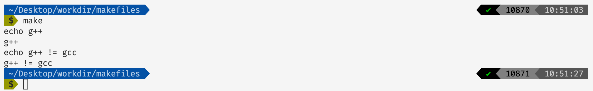
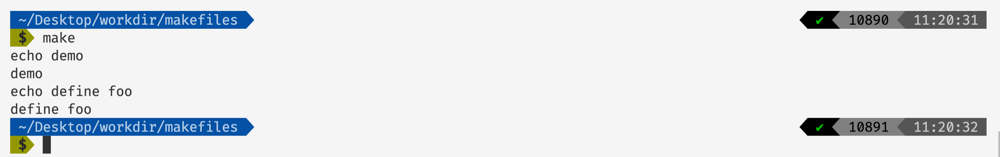
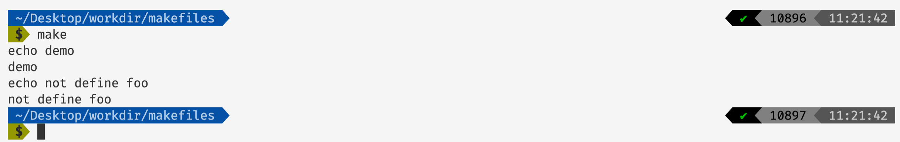
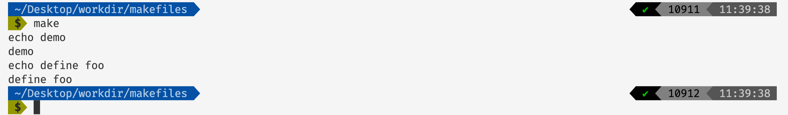

# 彻底掌握Makefile（二）

## 前言

在前面的文章[彻底掌握Makefile（一）]()当中，我们简要的介绍了一些常见的makefile使用方法，在本篇文章当中我们将继续介绍一些makefile当中的常见用法。

## Makefile中的条件判断

### ifeq 和 ifneq

我们在写makefile的时候常常会有通过if语句进行判断的需求，比如说根据不同的文件设置不同的编译器等等。

```makefile

cc=g++

main: demo.c
	echo $(cc)

ifeq ($(cc), gcc)
	echo $(cc) = 相等的语句执行了
else
	echo $(cc) != 不相等的语句执行了
endif
```

上面的makeifle的执行结果如下：


在上面的makefile当中定义了一个变量cc，他的值为gcc。在上面的makefile当中`ifeq`表示如果后边的表达式成立的话，也就是`$(cc)`的值等于`gcc`那么就执行后面的语句，否则执行else后面的语句。根据上面makefile的执行结果来看，$(cc)和gcc不相等，因此和我们的期待的结果是一致的。

我们修改上面的makefile文件如下：

```makefile

cc=g++

main: demo.c
	echo $(cc)

ifneq ($(cc), gcc)
	echo $(cc) != gcc
else
	echo $(cc) = gcc
endif
```

执行上面的makefile文件输出的结果如下：



在上面的makefile当中`ifneq`的含义表示如果不相等，因为g++不等于gcc，因此这个满足条件，程序执行的结果满足条件。

关于make的输出问题，当makefile执行到`echo $(cc) != gcc`的时候，首先这条命令会被make输出，然后make会执行这条命令，而这条命令是输出`g++ != gcc`，因此才会有上面的输出。`echo g++ != gcc`，而执行这条命令还会输出`g++ != gcc`，看到这应该能够理解上面的makefile的输出结果了。

前面两个关键字的语法如下所示：

```makefile
ifeq (<arg1>, <arg2>)
ifeq '<arg1>' '<arg2>'
ifeq "<arg1>" "<arg2>"
ifeq "<arg1>" '<arg2>'
ifeq '<arg1>' "<arg2>"

ifneq (<arg1>, <arg2>)
ifneq '<arg1>' '<arg2>'
ifneq "<arg1>" "<arg2>"
ifneq "<arg1>" '<arg2>'
ifneq '<arg1>' "<arg2>"
```

### ifdef 和 ifndef

除了上面的两个关键字之外，make还给我们提供了另外两个关键字`ifdef`和`ifndef`。

`ifdef`和`ifndef`用于判断表达式是否定义过，或者是否为空：

```makefile
foo = 1
main: demo.c
	echo demo
ifdef foo
	echo define foo
else
	echo not define foo
endif

```

上面的makefile的输出结果如下：



在上面的makefile当中我们定义了foo，因此`ifdef`判断正确，输出`define foo`，现在修改上面的makefile如下所示说：

```makefile
main: demo.c
	echo demo
ifdef foo
	echo define foo
else
	echo not define foo
endif
```



在上面的makefile当中我们没有定义`foo`，因此在上面的makefile当中会输出`not define foot`。

我们在来看一个结果比较令人疑惑的makefile:

```makefile
foo = 
main: demo.c
	echo demo
ifdef foo
	echo define foo
else
	echo not define foo
endif

```

在上面的makefile当中我们定义了foo，但是他没有值，我们看一下这个makefile的输出结果：


上面makefile的输出表示`foo`没有被定义，因此当我们定义一个空变量的时候和不定义的效果是一样的。

```makefile
bar =
foo = $(bar)
main: demo.c
	echo demo
ifdef foo
	echo define foo
else
	echo not define foo
endif
```

在上面的makefile当中我们定义了一个空的变量`bar`但是我们令`foot=$(bar)`我们看一下上面的makefile文件的输出：



可以看出是定义了foo的虽然foo的真实的值也为空，从这里也可以看出`ifdef`和`ifndef`在进行判断的时候并不会将变量直接展开，而是直接判断成不为空。

## Makfile中的函数

在makefile当中除了能够使用条件表达式之外我们还可以使用函数，在makefile当中函数的使用规则如下：

```makefiel
$(<function> <arguments>)
或者
将()替换为{}
```


