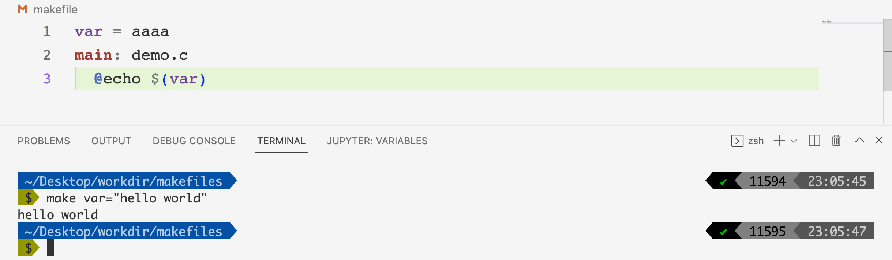

# 彻底掌握Makefile（三）

## 前言

在前面的文章[彻底掌握Makefile（一）](https://mp.weixin.qq.com/s?__biz=Mzg3ODgyNDgwNg==&mid=2247486795&idx=1&sn=1da47724ddaa139d87b8994abefef7cd&chksm=cf0c9142f87b1854f619b6f6d744b6f6c570adb726c857b36787cec7a821cebbaf2b6bd6799f&token=1023752079&lang=zh_CN#rd)和[彻底掌握Makefile（二）](https://mp.weixin.qq.com/s?__biz=Mzg3ODgyNDgwNg==&mid=2247486840&idx=1&sn=68fc4d2c10eb8112bd3c1c26b1c38ac5&chksm=cf0c9171f87b186769351ef320efa7e916dc367de9e948da83c30164b235e079340547e28cb5&token=2139521096&lang=zh_CN#rd)当中，我们简要的介绍了一些常见的makefile使用方法，在本篇文章当中我们将继续介绍一些makefile当中的常见用法。

## Makefile中与文件相关的函数

### dir与notdir函数

```makefile
file = ./files/a.c
fdir = $(dir $(file))
nfdir = $(notdir $(file))

main: demo.c
	echo $(fdir)
	echo $(nfdir)
```

dir函数主要书获取文件路径当中的目录部分，而notdir函数主要是获取文件路径当中文件名的部分，执行上面的makefile结果如下所示：


### suffix函数

这个函数主要是用于获取文件的后缀名。

```makefile
file = ./files/a.c
fdir = $(dir $(file))
nfdir = $(notdir $(file))
name = $(suffix $(file))
main: demo.c
	echo $(fdir)
	echo $(nfdir)
	echo $(name)
```

上面的makefile执行结果如下下图 所示：


### basename

这个函数用于获取文件路径当中除去后缀名的部分。

```makefile
file = ./files/a.c
base = $(basename $(file))
main: demo.c
	echo $(base)
```


### addsuffix

这个函数主要是给文件加上后缀的。

```makefile
file = ./files/a.c
base = $(addsuffix .c, $(file))
main: demo.c
	echo $(base)
```

上面的代码执行结果如下：


上面的结果就表示在文件的末尾加上了对应的后缀名。

### addprefix

这个函数的主要作用就是在字符串的前面加上一串字符。

```makefile
file = files/a.c
base = $(addprefix ./src/main/, $(file))
main: demo.c
	echo $(base)

```

上面的makefile执行结果如下图所示：


### 循环函数foreach

`foreach`函数的主要使用规则为：

```makefile
$(foreach <var>,<list>,<text>)
```

我们直接使用一个例子来说明这个情况：

```makefile
files = a.c b.c c.c d.c
new_files = $(foreach n, $(files), $(n)pp)
main: demo.c
	echo $(new_files)
```

上面的makefile输出结果如下图所示：


`foreach`函数会将files当中的字符串先按照空格、tab键、回车换行符进行分割，然后将分割后的值一个一个的放入变量`n`当中，然后会产生一个字符串$(n)pp，最终将这些字符串通过空格拼接起来并且赋值给new_files，这才会有最终的结果。

上面的过程对应一个python代码如下所示：


### call函数

call函数在makefile当中可以用于调用我们自定义的一个表达式，他的语法个数如下面所示：

```makefile
$(call <expression>,<parm1>,<parm2>,...,<parmn>)
```

- <expression>表示定义的表达式的名字。
- <parmn>表示第n个参数，我们在<expression>当中可以使用`$(n)`进行引用。

我们现在有一个需求就是将两个字符中间加上多个横杠，比如下面的makefile。

```makefile
a=a.c
b=b.c
c=$(a)-------$(b)
main: demo.c
	echo $(c)
```

上面的makefile执行结果如下图所示：


但是如果我们想要重复实现这个功能的话，我们就不需要每次都去写这样一个表达式，而是我们应该写一个表达式然后进行调用。

```makefile
a=a.c
b=b.c
c=$(1)-------$(2) # 定义表达式c $(1) 表示使用第一个参数 $(2) 表示使用第二个参数
main: demo.c
	echo $(call c, $(a), $(b)) # c 就是定义好的表达式 这里调用表达式c
```

上面的makefile输出结果和上面一样：


### 在makefile当中使用shell函数

我们在makefile的表达式当中可以使用shell的函数。

比如现在我们有一个文件叫做`test.txt`，文件的内容如下所示：

```makefile
a.c b.c c.c d.c
```


我们的makefile内容如下：

```makefile
content=$(shell cat test.txt) # 将shell命令的输出内容赋给content

main: demo.c
	echo $(content) # 输出content

```

上面的makefile执行结果如下图所示：


### origin函数

origin这个函数主要是返回变量的定义方式，使用格式如下：

```makefile
$(origin <variable>) # 其中 variable 是变量名字 这里不需要使用 $ 符号去引用
```

这个函数的输出结果又下面这些值：

##### **undefined**

如果 `<variable>` 从来没有定义过，origin函数返回这个值 `undefined`

##### **default**

如果 `<variable>` 是一个默认的定义，比如“CC”这个变量。

GNU make默认变量：


- AR－－＞归档维护程序的名称，默认值为ar
- ARFLAGS－－＞归档维护程序的选项
- AS－－＞汇编程序的名称，默认值为as
- ASFLAGS－－＞汇编程序的选项
- CC－->C编译器的名称，默认为gcc
- CPP－－＞C预编译器的名称
- CCFLAGS－－＞C编译器的选项
- CPPFLAGS－->C预编译的选项
- CXX－－＞C＋＋编译器的名称，默认为g++
- CXXFLAGS－－＞C＋＋编译器的选项
- FC－－＞FORTRAN编译器的名称，默认为f77
- FFLAGS－－＞FORTRAN编译器的选项

##### **environment**

variable是一个环境变量。

##### **file**

如果 `<variable>` 这个变量被定义在Makefile中。

##### **command** **line**

如果 `<variable>` 这个变量是被命令行定义的。

##### **override**

如果 `<variable>` 是被override指示符重新定义的，关于override的使用，请查看本文彩蛋部分。

现在我们举一个例子，去看看上面这些值对应的例子：

```makefile
override var = aaaa
file=file
main: demo.c
	echo $(origin file) # makefile 内部定义的
	echo $(origin data) # 命令行定义的
	@echo $(origin var) # override 重写
	@echo $(origin JAVA_HOME) # JAVA_HOME 是一个环境变量
	@echo $(origin CXX) # 默认定义的变量
```

我们现在使用make命令测试一下上面的makefile输出结果：


### error函数

在makefile当中我们可以使用error函数让makefie停止执行。当我们有需求：让在某种条件下让makefile停止编译

```makefile
data=data

ifeq ($(data), data)
$(error "data == data")
endif

main: main.c
	gcc main.c

```

现在我们执行makefile，输出结果如下：


还有一个函数`warning`使用方法和上面一样用于产生警告。

## 彩蛋

### @符号

有时候在makefile当中我们不想输出某些命令（如果不进行设置makefile会输出每一条我们执行过的命令），比如下面的makefile。

```makefile

main: demo.c
	echo hello world
```

上面的makefile输出结果为：


现在我们不想输出`echo hello world`这条命令，我们可以使用@进行修饰，在makefile当中如果一条命令使用@进行了修饰，那么这条命令就不会输出。

```makefile
main: demo.c
	@echo hello world
```

上面的makefile输出结果如下：


### override使用

在使用make命令的时候可以进行变量的设定，这个变量我们可以在makefile文件当中使用：

```makefile
main: demo.c
	@echo $(var)  # 使用变量 var
```

我们现在输入make命令并且指定参数然后查看结果：


可以看到我们指定的变量在makefile当中可以使用了。

但是如果在我们的makefile当中也有一个变量叫做`var`那么makefile当中的`var`就会被覆盖。比如像下面这个例子一样：



如果我们想让我们自己的变量起作用的话我们可以使用override：


## 总结

在本篇文章当中主要给大家介绍了Makefile当中一些常用的函数的使用，整体比较简单，大家可以对照着makefile和结果自己实现一遍。

---

以上就是本篇文章的所有内容了，我是**LeHung**，我们下期再见！！！更多精彩内容合集可访问项目：<https://github.com/Chang-LeHung/CSCore>

关注公众号：**一无是处的研究僧**，了解更多计算机（Java、Python、计算机系统基础、算法与数据结构）知识。


